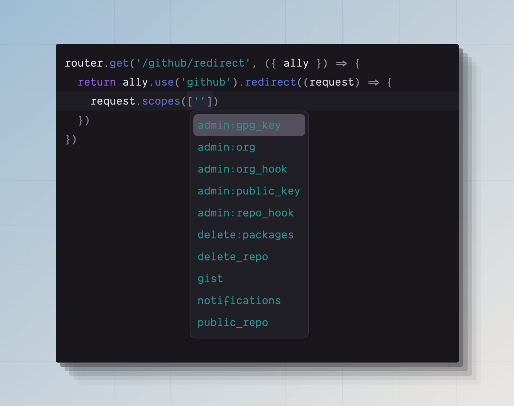

# 社交身份验证

你可以使用 `@adonisjs/ally` 包在 AdonisJS 应用程序中实现社交身份验证。
Ally 附带以下内置驱动程序，以及用于 [注册自定义驱动程序](#creating-a-custom-social-driver) 的可扩展 API。

- Twitter
- Facebook
- Spotify
- Google
- GitHub
- Discord
- LinkedIn

Ally 不会代表你存储任何用户或访问令牌。它实现了 OAuth2 和 OAuth1 协议，通过社交服务对用户进行身份验证，并提供用户详细信息。你可以将该信息存储在数据库中，并使用 [auth](./introduction.md) 包在你的应用程序中登录用户。

## 安装

使用以下命令安装并配置该包：

```sh
node ace add @adonisjs/ally

# 将提供程序定义为 CLI 标志
node ace add @adonisjs/ally --providers=github --providers=google
```

:::disclosure{title="查看 add 命令执行的步骤"}

1. 使用检测到的包管理器安装 `@adonisjs/ally` 包。

2. 在 `adonisrc.ts` 文件中注册以下服务提供者。

    ```ts
    {
      providers: [
        // ...other providers
        () => import('@adonisjs/ally/ally_provider')
      ]
    }
    ```

3. 创建 `config/ally.ts` 文件。此文件包含所选 OAuth 提供程序的配置设置。

4. 定义环境变量以存储所选 OAuth 提供程序的 `CLIENT_ID` 和 `CLIENT_SECRET`。

:::

## 配置

`@adonisjs/ally` 包配置存储在 `config/ally.ts` 文件中。你可以在单个配置文件中为多个服务定义配置。

另请参阅：[配置存根](https://github.com/adonisjs/ally/blob/main/stubs/config/ally.stub)

```ts
import { defineConfig, services } from '@adonisjs/ally'

defineConfig({
  github: services.github({
    clientId: env.get('GITHUB_CLIENT_ID')!,
    clientSecret: env.get('GITHUB_CLIENT_SECRET')!,
    callbackUrl: '',
  }),
  twitter: services.twitter({
    clientId: env.get('TWITTER_CLIENT_ID')!,
    clientSecret: env.get('TWITTER_CLIENT_SECRET')!,
    callbackUrl: '',
  }),
})
```

### 配置回调 URL

OAuth 提供程序要求你注册一个回调 URL，以便在用户授权登录请求后处理重定向响应。

回调 URL 必须向 OAuth 服务提供商注册。例如：如果你使用的是 GitHub，则必须登录 GitHub 帐户，[创建一个新应用](https://docs.github.com/en/apps/oauth-apps/building-oauth-apps/creating-an-oauth-app) and define the callback URL using the GitHub interface.

此外，你必须使用 `callbackUrl` 属性在 `config/ally.ts` 文件中注册相同的回调 URL。

## 用法

配置包后，你可以使用 `ctx.ally` 属性与 Ally API 进行交互。你可以使用 `ally.use()` 方法在配置的 auth 提供程序之间切换。例如：

```ts
router.get('/github/redirect', ({ ally }) => {
  // GitHub 驱动程序实例
  const gh = ally.use('github')
})

router.get('/twitter/redirect', ({ ally }) => {
  // Twitter 驱动程序实例
  const twitter = ally.use('twitter')
})

// 你也可以动态检索驱动程序
router.get('/:provider/redirect', ({ ally, params }) => {
  const driverInstance = ally.use(params.provider)
}).where('provider', /github|twitter/)
```

### 重定向用户进行身份验证

社交身份验证的第一步是将用户重定向到 OAuth 服务，并等待他们批准或拒绝身份验证请求。

你可以使用 `.redirect()` 方法执行重定向。

```ts
router.get('/github/redirect', ({ ally }) => {
  return ally.use('github').redirect()
})
```

你可以传递回调函数以在重定向期间定义自定义范围或查询字符串值。

```ts
router.get('/github/redirect', ({ ally }) => {
  return ally
    .use('github')
    .redirect((request) => {
      // highlight-start
      request.scopes(['user:email', 'repo:invite'])
      request.param('allow_signup', false)
      // highlight-end
    })
})
```

### 处理回调响应

用户批准或拒绝身份验证请求后，将被重定向回应用程序的 `callbackUrl`。

在此路由中，你可以调用 `.user()` 方法来获取登录用户的详细信息和访问令牌。但是，你还必须检查响应是否存在可能的错误状态。

```ts
router.get('/github/callback', async ({ ally }) => {
  const gh = ally.use('github')

  /**
   * 用户通过取消登录流程拒绝了访问
   */
  if (gh.accessDenied()) {
    return 'You have cancelled the login process'
  }

  /**
   * OAuth 状态验证失败。这发生在 CSRF Cookie 过期时。
   */
  if (gh.stateMisMatch()) {
    return 'We are unable to verify the request. Please try again'
  }

  /**
   * GitHub 响应了一些错误
   */
  if (gh.hasError()) {
    return gh.getError()
  }

  /**
   * 访问用户信息
   */
  const user = await gh.user()
  return user
})
```

## 用户属性

以下是可以从 `.user()` 方法调用的返回值访问的属性列表。这些属性在所有底层驱动程序中是一致的。

```ts
const user = await gh.user()

user.id
user.email
user.emailVerificationState
user.name
user.nickName
user.avatarUrl
user.token
user.original
```

### id
OAuth 提供程序返回的唯一 ID。

### email
OAuth 提供程序返回的电子邮件地址。如果 OAuth 请求不要求用户的电子邮件地址，则该值将为 `null`。

### emailVerificationState
许多 OAuth 提供程序允许电子邮件未经过验证的用户登录并验证 OAuth 请求。你应该使用此标志确保只有拥有经过验证的电子邮件的用户才能登录。

以下是可能值的列表。

- `verified`: 用户的电子邮件地址已通过 OAuth 提供程序的验证。
- `unverified`: 用户的电子邮件地址未经过验证。
- `unsupported`: OAuth 提供程序不共享电子邮件验证状态。

### name
OAuth 提供程序返回的用户姓名。

### nickName
用户公开可见的昵称。如果 OAuth 提供程序没有昵称的概念，则 `nickName` 和 `name` 的值将相同。

### avatarUrl
用户公开个人资料图片的 HTTP(s) URL。

### token
token 属性是对底层访问令牌对象的引用。令牌对象具有以下子属性。

```ts
user.token.token
user.token.type
user.token.refreshToken
user.token.expiresAt
user.token.expiresIn
```

| 属性 | 协议 | 描述 |
|---------|------------|------------|
| `token` | OAuth2 / OAuth1 | 访问令牌的值。该值适用于 `OAuth2` 和 `OAuth1` 协议。 |
| `secret` | OAuth1 | 令牌秘密仅适用于 `OAuth1` 协议。目前，Twitter 是唯一使用 OAuth1 的官方驱动程序。 |
| `type` | OAuth2 | 令牌类型。通常，它将是 [bearer token](https://oauth.net/2/bearer-tokens/)。
| `refreshToken` | OAuth2 | 你可以使用刷新令牌创建新的访问令牌。如果 OAuth 提供程序不支持刷新令牌，则该值将为 `undefined` |
| `expiresAt` | OAuth2 | 代表访问令牌过期的绝对时间的 luxon DateTime 类实例。 |
| `expiresIn` | OAuth2 | 值以秒为单位，之后令牌将过期。它是一个静态值，不会随着时间的推移而改变。 |

### original
对 OAuth 提供程序原始响应的引用。如果标准化的用户属性集没有你需要的所有信息，你可能希望引用原始响应。

```ts
const user = await github.user()
console.log(user.original)
```

## 定义范围 (Scopes)

范围是指用户批准身份验证请求后你要访问的数据。范围的名称和你可以访问的数据因 OAuth 提供程序而异；因此，你必须阅读他们的文档。

范围可以在 `config/ally.ts` 文件中定义，也可以在重定向用户时定义。

多亏了 TypeScript，你将获得所有可用范围的自动完成建议。



```ts
// title: config/ally.ts
github: {
  driver: 'github',
  clientId: env.get('GITHUB_CLIENT_ID')!,
  clientSecret: env.get('GITHUB_CLIENT_SECRET')!,
  callbackUrl: '',
  // highlight-start
  scopes: ['read:user', 'repo:invite'],
  // highlight-end
}
```

```ts
// title: During redirect
ally
  .use('github')
  .redirect((request) => {
    // highlight-start
    request.scopes(['read:user', 'repo:invite'])
    // highlight-end
  })
```

## 定义重定向查询参数

你可以自定义重定向请求的查询参数以及范围。在以下示例中，我们定义了适用于 [Google 提供程序](https://developers.google.com/identity/protocols/oauth2/web-server#httprest) 的 `prompt` 和 `access_type` 参数。

```ts
router.get('/google/redirect', async ({ ally }) => {
  return ally
    .use('google')
    .redirect((request) => {
      // highlight-start
      request
        .param('access_type', 'offline')
        .param('prompt', 'select_account')
      // highlight-end
    })
})
```

你可以使用请求上的 `.clearParam()` 方法清除任何现有参数。如果参数默认值在配置中定义，并且你需要为单独的自定义 auth 流程重新定义它们，这会很有帮助。

```ts
router.get('/google/redirect', async ({ ally }) => {
  return ally
    .use('google')
    .redirect((request) => {
      // highlight-start
      request
        .clearParam('redirect_uri')
        .param('redirect_uri', '')
      // highlight-end
    })
})
```

## 从访问令牌获取用户详细信息

有时，你可能希望从存储在数据库中或通过另一个 OAuth 流程提供的访问令牌中获取用户详细信息。例如，你通过移动应用程序使用了本机 OAuth 流程并收到了访问令牌。

你可以使用 `.userFromToken()` 方法获取用户详细信息。

```ts
const user = await ally
  .use('github')
  .userFromToken(accessToken)
```

你可以使用 `.userFromTokenAndSecret` 方法获取 OAuth1 驱动程序的用户详细信息。

```ts
const user = await ally
  .use('github')
  .userFromTokenAndSecret(token, secret)
```

## 无状态身份验证

许多 OAuth 提供程序 [建议使用 CSRF 状态令牌](https://developers.google.com/identity/openid-connect/openid-connect?hl=en#createxsrftoken) 来防止你的应用程序遭受跨站点请求伪造攻击。

Ally 创建一个 CSRF 令牌并将其保存在加密的 Cookie 中，该 Cookie 稍后在用户批准身份验证请求后进行验证。

但是，如果你因某种原因无法使用 Cookie，则可以启用无状态模式，在该模式下不会进行状态验证，因此不会生成 CSRF Cookie。

```ts
// title: Redirecting
ally.use('github').stateless().redirect()
```

```ts
// title: Handling callback response
const gh = ally.use('github').stateless()
await gh.user()
```


## 完整配置参考

以下是所有驱动程序的完整配置参考。你可以将以下对象直接复制粘贴到 `config/ally.ts` 文件中。

<div class="disclosure_wrapper">

:::disclosure{title="GitHub config"}

```ts
{
  github: services.github({
    clientId: '',
    clientSecret: '',
    callbackUrl: '',

    // GitHub specific
    login: 'adonisjs',
    scopes: ['user', 'gist'],
    allowSignup: true,
  })
}
```

:::

:::disclosure{title="Google config"}

```ts
{
  google: services.google({
    clientId: '',
    clientSecret: '',
    callbackUrl: '',

    // Google specific
    prompt: 'select_account',
    accessType: 'offline',
    hostedDomain: 'adonisjs.com',
    display: 'page',
    scopes: ['userinfo.email', 'calendar.events'],
  })
}
```

:::

:::disclosure{title="Twitter config"}

```ts
{
  twitter: services.twitter({
    clientId: '',
    clientSecret: '',
    callbackUrl: '',
  })
}
```

:::

:::disclosure{title="Discord config"}

```ts
{
  discord: services.discord({
    clientId: '',
    clientSecret: '',
    callbackUrl: '',

    // Discord specific
    prompt: 'consent' | 'none',
    guildId: '',
    disableGuildSelect: false,
    permissions: 10,
    scopes: ['identify', 'email'],
  })
}
```

:::

:::disclosure{title="LinkedIn config (deprecated)"}

此配置已弃用，以符合更新后的 [LinkedIn OAuth 要求](https://learn.microsoft.com/en-us/linkedin/consumer/integrations/self-serve/sign-in-with-linkedin)。

```ts
{
  linkedin: services.linkedin({
    clientId: '',
    clientSecret: '',
    callbackUrl: '',

    // LinkedIn specific
    scopes: ['r_emailaddress', 'r_liteprofile'],
  })
}
```
:::

:::disclosure{title="LinkedIn Openid Connect config"}

```ts
{
  linkedin: services.linkedinOpenidConnect({
    clientId: '',
    clientSecret: '',
    callbackUrl: '',

    // LinkedIn specific
    scopes: ['openid', 'profile', 'email'],
  })
}
```

:::

:::disclosure{title="Facebook config"}

```ts
{
  facebook: services.facebook({
    clientId: '',
    clientSecret: '',
    callbackUrl: '',

    // Facebook specific
    scopes: ['email', 'user_photos'],
    userFields: ['first_name', 'picture', 'email'],
    display: '',
    authType: '',
  })
}
```

:::

:::disclosure{title="Spotify config"}

```ts
{
  spotify: services.spotify({
    clientId: '',
    clientSecret: '',
    callbackUrl: '',

    // Spotify specific
    scopes: ['user-read-email', 'streaming'],
    showDialog: false
  })
}
```

:::


</div>

## 创建自定义社交驱动程序

我们创建了一个 [入门套件](https://github.com/adonisjs-community/ally-driver-boilerplate) 来在 npm 上实现和发布自定义社交驱动程序。请仔细阅读入门套件的 README 以获取更多说明。
