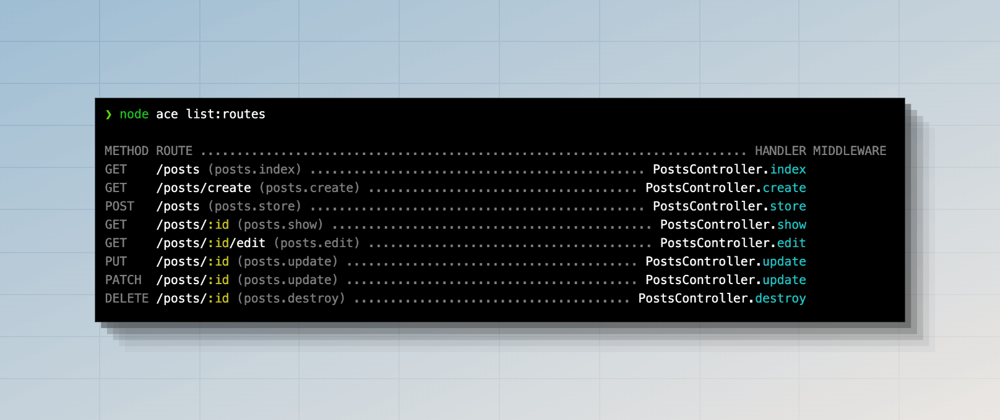
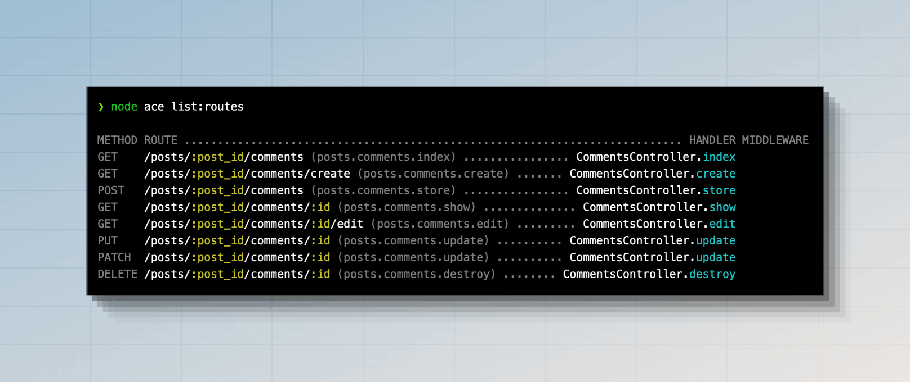
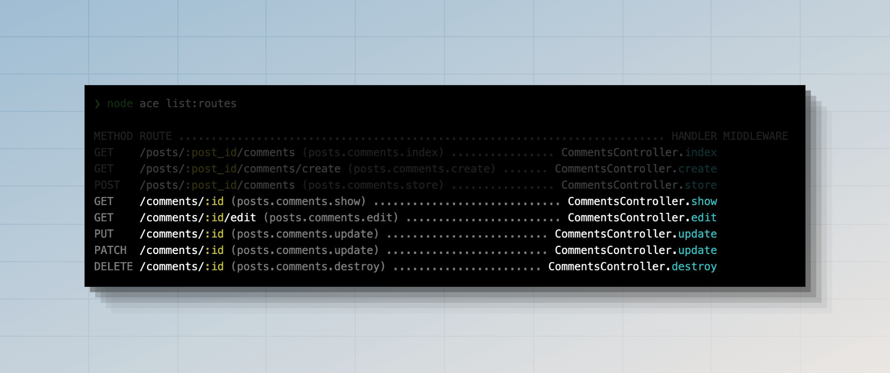

# 控制器

HTTP 控制器提供了一个抽象层，用于将路由处理程序组织在专用的文件中。你不再需要在路由文件中编写所有的请求处理逻辑，而是将其移动到控制器类中。

控制器存储在 `./app/controllers` 目录下，每个控制器都是一个普通的 JavaScript 类。你可以通过运行以下命令来创建一个新的控制器。

See also: [Make controller command](../references/commands.md#makecontroller)

```sh
node ace make:controller users
```

新创建的控制器使用 `class` 声明进行脚手架搭建，你可以手动在其中创建方法。在这个例子中，让我们创建一个 `index` 方法并返回一个用户数组。

```ts
// title: app/controllers/users_controller.ts  
export default class UsersController {
  index() {
    return [
      {
        id: 1,
        username: 'virk',
      },
      {
        id: 2,
        username: 'romain',
      },
    ]
  }
}
```

最后，让我们将这个控制器绑定到一个路由。我们将使用 `#controllers` 别名导入控制器。别名是使用 [Node.js 的子路径导入功能](../getting_started/folder_structure.md#the-sub-path-imports) 定义的。

```ts
// title: start/routes.ts
import router from '@adonisjs/core/services/router'
const UsersController = () => import('#controllers/users_controller')

router.get('users', [UsersController, 'index'])
```

正如你可能注意到的，我们没有创建控制器类的实例，而是将其直接传递给路由。这样做允许 AdonisJS：

- 为每个请求创建一个新的控制器实例。
- 并且使用 [IoC 容器](../concepts/dependency_injection.md) 构造类，这允许你利用自动依赖注入。

你还可以注意到我们使用函数懒加载控制器。

:::warning

当使用 [HMR](../concepts/hmr.md) 时，需要懒加载控制器。

:::

随着代码库的增长，你会注意到它开始影响应用程序的启动时间。一个常见的原因是在路由文件中导入了所有的控制器。

由于控制器处理 HTTP 请求，它们通常会导入其他模块，如模型、验证器或第三方包。结果，你的路由文件变成了导入整个代码库的中心点。

懒加载非常简单，只需将导入语句移动到函数后面并使用动态导入即可。

:::tip

你可以使用我们的 [ESLint 插件](https://github.com/adonisjs/tooling-config/tree/main/packages/eslint-plugin) 来强制并自动将标准控制器导入转换为懒加载动态导入。

:::

### 使用魔法字符串

懒加载控制器的另一种方法是将控制器及其方法引用为字符串。我们称之为魔法字符串，因为字符串本身没有意义，只是路由器使用它来查找控制器并在后台导入它。

在下面的例子中，我们在路由文件中没有任何导入语句，我们将控制器导入路径 + 方法作为字符串绑定到路由。

```ts
// title: start/routes.ts
import router from '@adonisjs/core/services/router'

router.get('users', '#controllers/users_controller.index')
```

魔法字符串唯一的缺点是它们不是类型安全的。如果你在导入路径中拼写错误，编辑器不会给你任何反馈。

从好的方面来说，魔法字符串可以清除路由文件中由于导入语句而产生的所有视觉混乱。

使用魔法字符串是主观的，你可以决定是否要在个人或团队中使用它们。

## 单动作控制器

AdonisJS 提供了一种定义单动作控制器的方法。这是一种将功能封装到命名清晰的类中的有效方法。要实现这一点，你需要由于在控制器内部定义一个 `handle` 方法。

```ts
// title: app/controllers/register_newsletter_subscription_controller.ts
export default class RegisterNewsletterSubscriptionController {
  handle() {
    // ...
  }
}
```

然后，你可以使用以下方式在路由上引用控制器。

```ts
// title: start/routes.ts
router.post('newsletter/subscriptions', [RegisterNewsletterSubscriptionController])
```

## HTTP 上下文

控制器方法接收 [HttpContext](../concepts/http_context.md) 类的实例作为第一个参数。

```ts
// title: app/controllers/users_controller.ts
import type { HttpContext } from '@adonisjs/core/http'

export default class UsersController {
  index(context: HttpContext) {
    // ...
  }
}
```

## 依赖注入

控制器类是使用 [IoC 容器](../concepts/dependency_injection.md) 实例化的；因此，你可以在控制器构造函数或控制器方法中对依赖项进行类型提示。

假设你有一个 `UserService` 类，你可以如下所示在控制器中注入它的实例。

```ts
// title: app/services/user_service.ts
export class UserService {
  all() {
    // return users from db
  }
}
```

```ts
// title: app/controllers/users_controller.ts
import { inject } from '@adonisjs/core'
import UserService from '#services/user_service'

@inject()
export default class UsersController {
  constructor(
    private userService: UserService
  ) {}

  index() {
    return this.userService.all()
  }
}
```

### 方法注入

你可以使用 [方法注入](../concepts/dependency_injection.md#using-method-injection) 直接在控制器方法内部注入 `UserService` 的实例。在这种情况下，你必须在方法名上应用 `@inject` 装饰器。

传递给控制器方法的第一个参数始终是 [`HttpContext`](../concepts/http_context.md)。因此，你必须将 `UserService` 类型提示为第二个参数。

```ts
// title: app/controllers/users_controller.ts
import { inject } from '@adonisjs/core'
import { HttpContext } from '@adonisjs/core/http'

import UserService from '#services/user_service'

export default class UsersController {
  @inject()
  index(ctx: HttpContext, userService: UserService) {
    return userService.all()
  }
}
```

### 依赖树

依赖项的自动解析不仅限于控制器。在控制器内部注入的任何类也可以对依赖项进行类型提示，IoC 容器将为你构建依赖树。

例如，让我们修改 `UserService` 类以接受 [HttpContext](../concepts/http_context.md) 的实例作为构造函数依赖项。

```ts
// title: app/services/user_service.ts
import { inject } from '@adonisjs/core'
import { HttpContext } from '@adonisjs/core/http'

@inject()
export class UserService {
  constructor(
    private ctx: HttpContext
  ) {}

  all() {
    console.log(this.ctx.auth.user)
    // return users from db
  }
}
```

更改后，`UserService` 将自动接收 `HttpContext` 类的实例。此外，控制器中不需要任何更改。

## 资源驱动控制器

对于传统的 [RESTful](https://en.wikipedia.org/wiki/Representational_state_transfer) 应用程序，控制器应仅设计为管理单个资源。资源通常是应用程序中的实体，如 **User resource** 或 **Post resource**。

让我们以 Post 资源为例，定义处理其 CRUD 操作的端点。我们将首先创建一个控制器。

你可以使用 `make:controller` ace 命令为资源创建控制器。`--resource` 标志使用以下方法为控制器搭建脚手架。

```sh
node ace make:controller posts --resource
```

```ts
// title: app/controllers/posts_controller.ts
import type { HttpContext } from '@adonisjs/core/http'

export default class PostsController {
  /**
   * Return list of all posts or paginate through
   * them
   */
  async index({}: HttpContext) {}

  /**
   * Render the form to create a new post.
   *
   * Not needed if you are creating an API server.
   */
  async create({}: HttpContext) {}

  /**
   * Handle form submission to create a new post
   */
  async store({ request }: HttpContext) {}

  /**
   * Display a single post by id.
   */
  async show({ params }: HttpContext) {}

  /**
   * Render the form to edit an existing post by its id.
   *
   * Not needed if you are creating an API server.
   */
  async edit({ params }: HttpContext) {}

  /**
   * Handle the form submission to update a specific post by id
   */
  async update({ params, request }: HttpContext) {}

  /**
   * Handle the form submission to delete a specific post by id.
   */
  async destroy({ params }: HttpContext) {}
}
```

接下来，让我们使用 `router.resource` 方法将 `PostsController` 绑定到资源路由。该方法接受资源名称作为第一个参数，控制器引用作为第二个参数。

```ts
// title: start/routes.ts
import router from '@adonisjs/core/services/router'
const PostsController = () => import('#controllers/posts_controller')

router.resource('posts', PostsController)
```

以下是 `resource` 方法注册的路由列表。你可以通过运行 `node ace list:routes` 命令查看此列表。



### 嵌套资源

可以通过使用点 `.` 符号分隔父资源名称和子资源名称来创建嵌套资源。

在下面的例子中，我们在 `posts` 资源下为 `comments` 资源创建路由。

```ts
router.resource('posts.comments', CommentsController)
```



### 浅层资源

当使用嵌套资源时，子资源的路由始终以父资源名称及其 ID 为前缀。例如：

- `/posts/:post_id/comments` 路由显示给定帖子的所有评论列表。
- 而 `/posts/:post_id/comments/:id` 路由通过其 ID 显示单个评论。

第二个路由中 `/posts/:post_id` 的存在是无关紧要的，因为你可以通过其 ID 查找评论。

浅层资源通过保持 URL 结构扁平（尽可能）来注册其路由。这一次，让我们将 `posts.comments` 注册为浅层资源。

```ts
router.shallowResource('posts.comments', CommentsController)
```



### 命名资源路由

使用 `router.resource` 方法创建的路由以资源名称和控制器操作命名。首先，我们将资源名称转换为蛇形命名（snake_case），并使用点 `.` 分隔符连接操作名称。

| Resource         | Action name | Route name               |
|------------------|-------------|--------------------------|
| posts            | index       | `posts.index`            |
| userPhotos       | index       | `user_photos.index`      |
| group-attributes | show        | `group_attributes.index` |

你可以使用 `resource.as` 方法重命名所有路由的前缀。在下面的例子中，我们将 `group_attributes.index` 路由名称重命名为 `attributes.index`。

```ts
// title: start/routes.ts
router.resource('group-attributes', GroupAttributesController).as('attributes')
```

赋予 `resource.as` 方法的前缀将转换为 snake\_ case。如果你愿意，可以关闭转换，如下所示。

```ts
// title: start/routes.ts
router.resource('group-attributes', GroupAttributesController).as('groupAttributes', false)
```

### 仅注册 API 路由

当创建 API 服务器时，创建和更新资源的表单由前端客户端或移动应用程序呈现。因此，为这些端点创建路由是多余的。

你可以使用 `resource.apiOnly` 方法删除 `create` 和 `edit` 路由。结果，只会创建五个路由。

```ts
// title: start/routes.ts
router.resource('posts', PostsController).apiOnly()
```

### 仅注册特定路由

要仅注册特定路由，可以使用 `resource.only` 或 `resource.except` 方法。

`resource.only` 方法接受操作名称数组，并删除除提到的路由之外的所有其他路由。在下面的例子中，只会注册 `index`、`store` 和 `destroy` 操作的路由。

```ts
// title: start/routes.ts
router
  .resource('posts', PostsController)
  .only(['index', 'store', 'destroy'])
```

`resource.except` 方法与 `only` 方法相反，注册除提到的路由之外的所有路由。

```ts
// title: start/routes.ts
router
  .resource('posts', PostsController)
  .except(['destroy'])
```

### 重命名资源参数

`router.resource` 方法生成的路由使用 `id` 作为参数名称。例如，`GET /posts/:id` 查看单个帖子，`DELETE /post/:id` 删除帖子。

你可以使用 `resource.params` 方法将参数从 `id` 重命名为其他名称。

```ts
// title: start/routes.ts
router
  .resource('posts', PostsController)
  .params({ posts: 'post' })
```

上述更改将生成以下路由 _（显示部分列表）_。

| HTTP method | Route               | Controller method |
|-------------|---------------------|-------------------|
| GET         | `/posts/:post`      | show              |
| GET         | `/posts/:post/edit` | edit              |
| PUT         | `/posts/:post`      | update            |
| DELETE      | `/posts/:post`      | destroy           |

你还在使用嵌套资源时重命名参数。

```ts
// title: start/routes.ts
router
  .resource('posts.comments', PostsController)
  .params({
    posts: 'post',
    comments: 'comment',
  })
```

### 为资源路由分配中间件
你可以使用 `resource.use` 方法将中间件分配给资源注册的路由。该方法接受操作名称数组和要分配给它们的中间件。例如：

```ts
// title: start/routes.ts
import router from '@adonisjs/core/services/router'
import { middleware } from '#start/kernel'

router
  .resource('posts')
  .use(
    ['create', 'store', 'update', 'destroy'],
    middleware.auth()
  )
```

你可以使用通配符 (*) 关键字将中间件分配给所有路由。

```ts
// title: start/routes.ts
router
  .resource('posts')
  .use('*', middleware.auth())
```

最后，你可以多次调用 `.use` 方法来分配多个中间件。例如：

```ts
// title: start/routes.ts
router
  .resource('posts')
  .use(
    ['create', 'store', 'update', 'destroy'],
    middleware.auth()
  )
  .use(
    ['update', 'destroy'],
    middleware.someMiddleware()
  )
```

