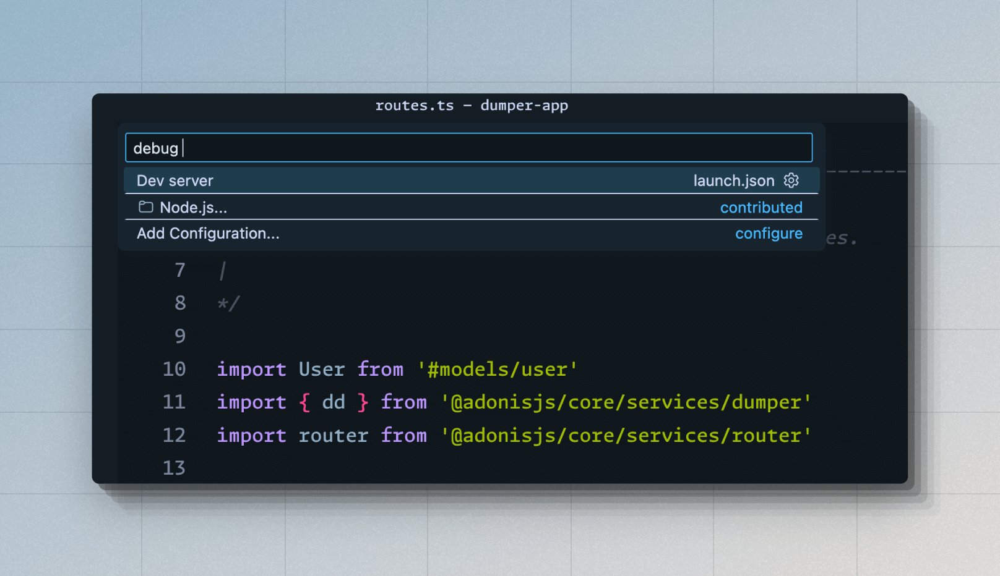
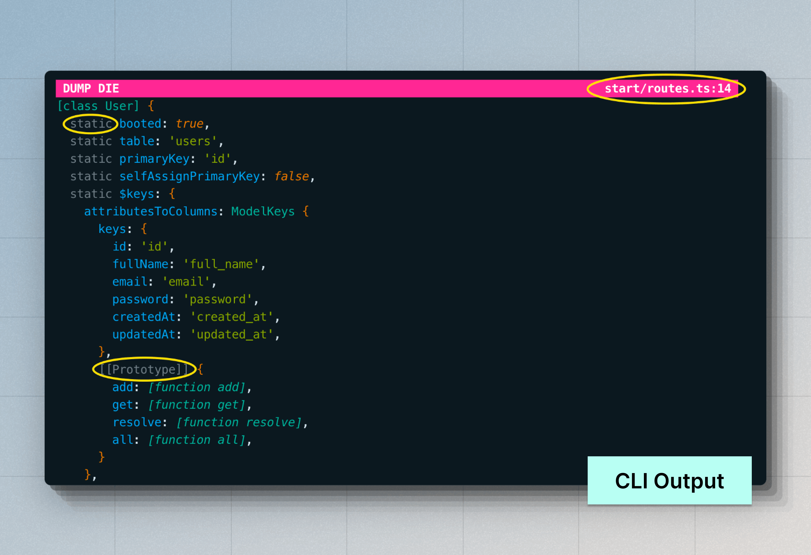
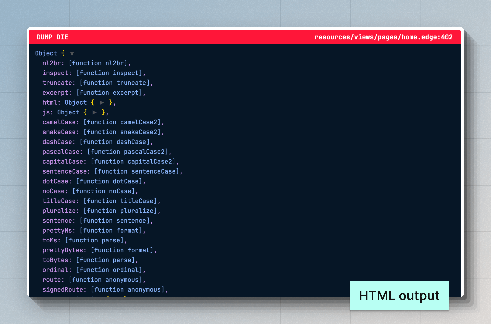
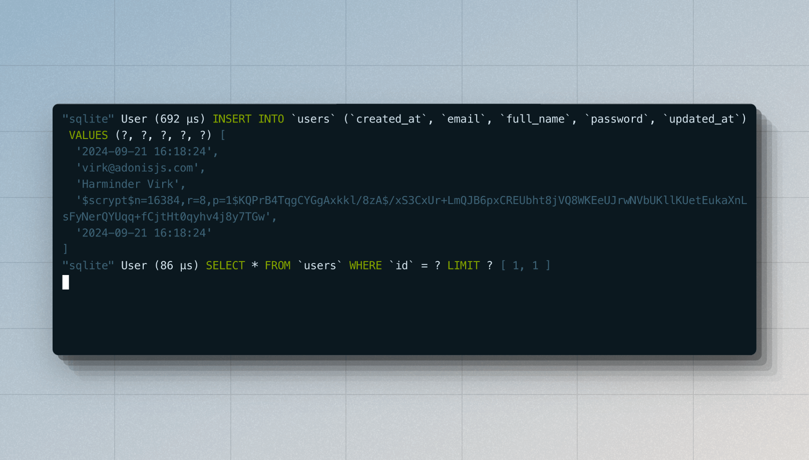

# 调试

在本指南中，我们将探索调试 AdonisJS 应用程序的多种方法，从使用 VSCode 调试器到使用 Dump and Die 以及查看框架的调试日志。

## 使用 VSCode 调试器进行调试

使用 VSCode 调试器调试 AdonisJS 应用程序非常简单。你只需要创建一个 `.vscode/launch.json` 文件并使用 Node.js 调试器即可。

在下面的示例中，我们定义了一个配置，以在调试模式下启动 AdonisJS 开发服务器，然后将 VSCode 调试器附加到它上面。

另请参阅：[VSCode 调试文档](https://code.visualstudio.com/docs/editor/debugging)

```json
// title: .vscode/launch.json
{
  "version": "0.2.0",
  "configurations": [
    {
      "type": "node",
      "request": "launch",
      "name": "Dev server",
      "program": "${workspaceFolder}/ace.js",
      "args": ["serve", "--hmr"],
      "skipFiles": ["<node_internals>/**"]
    }
  ]
}
```

要开始调试：

- 使用 `(CMD + Shift + P)` 打开命令面板。
- 搜索 **Debug: Select and Start Debugging**。你会找到来自 `.vscode/launch.json` 文件的启动选项列表。
- 选择 **Dev server** 选项以使用 VSCode 调试器运行 HTTP 服务器。



### 调试测试

你可以定义另一个启动选项来在调试模式下运行测试。

```json
// title: .vscode/launch.json
{
  "version": "0.2.0",
  "configurations": [
    {
      "type": "node",
      "request": "launch",
      "name": "Dev server",
      "program": "${workspaceFolder}/ace.js",
      "args": ["serve", "--hmr"],
      "skipFiles": ["<node_internals>/**"]
    },
    // insert-start
    {
      "type": "node",
      "request": "launch",
      "name": "Tests",
      "program": "${workspaceFolder}/ace.js",
      "args": ["test", "--watch"],
      "skipFiles": ["<node_internals>/**"]
    }
    // insert-end
  ]
}
```

### 调试所有其他 Ace 命令

为每个 ace 命令定义单独的启动选项是不切实际的。因此，你可以在 `.vscode/launch.json` 文件中定义一个 `attach` 配置。

在 `attach` 模式下，[VSCode 将其调试器附加](https://code.visualstudio.com/blogs/2018/07/12/introducing-logpoints-and-auto-attach#_autoattaching-to-node-processes) 到已经运行的 Node.js 进程，前提是该进程是在 VSCode 集成终端中使用 `--inspect` 标志启动的。

让我们首先修改 `.vscode/launch.json` 文件并向其添加以下配置。

```json
// title: .vscode/launch.json
{
  "version": "0.2.0",
  "configurations": [
    // insert-start
    {
      "type": "node",
      "request": "attach",
      "name": "Attach Program",
      "port": 9229,
      "autoAttachChildProcesses": true,
      "skipFiles": ["<node_internals>/**"]
    },
    // insert-end
    {
      "type": "node",
      "request": "launch",
      "name": "Dev server",
      "program": "${workspaceFolder}/ace.js",
      "args": ["serve", "--hmr"],
      "skipFiles": ["<node_internals>/**"]
    },
    {
      "type": "node",
      "request": "launch",
      "name": "Tests",
      "program": "${workspaceFolder}/ace.js",
      "args": ["test", "--watch"],
      "skipFiles": ["<node_internals>/**"]
    }
  ]
}
```

要在附加模式下开始调试：

- 使用 `(CMD + Shift + P)` 打开命令面板。
- 搜索 **Debug: Select and Start Debugging**。你会找到来自 `.vscode/launch.json` 文件的启动选项列表。
- 选择 **Attach Program** 选项。
- 使用 `--inspect` 标志运行 Ace 命令。例如：
  ```sh
  node --inspect ace migration:run
  ```

::video{url="https://res.cloudinary.com/adonis-js/video/upload/v1726932262/n91xtzqavpdoro79lnza.mp4" controls="true"}


### 调试 Edge 模板

你可以像调试用 TypeScript 编写的应用程序代码一样调试 Edge 模板。但是，对于 Edge，你不能使用 VSCode 提供的断点。相反，你必须使用 `@debugger` 标签来定义代码内断点。

:::note

调试器将显示 Edge 模板的编译输出。

:::

```edge
@debugger
```

## Dump and Die

Dump and Die（简称 `dd`）类似于最受欢迎的调试技术 `console.log`。但是，`dd` 辅助函数会通过抛出异常来停止执行，并在浏览器或终端中显示输出。

当你在 HTTP 请求期间使用 `dd` 辅助函数时，输出将渲染为 HTML 文档。否则，输出将显示在终端中。

```ts
// title: start/routes.ts
import User from '#models/user'
import router from '@adonisjs/core/services/router'
// highlight-start
import { dd } from '@adonisjs/core/services/dumper'
// highlight-end

router.get('/users', async () => {
  const users = await User.all()
  // highlight-start
  /**
   * 访问 "/users" 端点以查看转储的值
   */
  dd(users)
  // highlight-end
  return users
})
```

`dd` 的输出与使用 `console.log` 时看到的略有不同。

- 你可以看到值被转储的源代码位置。
- 你可以查看类的静态属性和对象的原型属性。
- 默认情况下，最多显示 10 层嵌套值。
- 支持 HTML 输出的多种主题。你可以在 `nightOwl`、`catppuccin` 和 `minLight` 之间进行选择。





### 用于调试的 Edge 辅助函数

你可以通过 `@dd` 标签在 Edge 模板中使用 `dd` 辅助函数。此外，你还可以使用 `@dump` 辅助函数，它不会抛出异常并继续渲染模板的其余部分。

```edge
{{-- 转储模板状态并终止 --}}
@dd(state)

{{-- 转储模板状态并继续渲染 --}}
@dump(state)
```

使用 `@dump` 辅助函数时，请确保页面上有一个名为 "dumper" 的 [EdgeJS Stack](https://edgejs.dev/docs/stacks)。`@dump` 辅助函数使用的脚本和样式将写入此堆栈，以包含在最终的 HTML 输出中。

```edge
<!DOCTYPE html>
  <html lang="en">
  <head>
    <meta charset="UTF-8" />
    <meta name="viewport" content="width=device-width, initial-scale=1.0" />
    @stack('dumper')
  </head>
  <body>
    @dump(state)
  </body>
</html>
```

### Dumper 设置

你可以在 `config/app.ts` 文件中配置 dumper 设置。此文件应导出 `dumper` 配置对象，如下所示。

```ts
// title: config/app.ts
/**
 * "dd" 辅助函数使用的全局配置。你可以
 * 分别为 "console" 和 "html" 打印器
 * 配置设置。
 */
export const dumper = dumperConfig({
  /**
   * 控制台打印器的设置
   */
  console: {
    depth: 10,

    /**
     * 不应进一步展开的对象。
     * 该数组接受对象构造函数名称的数组。
     */
    collapse: ['DateTime', 'Date'],
    inspectStaticMembers: true,
  },

  /**
   * HTML 打印器的设置
   */
  html: {
    depth: 10,
    inspectStaticMembers: true,
  },
})
```

<dl>

<dt> showHidden </dt>
<dd>

当设置为 `true` 时，将处理对象的不可枚举属性。**默认值：`false`**

</dd>

<dt> depth </dt>
<dd>

停止解析嵌套值的深度。该深度在所有树状数据结构之间共享。例如，Objects、Arrays、Maps 和 Sets。**默认值：`5`**

</dd>

<dt> inspectObjectPrototype </dt>
<dd>

检查对象的原型属性。默认情况下包含原型的不可枚举属性。**默认值：`'unless-plain-object'`**。

- 当设置为 `true` 时，将处理所有对象的原型属性。
- 当设置为 `false` 时，永远不会处理原型属性。
- 当设置为 `'unless-plain-object'` 时，将处理类实例的原型属性。

</dd>

<dt> inspectArrayPrototype </dt>
<dd>

检查 Array 的原型属性。**默认值：`false`**。

</dd>

<dt> inspectStaticMembers </dt>
<dd>

检查类的静态成员。尽管函数和类在技术上是相同的，但此配置仅适用于使用 `[class]` 关键字定义的函数。**默认值：`false`**。

</dd>

<dt> maxArrayLength </dt>
<dd>

`Arrays`、`Maps` 和 `Sets` 处理的最大成员数。**默认值：`100`**。

</dd>

<dt> maxStringLength </dt>
<dd>

字符串显示的最大字符数。**默认值：`1000`**。

</dd>

<dt> collapse </dt>
<dd>

不应进一步检查的对象构造函数名称数组。

</dd>

</dl>

## 框架调试日志

你可以使用 `NODE_DEBUG` 环境变量查看框架调试日志。Node.js 运行时支持 `NODE_DEBUG` 标志，你可以使用它查看一个或多个模块的日志（使用模块名称）。

例如，你可以使用 `NODE_DEBUG="adonisjs:*"` 值查看所有 AdonisJS 包的日志。

```sh
NODE_DEBUG="adonisjs:*" node ace serve --hmr
```

同样，你可以使用 `NODE_DEBUG` 环境变量查看来自 Node.js 原生模块（如 `fs`、`net`、`module` 等）的日志。

```sh
NODE_DEBUG="adonisjs:*,net,fs" node ace serve --hmr
```

<!-- ## Observing activities
Observing actions performed by different parts of your application can present some meaningful insights and help you debug and understand the inner workings of the framework.

### Lucid queries
You may debug Lucid queries by enabling the `debug` flag inside the `config/database.ts` file. Additionally, you must enable the `prettyPrintDebugQueries` within the same file to print SQL queries in the terminal.

```ts
// title: config/database.ts
const dbConfig = defineConfig({
  connection: 'sqlite',
  // insert-start
  prettyPrintDebugQueries: true,
  // insert-end
  connections: {
    sqlite: {
      client: 'better-sqlite3',
      connection: {
        filename: app.tmpPath('db.sqlite3'),
      },
      // insert-start
      debug: true,
      // insert-end
      useNullAsDefault: true,
      migrations: {
        naturalSort: true,
        paths: ['database/migrations'],
      },
    },
  },
})
```

 -->

<!-- ### Outgoing emails

### HTTP requests -->
