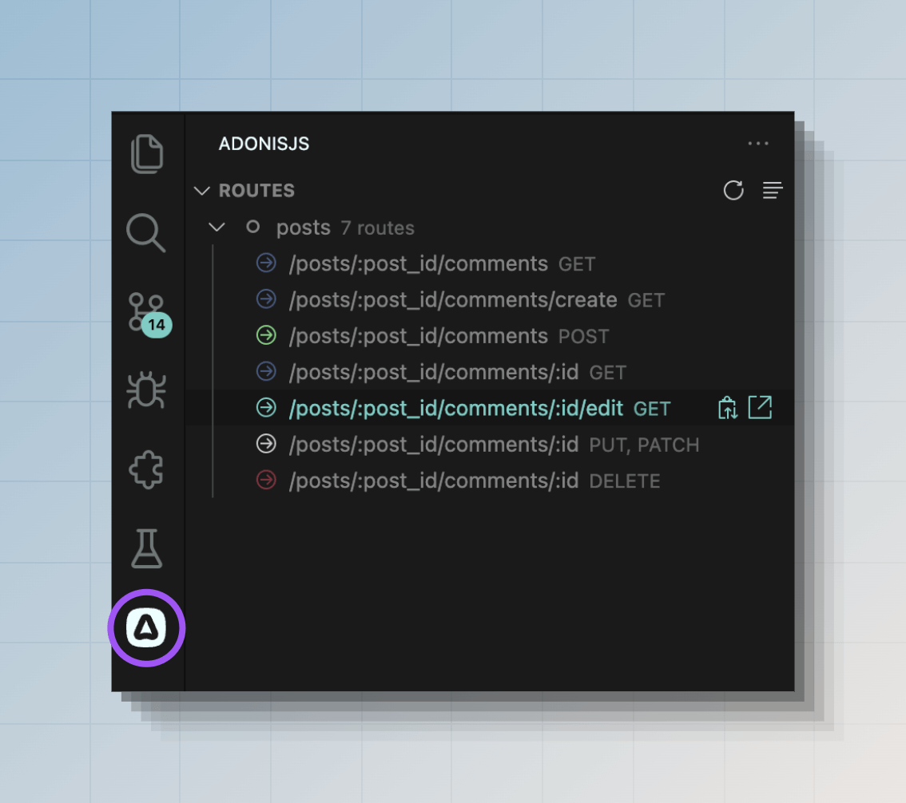

# 路由

网站或 Web 应用的用户可以访问不同的 URL，如 `/`、`/about` 或 `/posts/1`。为了使这些 URL 工作，你需要定义路由。

在 AdonisJS 中，路由定义在 `start/routes.ts` 文件中。路由是 **URI 模式** 和处理该特定路由请求的 **处理器 (handler)** 的组合。例如：

```ts
// title: start/routes.ts
import router from '@adonisjs/core/services/router'

router.get('/', () => {
  return 'Hello world from the home page.'
})

router.get('/about', () => {
  return 'This is the about page.'
})

router.get('/posts/:id', ({ params }) => {
  return `This is post with id ${params.id}`
})
```

上例中的最后一个路由使用了动态 URI 模式。`:id` 是告诉路由器接受任何 id 值的一种方式。我们称之为 **路由参数 (route params)**。

## 查看已注册路由列表
你可以运行 `list:routes` 命令来查看应用程序注册的路由列表。

```sh
node ace list:routes
```

此外，如果你使用我们的 [官方 VSCode 扩展](https://marketplace.visualstudio.com/items?itemName=jripouteau.adonis-vscode-extension)，还可以从 VSCode 活动栏查看路由列表。



## 路由参数

路由参数允许你定义可以接受动态值的 URI。每个参数捕获一个 URI 段的值，你可以在路由处理器中访问该值。

路由参数始终以冒号 `:` 开头，后跟参数名称。

```ts
// title: start/routes.ts
import router from '@adonisjs/core/services/router'

router.get('/posts/:id', ({ params }) => {
  return params.id
})
```

| URL              | Id        |
|------------------|-----------|
| `/posts/1`       | `1`       |
| `/posts/100`     | `100`     |
| `/posts/foo-bar` | `foo-bar` |

一个 URI 也可以接受多个参数。每个参数应具有唯一的名称。

```ts
// title: start/routes.ts
import router from '@adonisjs/core/services/router'

router.get('/posts/:id/comments/:commentId', ({ params }) => {
  console.log(params.id)
  console.log(params.commentId)
})
```

| URL                          | Id        | Comment Id |
|------------------------------|-----------|------------|
| `/posts/1/comments/4`        | `1`       | `4`        |
| `/posts/foo-bar/comments/22` | `foo-bar` | `22`       |

### 可选参数

通过在参数名称末尾附加问号 `?`，路由参数也可以是可选的。可选参数应位于必选参数之后。

```ts
// title: start/routes.ts
import router from '@adonisjs/core/services/router'

router.get('/posts/:id?', ({ params }) => {
  if (!params.id) {
    return 'Showing all posts'
  }

  return `Showing post with id ${params.id}`
})
```

### 通配符参数

要捕获 URI 的所有段，可以定义通配符参数。通配符参数使用特殊的 `*` 关键字指定，并且必须定义在最后位置。

```ts
// title: start/routes.ts
import router from '@adonisjs/core/services/router'

router.get('/docs/:category/*', ({ params }) => {
  console.log(params.category)
  console.log(params['*'])
})
```

| URL                  | Category | Wildcard param   |
|----------------------|----------|------------------|
| `/docs/http/context` | `http`   | `['context']`    |
| `/docs/api/sql/orm`  | `api`    | `['sql', 'orm']` |

### 参数匹配器

路由器不知道你想接受的参数数据格式。例如，URI 为 `/posts/foo-bar` 和 `/posts/1` 的请求将匹配相同的路由。但是，你可以使用参数匹配器显式验证参数值。

匹配器通过链式调用 `where()` 方法注册。第一个参数是参数名称，第二个参数是匹配器对象。

在以下示例中，我们定义了一个正则表达式来验证 id 是否为有效数字。如果验证失败，该路由将被跳过。

```ts
// title: start/routes.ts
import router from '@adonisjs/core/services/router'

router
  .get('/posts/:id', ({ params }) => {})
  .where('id', {
    match: /^[0-9]+$/,
  })
```

除了 `match` 正则表达式外，你还可以定义 `cast` 函数将参数值转换为其正确的数据类型。在此示例中，我们可以将 id 转换为数字。

```ts
// title: start/routes.ts
import router from '@adonisjs/core/services/router'

router
  .get('/posts/:id', ({ params }) => {
    console.log(typeof params.id)
  })
  .where('id', {
    match: /^[0-9]+$/,
    cast: (value) => Number(value),
  })
```

### 内置匹配器

路由器附带了以下用于常用数据类型的辅助方法。

```ts
// title: start/routes.ts
import router from '@adonisjs/core/services/router'

// 验证 id 为数字 + 转换为数字数据类型
router.where('id', router.matchers.number())

// 验证 id 为有效的 UUID
router.where('id', router.matchers.uuid())

// 验证 slug 匹配给定的 slug 正则表达式: regexr.com/64su0
router.where('slug', router.matchers.slug())
```

### 全局匹配器

路由匹配器可以在路由器实例上全局定义。除非在路由级别显式覆盖，否则全局匹配器将应用于所有路由。

```ts
// title: start/routes.ts
import router from '@adonisjs/core/services/router'

// 全局匹配器
router.where('id', router.matchers.uuid())

router
  .get('/posts/:id', () => {})
  // 在路由级别覆盖
  .where('id', router.matchers.number())
```

## HTTP 方法

`router.get()` 方法创建一个响应 [GET HTTP 方法](https://developer.mozilla.org/en-US/docs/Web/HTTP/Methods/GET) 的路由。同样，你可以使用以下方法为不同的 HTTP 方法注册路由。

```ts
// title: start/routes.ts
import router from '@adonisjs/core/services/router'

// GET 方法
router.get('users', () => {})

// POST 方法
router.post('users', () => {})

// PUT 方法
router.put('users/:id', () => {})

// PATCH 方法
router.patch('users/:id', () => {})

// DELETE 方法
router.delete('users/:id', () => {})
```

你可以使用 `router.any()` 方法创建一个响应所有标准 HTTP 方法的路由。

```ts
// title: start/routes.ts
router.any('reports', () => {})
```

最后，你可以使用 `router.route()` 方法为自定义 HTTP 方法创建路由。

```ts
// title: start/routes.ts
router.route('/', ['TRACE'], () => {})
```

## 路由处理器

路由处理器通过返回响应或引发异常来中止请求来处理请求。

处理器可以是内联回调（如本指南所示）或对控制器方法的引用。

```ts
// title: start/routes.ts
router.post('users', () => {
  // 做点什么
})
```

:::note

路由处理器可以是异步函数，AdonisJS 将自动处理 Promise 解析。

:::

在以下示例中，我们导入 `UsersController` 类并将其绑定到路由。在 HTTP 请求期间，AdonisJS 将使用 IoC 容器创建控制器类的实例并执行 `store` 方法。

参考：[控制器](./controllers.md) 专用指南。


```ts
// title: start/routes.ts
const UsersController = () => import('#controllers/users_controller')

router.post('users', [UsersController, 'store'])
```

## 路由中间件

你可以通过链式调用 `use()` 方法在路由上定义中间件。该方法接受内联回调或对命名中间件的引用。

以下是定义路由中间件的最小示例。我们建议阅读 [中间件专用指南](./middleware.md)，以探索所有可用选项和中间件的执行流程。

```ts
// title: start/routes.ts
router
  .get('posts', () => {
    console.log('Inside route handler')

    return 'Viewing all posts'
  })
  .use((_, next) => {
    console.log('Inside middleware')
    return next()
  })
```

## 路由标识符

每个路由都有一个唯一的标识符，你可以用它在应用程序的其他地方引用该路由。例如，你可以使用 [URL 构建器](#url-builder) 生成路由的 URL，或使用 [`response.redirect()`](./response.md#redirects) 方法重定向到路由。

默认情况下，路由模式是路由标识符。但是，你可以使用 `route.as` 方法为路由分配一个唯一且好记的名称。

```ts
// title: start/routes.ts
router.get('users', () => {}).as('users.index')

router.post('users', () => {}).as('users.store')

router.delete('users/:id', () => {}).as('users.delete')
```

你现在可以在模板中使用路由名称或使用 URL 构建器来构造 URL。

```ts
const url = router.builder().make('users.delete', [user.id])
```

```edge
<form
  method='POST'
  action="{{
    route('users.delete', [user.id], { formAction: 'delete' })
  }}"
></form>
```

## 路由分组

路由组提供了一个方便的层来批量配置嵌套在组内的路由。你可以使用 `router.group` 方法创建一组路由。

```ts
// title: start/routes.ts
router.group(() => {
  /**
   * 在回调中注册的所有路由
   * 都是周围组的一部分
   */
  router.get('users', () => {})
  router.post('users', () => {})
})
```

路由组可以相互嵌套，AdonisJS 将根据应用设置的行为合并或覆盖属性。

```ts
// title: start/routes.ts
router.group(() => {
  router.get('posts', () => {})

  router.group(() => {
    router.get('users', () => {})
  })
})
```

### 为组内路由添加前缀

可以使用 `group.prefix` 方法为组内的路由 URI 模式添加前缀。以下示例将为 `/api/users` 和 `/api/payments` URI 模式创建路由。

```ts
// title: start/routes.ts
router
  .group(() => {
    router.get('users', () => {})
    router.get('payments', () => {})
  })
  .prefix('/api')
```

在嵌套组的情况下，前缀将从外到内应用。以下示例将为 `/api/v1/users` 和 `/api/v1/payments` URI 模式创建路由。

```ts
// title: start/routes.ts
router
  .group(() => {
    router
      .group(() => {
        router.get('users', () => {})
        router.get('payments', () => {})
      })
      .prefix('v1')
  })
  .prefix('api')
```

### 为组内路由命名

与为路由模式添加前缀类似，你也可以使用 `group.as` 方法为组内的路由名称添加前缀。

:::note

组内的路由必须先有名称，然后才能为它们添加前缀。

:::

```ts
// title: start/routes.ts
router
  .group(() => {
    router
      .get('users', () => {})
      .as('users.index') // 最终名称 - api.users.index
  })
  .prefix('api')
  .as('api')
```

在嵌套组的情况下，名称将从外到内添加前缀。

```ts
// title: start/routes.ts
router
  .group(() => {
    router
      .get('users', () => {})
      .as('users.index') // api.users.index

    router
      .group(() => {
        router
          .get('payments', () => {})
          .as('payments.index') // api.commerce.payments.index
      })
      .as('commerce')
  })
  .prefix('api')
  .as('api')
```

### 将中间件应用于组内路由

你可以使用 `group.use` 方法将中间件分配给组内的路由。组中间件在应用于组内单个路由的中间件之前执行。

在嵌套组的情况下，最外层组的中间件将首先运行。换句话说，组将中间件添加到路由中间件堆栈的前面。

参考：[中间件指南](./middleware.md)

```ts
// title: start/routes.ts
router
  .group(() => {
    router
      .get('posts', () => {})
      .use((_, next) => {
        console.log('logging from route middleware')
        return next()
      })
  })
  .use((_, next) => {
    console.log('logging from group middleware')
    return next()
  })
```

## 为特定域名注册路由

AdonisJS 允许你在特定域名下注册路由。当你的应用映射到多个域名并且希望每个域名有不同的路由时，这非常有用。

在以下示例中，我们定义了两组路由。

- 针对任何域名/主机名解析的路由。
- 仅当域名/主机名匹配预定义的域名值时才匹配的路由。

```ts
// title: start/routes.ts
router.group(() => {
  router.get('/users', () => {})
  router.get('/payments', () => {})
})

router.group(() => {
  router.get('/articles', () => {})
  router.get('/articles/:id', () => {})
}).domain('blog.adonisjs.com')
```

一旦你部署了应用，只有当请求的主机名为 `blog.adonisjs.com` 时，具有显式域名的组下的路由才会被匹配。

### 动态子域名

你可以使用 `group.domain` 方法指定动态子域名。与路由参数类似，域名的动态部分以冒号 `:` 开头。

在以下示例中，`tenant` 段接受任何子域名，你可以使用 `HttpContext.subdomains` 对象访问其值。

```ts
// title: start/routes.ts
router
 .group(() => {
   router.get('users', ({ subdomains }) => {
     return `Listing users for ${subdomains.tenant}`
   })
 })
 .domain(':tenant.adonisjs.com')
```

## 从路由渲染 Edge 视图

如果你有一个仅渲染视图的路由处理器，可以使用 `router.on().render()` 方法。它是渲染视图而无需定义显式处理器的便捷快捷方式。

render 方法接受要渲染的 Edge 模板的名称。或者，你可以将模板数据作为第二个参数传递。

:::warning

`route.on().render()` 方法仅在你配置了 [Edge 服务提供者](../views-and-templates/edgejs.md) 时才存在。

:::

```ts
// title: start/routes.ts
import router from '@adonisjs/core/services/router'

router.on('/').render('home')
router.on('about').render('about', { title: 'About us' })
router.on('contact').render('contact', { title: 'Contact us' })
```

## 从路由渲染 Inertia 视图

如果你使用 Inertia.js 适配器，可以使用 `router.on().renderInertia()` 方法渲染 Inertia 视图。它是渲染视图而无需定义显式处理器的便捷快捷方式。

renderInertia 方法接受要渲染的 Inertia 组件的名称。或者，你可以将组件数据作为第二个参数传递。

:::warning

`route.on().renderInertia()` 方法仅在你配置了 [Inertia 服务提供者](../views-and-templates/inertia.md) 时才存在。

:::

```ts
// title: start/routes.ts
import router from '@adonisjs/core/services/router'

router.on('/').renderInertia('home')
router.on('about').renderInertia('about', { title: 'About us' })
router.on('contact').renderInertia('contact', { title: 'Contact us' })
```

## 从路由重定向

如果你定义的路由处理器是将请求重定向到另一个路径或路由，可以使用 `router.on().redirect()` 或 `router.on().redirectToPath()` 方法。

`redirect` 方法接受路由标识符。而 `redirectToPath` 方法接受静态路径/URL。

```ts
// title: start/routes.ts
import router from '@adonisjs/core/services/router'

// 重定向到路由
router.on('/posts').redirect('/articles')

// 重定向到 URL
router.on('/posts').redirectToPath('https://medium.com/my-blog')
```

### 转发参数

在以下示例中，原始请求中的 `id` 值将用于构造 `/articles/:id` 路由。因此，如果请求是 `/posts/20`，它将被重定向到 `/articles/20`。

```ts
// title: start/routes.ts
import router from '@adonisjs/core/services/router'

router.on('/posts/:id').redirect('/articles/:id')
```

### 显式指定参数

你也可以作为第二个参数显式指定路由参数。在这种情况下，当前请求中的参数将被忽略。

```ts
// title: start/routes.ts
import router from '@adonisjs/core/services/router'

// 始终重定向到 /articles/1
router.on('/posts/:id').redirect('/articles/:id', {
  id: 1
})
```

### 带查询字符串

重定向 URL 的查询字符串可以在选项对象中定义。

```ts
// title: start/routes.ts
import router from '@adonisjs/core/services/router'

router.on('/posts').redirect('/articles', {
  qs: {
    limit: 20,
    page: 1,
  }  
})
```

## 当前请求路由

可以使用 [`HttpContext.route`](../concepts/http_context.md#http-context-properties) 属性访问当前请求的路由。它包括 **路由模式**、**名称**、**对其中间件存储的引用** 和 **对路由处理器的引用**。

```ts
// title: start/routes.ts
router.get('payments', ({ route }) => {
  console.log(route)
})
```

你还可以使用 `request.matchesRoute` 方法检查当前请求是否针对特定路由。该方法接受路由 URI 模式或路由名称。

```ts
// title: start/routes.ts
router.get('/posts/:id', ({ request }) => {
  if (request.matchesRoute('/posts/:id')) {
  }
})
```

```ts
// title: start/routes.ts
router
  .get('/posts/:id', ({ request }) => {
    if (request.matchesRoute('posts.show')) {
    }
  })
  .as('posts.show')
```

你也可以匹配多个路由。该方法一旦找到第一个匹配项就会返回 true。

```ts
if (request.matchesRoute(['/posts/:id', '/posts/:id/comments'])) {
  // 做点什么
}
```

## AdonisJS 如何匹配路由

路由按照它们在路由文件中注册的顺序进行匹配。我们从最上面的路由开始匹配，并在找到第一个匹配的路由时停止。

如果有两个相似的路由，必须首先注册最具体的路由。

在以下示例中，对 URL `/posts/archived` 的请求将由第一个路由（即 `/posts/:id`）处理，因为动态参数 `id` 将捕获 `archived` 值。

```ts
// title: start/routes.ts
import router from '@adonisjs/core/services/router'

router.get('posts/:id', () => {})
router.get('posts/archived', () => {})
```

可以通过重新排序路由来修复此行为，将最具体的路由放在具有动态参数的路由之前。

```ts
// title: start/routes.ts
router.get('posts/archived', () => {})
router.get('posts/:id', () => {})
```


### 处理 404 请求

当没有找到与当前请求 URL 匹配的路由时，AdonisJS 会引发 404 异常。

要向用户显示 404 页面，你可以在 [全局异常处理器](./exception_handling.md) 中捕获 `E_ROUTE_NOT_FOUND` 异常并渲染模板。

```ts
// app/exceptions/handler.ts
import { errors } from '@adonisjs/core'
import { HttpContext, ExceptionHandler } from '@adonisjs/core/http'

export default class HttpExceptionHandler extends ExceptionHandler {
  async handle(error: unknown, ctx: HttpContext) {
    if (error instanceof errors.E_ROUTE_NOT_FOUND) {
      return ctx.view.render('errors/404')
    }
    
    return super.handle(error, ctx)
  }
}
```

## URL 构建器

你可以使用 URL 构建器为应用中的预定义路由创建 URL。例如，在 Edge 模板中创建表单操作 URL，或创建将请求重定向到另一个路由的 URL。

`router.builder` 方法创建一个 [URL 构建器](https://github.com/adonisjs/http-server/blob/main/src/router/lookup_store/url_builder.ts) 类的实例，你可以使用构建器的流畅 API 查找路由并为其创建 URL。

```ts
// title: start/routes.ts
import router from '@adonisjs/core/services/router'
const PostsController = () => import('#controllers/posts_controller')

router
  .get('posts/:id', [PostsController, 'show'])
  .as('posts.show')
```

你可以按如下方式为 `posts.show` 路由生成 URL。

```ts
// title: start/routes.ts
import router from '@adonisjs/core/services/router'

router
  .builder()
  .params([1])
  .make('posts.show') // /posts/1

router
 .builder()
 .params([20])
 .make('posts.show') // /posts/20
```

参数可以指定为位置参数数组。或者你可以将它们定义为键值对。

```ts
// title: start/routes.ts
router
 .builder()
 .params({ id: 1 })
 .make('posts.show') // /posts/1
```

### 定义查询参数

可以使用 `builder.qs` 方法定义查询参数。该方法接受键值对对象并将其序列化为查询字符串。

```ts
// title: start/routes.ts
router
  .builder()
  .qs({ page: 1, sort: 'asc' })
  .make('posts.index') // /posts?page=1&sort=asc
```

查询字符串使用 [qs](https://www.npmjs.com/package/qs) npm 包进行序列化。你可以在 `config/app.ts` 文件的 `http` 对象下 [配置其设置](https://github.com/adonisjs/http-server/blob/main/src/define_config.ts#L49-L54)。

```ts
// title: config/app.js
http: defineConfig({
  qs: {
    stringify: {
      // 
    }
  }
})
```

### 添加 URL 前缀

可以使用 `builder.prefixUrl` 方法为输出添加基本 URL 前缀。

```ts
// title: start/routes.ts
router
  .builder()
  .prefixUrl('https://blog.adonisjs.com')
  .params({ id: 1 })
  .make('posts.show')
```

### 生成签名 URL

签名 URL 是附加了签名查询字符串的 URL。签名用于验证 URL 生成后是否被篡改。

例如，你有一个取消订阅用户的 URL。该 URL 包含 `userId`，可能如下所示。

```
/unsubscribe/231
```

为了防止有人将用户 ID 从 `231` 更改为其他值，你可以对该 URL 进行签名，并在处理该路由的请求时验证签名。

```ts
// title: start/routes.ts
router.get('unsubscribe/:id', ({ request, response }) => {
  if (!request.hasValidSignature()) {
    return response.badRequest('Invalid or expired URL')
  }
  
  // 移除订阅
}).as('unsubscribe')
```

你可以使用 `makeSigned` 方法创建签名 URL。

```ts
// title: start/routes.ts
router
  .builder()
  .prefixUrl('https://blog.adonisjs.com')
  .params({ id: 231 })
  // highlight-start
  .makeSigned('unsubscribe')
  // highlight-end
```

#### 签名 URL 过期

你可以使用 `expiresIn` 选项生成在给定持续时间后过期的签名 URL。该值可以是毫秒数或时间表达式字符串。

```ts
// title: start/routes.ts
router
  .builder()
  .prefixUrl('https://blog.adonisjs.com')
  .params({ id: 231 })
  // highlight-start
  .makeSigned('unsubscribe', {
    expiresIn: '3 days'
  })
  // highlight-end
```

### 禁用路由查找

URL 构建器使用提供给 `make` 和 `makeSigned` 方法的路由标识符执行路由查找。

如果你想为 AdonisJS 应用之外定义的路由创建 URL，可以禁用路由查找，并将路由模式提供给 `make` 和 `makeSigned` 方法。

```ts
// title: start/routes.ts
router
  .builder()
  .prefixUrl('https://your-app.com')
  .disableRouteLookup()
  .params({ token: 'foobar' })
  .make('/email/verify/:token') // /email/verify/foobar
```

### 为域名下的路由生成 URL
你可以使用 `router.builderForDomain` 方法为特定域名下注册的路由生成 URL。该方法接受你在定义路由时使用的路由模式。

```ts
// title: start/routes.ts
import router from '@adonisjs/core/services/router'
const PostsController = () => import('#controllers/posts_controller')

router.group(() => {
  router
    .get('/posts/:id', [PostsController, 'show'])
    .as('posts.show')
}).domain('blog.adonisjs.com')
```

你可以按如下方式为 `blog.adonisjs.com` 域名下的 `posts.show` 路由创建 URL。

```ts
// title: start/routes.ts
router
  .builderForDomain('blog.adonisjs.com')
  .params({ id: 1 })
  .make('posts.show')
```

### 在模板中生成 URL

你可以在模板中使用 `route` 和 `signedRoute` 方法，利用 URL 构建器生成 URL。

参考：[Edge 辅助函数参考](../references/edge.md#routesignedroute)

```edge
<a href="{{ route('posts.show', [post.id]) }}">
  View post
</a>
```

```edge
<a href="{{
  signedRoute('unsubscribe', [user.id], {
    expiresIn: '3 days',
    prefixUrl: 'https://blog.adonisjs.com'    
  })
}}">
  Unsubscribe
</a>
```

## 扩展路由

你可以使用宏 (macros) 和 getter 向不同的路由器类添加自定义属性。如果你是宏概念的新手，请务必先阅读 [扩展 AdonisJS 指南](../concepts/extending_the_framework.md)。

以下是可以扩展的类列表。

### Router

[Router 类](https://github.com/adonisjs/http-server/blob/main/src/router/main.ts) 包含用于创建路由、路由组或路由资源的顶级方法。该类的实例通过路由器服务提供。

```ts
import { Router } from '@adonisjs/core/http'

Router.macro('property', function (this: Router) {
  return value
})
Router.getter('propertyName', function (this: Router) {
  return value
})
```

```ts
// title: types/http.ts
declare module '@adonisjs/core/http' {
  export interface Router {
    property: valueType
  }
}
```

### Route

[Route 类](https://github.com/adonisjs/http-server/blob/main/src/router/route.ts) 表示单个路由。一旦调用 `router.get`、`router.post` 和其他类似方法，就会创建 Route 类的实例。

```ts
import { Route } from '@adonisjs/core/http'

Route.macro('property', function (this: Route) {
  return value
})
Router.getter('property', function (this: Route) {
  return value
})
```

```ts
// title: types/http.ts
declare module '@adonisjs/core/http' {
  export interface Route {
    property: valueType
  }
}
```

### RouteGroup

[RouteGroup 类](https://github.com/adonisjs/http-server/blob/main/src/router/group.ts) 表示一组路由。一旦调用 `router.group` 方法，就会创建 RouteGroup 类的实例。

你可以在宏或 getter 实现中使用 `this.routes` 属性访问组的路由。

```ts
import { RouteGroup } from '@adonisjs/core/http'

RouteGroup.macro('property', function (this: RouteGroup) {
  return value
})
RouteGroup.getter('property', function (this: RouteGroup) {
  return value
})
```

```ts
// title: types/http.ts
declare module '@adonisjs/core/http' {
  export interface RouteGroup {
    property: valueType
  }
}
```

### RouteResource

[RouteResource 类](https://github.com/adonisjs/http-server/blob/main/src/router/resource.ts) 表示资源的路由组。一旦调用 `router.resource` 方法，就会创建 RouteResource 类的实例。

你可以在宏或 getter 实现中使用 `this.routes` 属性访问资源的路由。

```ts
import { RouteResource } from '@adonisjs/core/http'

RouteResource.macro('property', function (this: RouteResource) {
  return value
})
RouteResource.getter('property', function (this: RouteResource) {
  return value
})
```

```ts
// title: types/http.ts
declare module '@adonisjs/core/http' {
  export interface RouteResource {
    property: valueType
  }
}
```

### BriskRoute

[BriskRoute 类](https://github.com/adonisjs/http-server/blob/main/src/router/brisk.ts) 表示没有显式处理器的路由。一旦调用 `router.on` 方法，就会创建 BriskRoute 类的实例。

你可以在宏或 getter 中调用 `this.setHandler` 方法来分配路由处理器。

```ts
import { BriskRoute } from '@adonisjs/core/http'

BriskRoute.macro('property', function (this: BriskRoute) {
  return value
})
BriskRouter.getter('property', function (this: BriskRoute) {
  return value
})
```

```ts
// title: types/http.ts
declare module '@adonisjs/core/http' {
  export interface BriskRoute {
    property: valueType
  }
}
```
