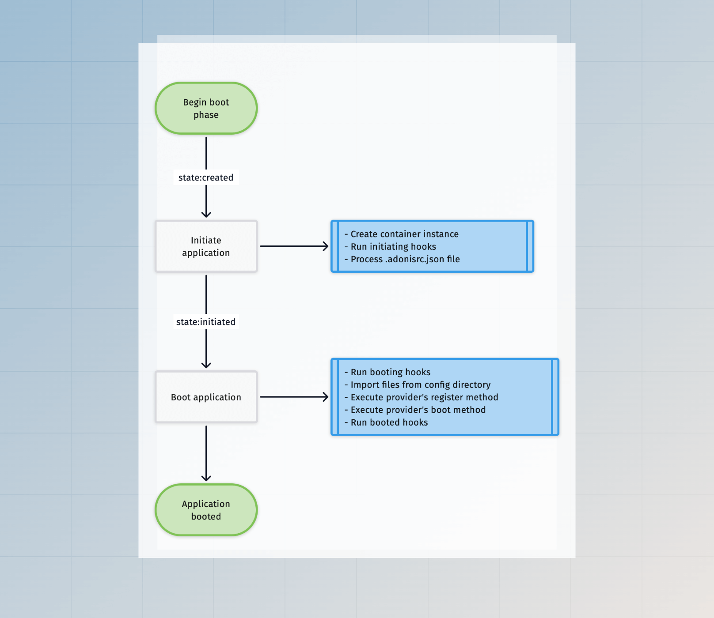
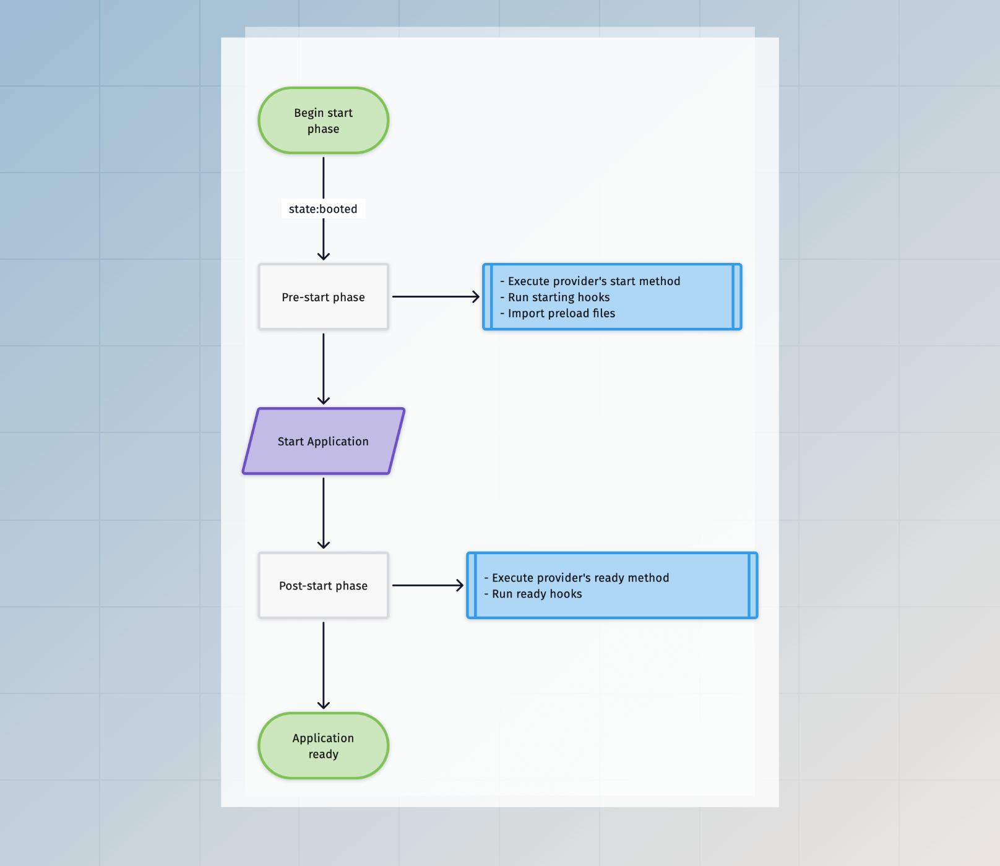
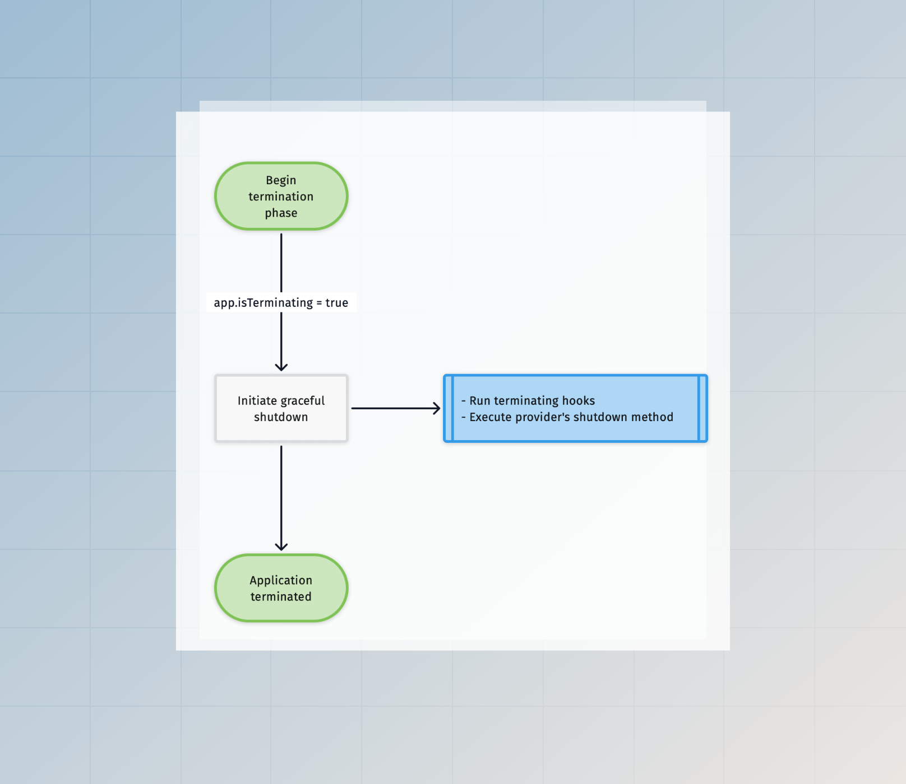

# 应用程序生命周期

在本指南中，我们将了解 AdonisJS 如何启动您的应用程序，以及在应用程序被认为准备好之前可以使用哪些生命周期钩子来更改应用程序状态。

应用程序的生命周期取决于它运行的环境。例如，启动用于服务 HTTP 请求的长运行进程的管理方式与短运行的 ace 命令不同。

因此，让我们了解每个受支持环境的应用程序生命周期。

## AdonisJS 应用程序如何启动

AdonisJS 应用程序有多个入口点，每个入口点都在特定的环境中启动应用程序。以下入口点文件存储在 `bin` 目录中。

- `bin/server.ts` 入口点启动 AdonisJS 应用程序以处理 HTTP 请求。当您运行 `node ace serve` 命令时，我们在幕后作为子进程运行此文件。
- `bin/console.ts` 入口点启动 AdonisJS 应用程序以处理 CLI 命令。此文件在底层使用 [Ace](../ace/introduction.md)。
- `bin/test.ts` 入口点启动 AdonisJS 应用程序以使用 Japa 运行测试。

如果您打开这些文件中的任何一个，您会发现我们使用 [Ignitor](https://github.com/adonisjs/core/blob/main/src/ignitor/main.ts#L23) 模块来连接各个部分，然后启动应用程序。

Ignitor 模块封装了启动 AdonisJS 应用程序的逻辑。在底层，它执行以下操作。

- 创建 [Application](https://github.com/adonisjs/application/blob/main/src/application.ts) 类的一个实例。
- 初始化/启动应用程序。
- 执行主要操作以启动应用程序。例如，在 HTTP 服务器的情况下，`main` 操作涉及启动 HTTP 服务器。而在测试的情况下，`main` 操作涉及运行测试。

[Ignitor 代码库](https://github.com/adonisjs/core/tree/main/src/ignitor) 相对简单，因此请浏览源代码以更好地理解它。

## 启动阶段 (Boot phase)

除了 `console` 环境外，所有环境的启动阶段都保持相同。在 `console` 环境中，执行的命令决定是否启动应用程序。

只有在应用程序启动后，您才能使用容器绑定和服务。



## 开始阶段 (Start phase)

开始阶段在所有环境之间有所不同。此外，执行流程进一步分为以下子阶段

- `pre-start` 阶段是指在启动应用程序之前执行的操作。

- `post-start` 阶段是指在启动应用程序之后执行的操作。在 HTTP 服务器的情况下，这些操作将在 HTTP 服务器准备好接受新连接之后执行。



### 在 Web 环境中

在 Web 环境中，创建一个长运行的 HTTP 连接来监听传入请求，并且应用程序保持在 `ready` 状态，直到服务器崩溃或进程收到关闭信号。

### 在测试环境中

在测试环境中执行 **pre-start** 和 **post-start** 操作。之后，我们导入测试文件并执行测试。

### 在控制台环境中

在 `console` 环境中，执行的命令决定是否启动应用程序。

命令可以通过启用 `options.startApp` 标志来启动应用程序。因此，**pre-start** 和 **post-start** 操作将在命令的 `run` 方法之前运行。

```ts
import { BaseCommand } from '@adonisjs/core/ace'

export default class GreetCommand extends BaseCommand {
  static options = {
    startApp: true
  }
  
  async run() {
    console.log(this.app.isReady) // true
  }
}
```

## 终止阶段 (Termination phase)

应用程序的终止在短运行进程和长运行进程之间差异很大。

短运行命令或测试进程在主操作结束后开始终止。

长运行的 HTTP 服务器进程等待退出信号（如 `SIGTERM`）以开始终止过程。



### 响应进程信号

在所有环境中，当应用程序收到 `SIGTERM` 信号时，我们开始优雅的关闭过程。如果您使用 [pm2](https://pm2.keymetrics.io/docs/usage/signals-clean-restart/) 启动了应用程序，则优雅关闭将在收到 `SIGINT` 事件后发生。

### 在 Web 环境中

在 Web 环境中，应用程序保持运行，直到底层 HTTP 服务器因错误崩溃。在这种情况下，我们开始终止应用程序。

### 在测试环境中

在所有测试执行完毕后，开始优雅终止。

### 在控制台环境中

在 `console` 环境中，应用程序的终止取决于执行的命令。

除非启用了 `options.staysAlive` 标志，否则应用程序将在命令执行后立即终止，在这种情况下，命令应显式终止应用程序。

```ts
import { BaseCommand } from '@adonisjs/core/ace'

export default class GreetCommand extends BaseCommand {
  static options = {
    startApp: true,
    staysAlive: true,
  }
  
  async run() {
    await runSomeProcess()
    
    // 终止进程
    await this.terminate()
  }
}
```

## 生命周期钩子

生命周期钩子允许您挂钩到应用程序引导过程，并在应用程序经过不同状态时执行操作。

您可以使用服务提供者类监听钩子，或在应用程序类上内联定义它们。

### 内联回调

您应该在创建应用程序实例后立即注册生命周期钩子。

入口点文件 `bin/server.ts`、`bin/console.ts` 和 `bin/test.ts` 为不同环境创建新的应用程序实例，您可以在这些文件中注册内联回调。

```ts
const app = new Application(new URL('../', import.meta.url))

new Ignitor(APP_ROOT, { importer: IMPORTER })
  .tap((app) => {
    // highlight-start
    app.booted(() => {
      console.log('invoked after the app is booted')
    })
    
    app.ready(() => {
      console.log('invoked after the app is ready')
    })
    
    app.terminating(() => {
      console.log('invoked before the termination starts')
    })
    // highlight-end
  })
```

- `initiating`: 钩子操作在应用程序进入初始化状态之前调用。`adonisrc.ts` 文件在执行 `initiating` 钩子之后被解析。

- `booting`: 钩子操作在启动应用程序之前调用。配置文件在执行 `booting` 钩子之后被导入。

- `booted`: 钩子操作在所有服务提供者注册并启动之后调用。

- `starting`: 钩子操作在导入预加载文件之前调用。

- `ready`: 钩子操作在应用程序准备好之后调用。

- `terminating`: 钩子操作在优雅退出过程开始后调用。例如，此钩子可以关闭数据库连接或结束打开的流。

### 使用服务提供者

服务提供者将生命周期钩子定义为提供者类中的方法。我们建议使用服务提供者而不是内联回调，因为它们使一切井井有条。

以下是可用生命周期方法的列表。

```ts
import { ApplicationService } from '@adonisjs/core/types'

export default class AppProvider {
  constructor(protected app: ApplicationService) {}
  
  register() {
  }
  
  async boot() {
  }
  
  async start() {
  }
  
  async ready() {
  }
  
  async shutdown() {
  }
}
```

- `register`: register 方法在容器内注册绑定。此方法在设计上是同步的。

- `boot`: boot 方法用于启动或初始化您在容器内注册的绑定。

- `start`: start 方法在 `ready` 方法之前运行。它允许您执行 `ready` 钩子操作可能需要的操作。

- `ready`: ready 方法在应用程序被认为准备好之后运行。

- `shutdown`: shutdown 方法在应用程序开始优雅关闭时调用。您可以使用此方法关闭数据库连接或结束打开的流。
