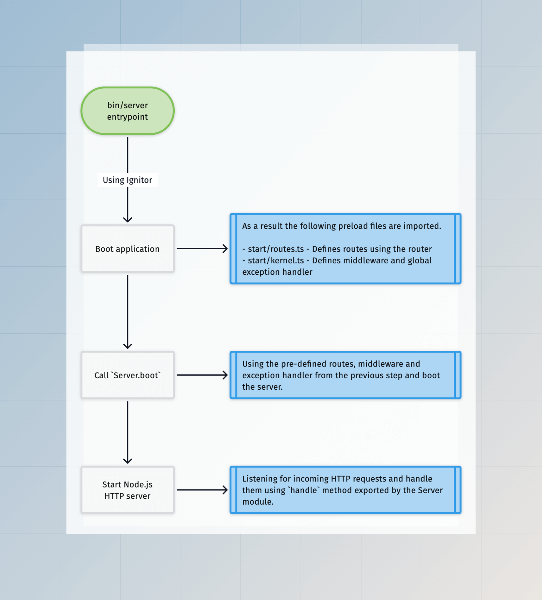

# HTTP 概览

AdonisJS 主要是一个用于创建响应 HTTP 请求的应用程序的 Web 框架。在本指南中，我们将了解 AdonisJS 如何启动 HTTP 服务器，处理传入请求，以及 HTTP 层可用的模块。

## HTTP 层

AdonisJS 应用程序中的 HTTP 层由以下模块组成。值得一提的是，AdonisJS 的 HTTP 层是从头开始构建的，底层没有使用任何微框架。

<dl>

<dt>

[路由器 (Router)](../basics/routing.md)

</dt>

<dd>

[路由器模块](https://github.com/adonisjs/http-server/blob/main/src/router/main.ts) 负责定义应用程序的端点，这些端点被称为路由。一个路由应该定义一个负责处理请求的处理程序。处理程序可以是一个闭包或对控制器的引用。

</dd>

<dt>

[控制器 (Controllers)](../basics/controllers.md)

</dt>

<dd>

控制器是 JavaScript 类，您可以将其绑定到路由以处理 HTTP 请求。控制器充当组织层，帮助您将应用程序的业务逻辑划分到不同的文件/类中。

</dd>

<dt>

[HttpContext](./http_context.md)

</dt>

<dd>

AdonisJS 为每个传入的 HTTP 请求创建一个 [HttpContext](https://github.com/adonisjs/http-server/blob/main/src/http_context/main.ts) 类的实例。HttpContext（又名 `ctx`）携带给定请求的信息，如请求体、标头、认证用户等。

</dd>

<dt>

[中间件 (Middleware)](../basics/middleware.md)

</dt>

<dd>

AdonisJS 中的中间件管道是 [责任链](https://refactoring.guru/design-patterns/chain-of-responsibility) 设计模式的实现。您可以使用中间件拦截 HTTP 请求，并在它们到达路由处理程序之前对其进行响应。

</dd>

<dt>

[全局异常处理器 (Global Exception handler)](../basics/exception_handling.md)

</dt>

<dd>

全局异常处理器在一个中心位置处理 HTTP 请求期间引发的异常。您可以使用全局异常处理器将异常转换为 HTTP 响应或将其报告给外部日志记录服务。

</dd>

<dt>

服务器 (Server)

</dt>

<dd>

[服务器模块](https://github.com/adonisjs/http-server/blob/main/src/server/main.ts) 连接路由器、中间件、全局异常处理器，并导出 [一个 `handle` 函数](https://github.com/adonisjs/http-server/blob/main/src/server/main.ts#L330)，您可以将其绑定到 Node.js HTTP 服务器以处理请求。

</dd>

</dl>

## AdonisJS 如何启动 HTTP 服务器

一旦您调用 Server 类上的 [`boot` 方法](https://github.com/adonisjs/http-server/blob/main/src/server/main.ts#L252)，HTTP 服务器就会启动。在底层，此方法执行以下操作。

- 创建中间件管道
- 编译路由
- 导入并实例化全局异常处理器

在典型的 AdonisJS 应用程序中，`boot` 方法由 `bin/server.ts` 文件中的 [Ignitor](https://github.com/adonisjs/core/blob/main/src/ignitor/http.ts) 模块调用。

此外，必须在调用 `boot` 方法之前定义路由、中间件和全局异常处理器，AdonisJS 使用 `start/routes.ts` 和 `start/kernel.ts` [预加载文件](./adonisrc_file.md#preloads) 来实现这一点。

## HTTP 请求生命周期

现在我们有了一个监听传入请求的 HTTP 服务器。让我们看看 AdonisJS 如何处理给定的 HTTP 请求。

:::note

**另请参阅：**\
[中间件执行流程](../basics/middleware.md#middleware-execution-flow)\
[中间件和异常处理](../basics/middleware.md#middleware-and-exception-handling)

:::

<dl>

<dt> 创建 HttpContext </dt>

<dd>

作为第一步，服务器模块创建 [HttpContext](./http_context.md) 类的一个实例，并将其作为引用传递给中间件、路由处理程序和全局异常处理器。

如果您启用了 [AsyncLocalStorage](./async_local_storage.md#usage)，那么同一个实例将作为本地存储状态共享。

</dd>

<dt> 执行服务器中间件堆栈 </dt>

<dd>

接下来，执行 [服务器中间件堆栈](../basics/middleware.md#server-middleware-stack) 中的中间件。这些中间件可以在请求到达路由处理程序之前拦截并响应该请求。

此外，每个 HTTP 请求都会经过服务器中间件堆栈，即使您没有为给定的端点定义任何路由器。这允许服务器中间件在不依赖路由系统的情况下向应用程序添加功能。

</dd>

<dt> 查找匹配的路由 </dt>

<dd>

如果服务器中间件没有结束请求，我们会查找与 `req.url` 属性匹配的路由。当不存在匹配的路由时，请求将以 `404 - Not found` 异常中止。否则，我们将继续处理请求。

</dd>

<dt> 执行路由中间件 </dt>

<dd>

一旦找到匹配的路由，我们将执行 [路由器全局中间件](../basics/middleware.md#router-middleware-stack) 和 [命名中间件堆栈](../basics/middleware.md#named-middleware-collection). 同样，中间件可以在请求到达路由处理程序之前拦截该请求。

</dd>

<dt> 执行路由处理程序 </dt>

<dd>

作为最后一步，请求到达路由处理程序并向客户端返回响应。

假设在过程中的任何步骤引发了异常。在这种情况下，请求将移交给全局异常处理器，该处理器负责将异常转换为响应。

</dd>

<dt> 序列化响应 </dt>

<dd>

一旦您使用 `response.send` 方法定义了响应体或从路由处理程序返回了一个值，我们将开始响应序列化过程并设置适当的标头。

了解更多关于 [响应体序列化](../basics/response.md#response-body-serialization) 的信息

</dd>

</dl>
