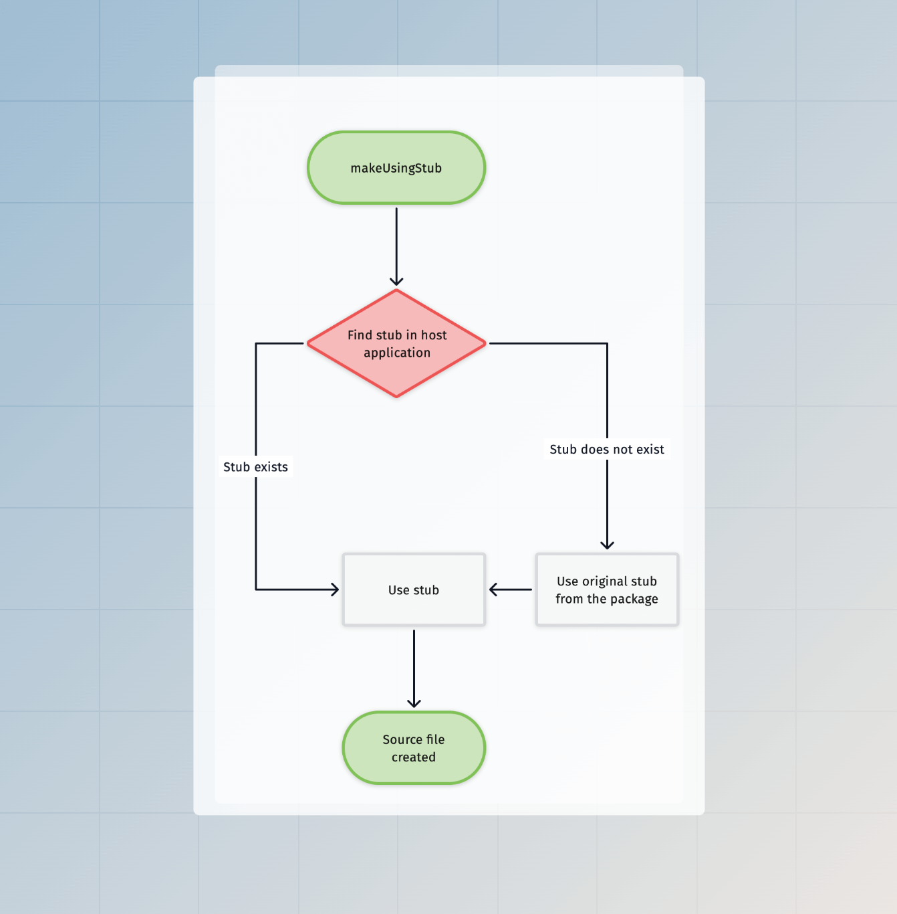

# 脚手架和 codemods

脚手架（Scaffolding）是指从静态模板（即 stubs）生成源文件的过程，而 codemods 是指通过解析 AST 来更新 TypeScript 源代码。

AdonisJS 使用这两者来加速创建新文件和配置包的重复任务。在本指南中，我们将介绍脚手架的构建块，并介绍可以在 Ace 命令中使用的 codemods API。

## 构建块

### Stubs

Stubs 是指模板，用于在给定操作上创建源文件。例如，`make:controller` 命令使用[控制器 stub](https://github.com/adonisjs/core/blob/main/stubs/make/controller/main.stub) 在宿主项目中创建控制器文件。

### 生成器

生成器（Generators）强制执行命名约定，并根据预定义的约定生成文件、类或方法名称。

例如，控制器 stubs 使用 [controllerName](https://github.com/adonisjs/application/blob/main/src/generators.ts#L122) 和 [controllerFileName](https://github.com/adonisjs/application/blob/main/src/generators.ts#L139) 生成器来创建控制器。

由于生成器被定义为对象，因此你可以覆盖现有方法来调整约定。我们将在本指南后面了解更多相关信息。

### Codemods

Codemods API 来自 [@adonisjs/assembler](https://github.com/adonisjs/assembler/blob/main/src/code_transformer/main.ts) 包，它在底层使用 [ts-morph](https://github.com/dsherret/ts-morph)。

由于 `@adonisjs/assembler` 是开发依赖项，因此 `ts-morph` 不会在生产环境中增加项目依赖项。这也意味着，codemods API 在生产环境中不可用。

AdonisJS 暴露的 codemods API 非常具体，用于完成高级任务，例如**向 `.adonisrc.ts` 文件添加提供者**，或**在 `start/kernel.ts` 文件中注册中间件**。此外，这些 API 依赖于默认的命名约定，因此如果你对项目进行了大幅更改，你将无法运行 codemods。

### Configure 命令

Configure 命令用于配置 AdonisJS 包。在底层，此命令导入主入口点文件并执行所提及包导出的 `configure` 方法。

包的 `configure` 方法接收 [Configure 命令](https://github.com/adonisjs/core/blob/main/commands/configure.ts)的实例，因此，它可以直接从命令实例访问 stubs 和 codemods API。

## 使用 stubs

大多数时候，你将在 Ace 命令中使用 stubs，或者在你创建的包的 `configure` 方法中使用。你可以通过 Ace 命令的 `createCodemods` 方法在这两种情况下初始化 codemods 模块。

`codemods.makeUsingStub` 方法从 stub 模板创建源文件。它接受以下参数：

- 存储 stubs 的目录的根 URL。
- 从 `STUBS_ROOT` 目录到 stub 文件（包括扩展名）的相对路径。
- 以及要与 stub 共享的数据对象。

```ts
// title: 在命令内部
import { BaseCommand } from '@adonisjs/core/ace'

const STUBS_ROOT = new URL('./stubs', import.meta.url)

export default class MakeApiResource extends BaseCommand {
  async run() {
    // highlight-start
    const codemods = await this.createCodemods()
    await codemods.makeUsingStub(STUBS_ROOT, 'api_resource.stub', {})
    // highlight-end
  }
}
```

### Stubs 模板

我们使用 [Tempura](https://github.com/lukeed/tempura) 模板引擎来处理带有运行时数据的 stubs。Tempura 是一个超轻量级的 handlebars 风格的 JavaScript 模板引擎。

:::tip

由于 Tempura 的语法与 handlebars 兼容，你可以将代码编辑器设置为对 `.stub` 文件使用 handlebars 语法高亮显示。

:::

在以下示例中，我们创建一个输出 JavaScript 类的 stub。它使用双花括号来评估运行时值。

```handlebars
export default class {{ modelName }}Resource {
  serialize({{ modelReference }}: {{ modelName }}) {
    return {{ modelReference }}.toJSON()
  }
}
```

### 使用生成器

如果你现在执行上面的 stub，它将失败，因为我们没有提供 `modelName` 和 `modelReference` 数据属性。

我们建议使用内联变量在 stub 中计算这些属性。这样，宿主应用程序可以[弹出 stub](#ejecting-stubs) 并修改变量。

```js
// insert-start
{{#var entity = generators.createEntity('user')}}
{{#var modelName = generators.modelName(entity.name)}}
{{#var modelReference = string.camelCase(modelName)}}
// insert-end

export default class {{ modelName }}Resource {
  serialize({{ modelReference }}: {{ modelName }}) {
    return {{ modelReference }}.toJSON()
  }
}
```

### 输出目标

最后，我们必须指定使用 stub 创建的文件的目标路径。我们再次在 stub 文件中指定目标路径，因为它允许宿主应用程序[弹出 stub](#ejecting-stubs) 并自定义其输出目标。

目标路径使用 `exports` 函数定义。该函数接受一个对象并将其导出为 stub 的输出状态。稍后，codemods API 使用此对象在指定位置创建文件。

```js
{{#var entity = generators.createEntity('user')}}
{{#var modelName = generators.modelName(entity.name)}}
{{#var modelReference = string.camelCase(modelName)}}
// insert-start
{{#var resourceFileName = string(modelName).snakeCase().suffix('_resource').ext('.ts').toString()}}
{{{
  exports({
    to: app.makePath('app/api_resources', entity.path, resourceFileName)
  })
}}}
// insert-end
export default class {{ modelName }}Resource {
  serialize({{ modelReference }}: {{ modelName }}) {
    return {{ modelReference }}.toJSON()
  }
}
```

### 通过命令接受实体名称

现在，我们在 stub 中硬编码了实体名称为 `user`。但是，你应该接受它作为命令参数，并将其作为模板状态与 stub 共享。

```ts
import { BaseCommand, args } from '@adonisjs/core/ace'

export default class MakeApiResource extends BaseCommand {
  // insert-start
  @args.string({
    description: 'The name of the resource'
  })
  declare name: string
  // insert-end

  async run() {
    const codemods = await this.createCodemods()
    await codemods.makeUsingStub(STUBS_ROOT, 'api_resource.stub', {
      // insert-start
      name: this.name,
      // insert-end
    })
  }
}
```

```js
// delete-start
{{#var entity = generators.createEntity('user')}}
// delete-end
// insert-start
{{#var entity = generators.createEntity(name)}}
// insert-end
{{#var modelName = generators.modelName(entity.name)}}
{{#var modelReference = string.camelCase(modelName)}}
{{#var resourceFileName = string(modelName).snakeCase().suffix('_resource').ext('.ts').toString()}}
{{{
  exports({
    to: app.makePath('app/api_resources', entity.path, resourceFileName)
  })
}}}
export default class {{ modelName }}Resource {
  serialize({{ modelReference }}: {{ modelName }}) {
    return {{ modelReference }}.toJSON()
  }
}
```

### 全局变量

以下全局变量始终与 stub 共享。

| 变量 | 描述 |
|---|---|
| `app` | [application 类](./application.md)实例的引用。 |
| `generators` | [generators 模块](https://github.com/adonisjs/application/blob/main/src/generators.ts)的引用。 |
| `randomString` | [randomString](../references/helpers.md#random) 辅助函数的引用。 |
| `string` | 创建 [string builder](../references/helpers.md#string-builder) 实例的函数。你可以使用 string builder 对字符串应用转换。 |
| `flags` | 运行 ace 命令时定义的命令行标志。 |


## 弹出 stubs

你可以使用 `node ace eject` 命令在 AdonisJS 应用程序中弹出/复制 stubs。eject 命令接受原始 stub 文件或其父目录的路径，并将模板复制到项目根目录下的 `stubs` 目录中。

在以下示例中，我们将从 `@adonisjs/core` 包中复制 `make/controller/main.stub` 文件。

```sh
node ace eject make/controller/main.stub
```

如果你打开 stub 文件，它将包含以下内容。

```js
{{#var controllerName = generators.controllerName(entity.name)}}
{{#var controllerFileName = generators.controllerFileName(entity.name)}}
{{{
  exports({
    to: app.httpControllersPath(entity.path, controllerFileName)
  })
}}}
// import type { HttpContext } from '@adonisjs/core/http'

export default class {{ controllerName }} {
}
```

- 在前两行中，我们使用 [generators 模块](https://github.com/adonisjs/application/blob/main/src/generators.ts)生成控制器类名和控制器文件名。
- 从第 3 行到第 7 行，我们使用 `exports` 函数[定义控制器文件的目标路径](#using-cli-flags-to-customize-stub-output-destination)。
- 最后，我们定义了脚手架控制器的内容。

随意修改 stub。下次运行 `make:controller` 命令时，将采用这些更改。

### 弹出目录

你可以使用 `eject` 命令弹出一个包含 stubs 的整个目录。传递目录的路径，该命令将复制整个目录。

```sh
# Publish all the make stubs
node ace eject make

# Publish all the make:controller stubs
node ace eject make/controller
```

### 使用 CLI 标志自定义 stub 输出目标
所有脚手架命令都与 stub 模板共享 CLI 标志（包括不支持的标志）。因此，你可以使用它们来创建自定义工作流或更改输出目标。

在下面的示例中，我们使用 `--feature` 标志在提到的 features 目录中创建一个控制器。

```sh
node ace make:controller invoice --feature=billing
```

```js
// title: Controller stub
{{#var controllerName = generators.controllerName(entity.name)}}
// insert-start
{{#var featureDirectoryName = flags.feature}}
// insert-end
{{#var controllerFileName = generators.controllerFileName(entity.name)}}
{{{
  exports({
    // delete-start
    to: app.httpControllersPath(entity.path, controllerFileName)
    // delete-end
    // insert-start
    to: app.makePath('features', featureDirectoryName, controllerFileName)
    // insert-end
  })
}}}
// import type { HttpContext } from '@adonisjs/core/http'

export default class {{ controllerName }} {
}
```

### 从其他包弹出 stubs

默认情况下，`eject` 命令从 `@adonisjs/core` 包复制模板。但是，你可以使用 `--pkg` 标志从其他包复制 stubs。

```sh
node ace eject make/migration/main.stub --pkg=@adonisjs/lucid
```

### 如何找到要复制的 stubs？
你可以通过访问其 GitHub 仓库找到包的 stubs。我们将所有 stubs 存储在包根目录下的 `stubs` 目录中。

## Stubs 执行流程
这是我们通过 `makeUsingStub` 方法查找和执行 stubs 的可视化表示。



## Codemods API
Codemods API 由 [ts-morph](https://github.com/dsherret/ts-morph) 提供支持，仅在开发期间可用。你可以使用 `command.createCodemods` 方法延迟实例化 codemods 模块。`createCodemods` 方法返回 [Codemods](https://github.com/adonisjs/core/blob/main/modules/ace/codemods.ts) 类的一个实例。

```ts
import type Configure from '@adonisjs/core/commands/configure'

export async function configure(command: ConfigureCommand) {
  const codemods = await command.createCodemods()
}
```

### defineEnvValidations
定义环境变量的验证规则。该方法接受键值对变量。`key` 是环境变量名，`value` 是作为字符串的验证表达式。

:::note
此 codemod 期望 `start/env.ts` 文件存在，并且必须具有 `export default await Env.create` 方法调用。

此外，codemod 不会覆盖给定环境变量的现有验证规则。这样做是为了尊重应用程序内的修改。
:::

```ts
const codemods = await command.createCodemods()

try {
  await codemods.defineEnvValidations({
    leadingComment: 'App environment variables',
    variables: {
      PORT: 'Env.schema.number()',
      HOST: 'Env.schema.string()',
    }
  })
} catch (error) {
  console.error('Unable to define env validations')
  console.error(error)
}
```

```ts
// title: Output
import { Env } from '@adonisjs/core/env'

export default await Env.create(new URL('../', import.meta.url), {
  /**
   * App environment variables
   */
  PORT: Env.schema.number(),
  HOST: Env.schema.string(),
})
```

### defineEnvVariables
向 `.env` 和 `.env.example` 文件添加一个或多个新环境变量。该方法接受键值对变量。

```ts
const codemods = await command.createCodemods()

try {
  await codemods.defineEnvVariables({
    MY_NEW_VARIABLE: 'some-value',
    MY_OTHER_VARIABLE: 'other-value'
  })
} catch (error) {
  console.error('Unable to define env variables')
  console.error(error)
}
```

有时你可能希望 **不** 在 `.env.example` 文件中插入变量值。你可以使用 `omitFromExample` 选项来实现。

```ts
const codemods = await command.createCodemods()

await codemods.defineEnvVariables({
  MY_NEW_VARIABLE: 'SOME_VALUE',
}, {
  omitFromExample: ['MY_NEW_VARIABLE']
})
```

上面的代码将在 `.env` 文件中插入 `MY_NEW_VARIABLE=SOME_VALUE`，并在 `.env.example` 文件中插入 `MY_NEW_VARIABLE=`。

### registerMiddleware
将 AdonisJS 中间件注册到已知的中间件堆栈之一。该方法接受中间件堆栈和要注册的中间件数组。

中间件堆栈可以是 `server | router | named` 之一。

:::note
此 codemod 期望 `start/kernel.ts` 文件存在，并且必须具有你要为其注册中间件的中间件堆栈的函数调用。
:::

```ts
const codemods = await command.createCodemods()

try {
  await codemods.registerMiddleware('router', [
    {
      path: '@adonisjs/core/bodyparser_middleware'
    }
  ])
} catch (error) {
  console.error('Unable to register middleware')
  console.error(error)
}
```

```ts
// title: Output
import router from '@adonisjs/core/services/router'

router.use([
  () => import('@adonisjs/core/bodyparser_middleware')
])
```

你可以按如下方式定义命名中间件。

```ts
const codemods = await command.createCodemods()

try {
  await codemods.registerMiddleware('named', [
    {
      name: 'auth',
      path: '@adonisjs/auth/auth_middleware'
    }
  ])
} catch (error) {
  console.error('Unable to register middleware')
  console.error(error)
}
```

### updateRcFile
在 `adonisrc.ts` 文件中注册 `providers`、`commands`，定义 `metaFiles` 和 `commandAliases`。

:::note
此 codemod 期望 `adonisrc.ts` 文件存在，并且必须具有 `export default defineConfig` 函数调用。
:::

```ts
const codemods = await command.createCodemods()

try {
  await codemods.updateRcFile((rcFile) => {
    rcFile
      .addProvider('@adonisjs/lucid/db_provider')
      .addCommand('@adonisjs/lucid/commands'),
      .setCommandAlias('migrate', 'migration:run')
  })
} catch (error) {
  console.error('Unable to update adonisrc.ts file')
  console.error(error)  
}
```

```ts
// title: Output
import { defineConfig } from '@adonisjs/core/app'

export default defineConfig({
  commands: [
    () => import('@adonisjs/lucid/commands')
  ],
  providers: [
    () => import('@adonisjs/lucid/db_provider')
  ],
  commandAliases: {
    migrate: 'migration:run'
  }
})
```

### registerJapaPlugin
将 Japa 插件注册到 `tests/bootstrap.ts` 文件。

:::note
此 codemod 期望 `tests/bootstrap.ts` 文件存在，并且必须具有 `export const plugins: Config['plugins']` 导出。
:::

```ts
const codemods = await command.createCodemods()

const imports = [
  {
    isNamed: false,
    module: '@adonisjs/core/services/app',
    identifier: 'app'
  },
  {
    isNamed: true,
    module: '@adonisjs/session/plugins/api_client',
    identifier: 'sessionApiClient'
  }
]
const pluginUsage = 'sessionApiClient(app)'

try {
  await codemods.registerJapaPlugin(pluginUsage, imports)
} catch (error) {
  console.error('Unable to register japa plugin')
  console.error(error)
}
```

```ts
// title: Output
import app from '@adonisjs/core/services/app'
import { sessionApiClient } from '@adonisjs/session/plugins/api_client'

export const plugins: Config['plugins'] = [
  sessionApiClient(app)
]
```

### registerPolicies
将 AdonisJS bouncer 策略注册到 `app/policies/main.ts` 文件导出的 `policies` 对象列表中。

:::note
此 codemod 期望 `app/policies/main.ts` 文件存在，并且必须从中导出 `policies` 对象。
:::

```ts
const codemods = await command.createCodemods()

try {
  await codemods.registerPolicies([
    {
      name: 'PostPolicy',
      path: '#policies/post_policy'
    }
  ])
} catch (error) {
  console.error('Unable to register policy')
  console.error(error)
}
```

```ts
// title: Output
export const policies = {
  PostPolicy: () => import('#policies/post_policy')
}
```

### registerVitePlugin

将 Vite 插件注册到 `vite.config.ts` 文件。

:::note
此 codemod 期望 `vite.config.ts` 文件存在，并且必须具有 `export default defineConfig` 函数调用。
:::

```ts
const transformer = new CodeTransformer(appRoot)
const imports = [
  {
    isNamed: false,
    module: '@vitejs/plugin-vue',
    identifier: 'vue'
  },
]
const pluginUsage = 'vue({ jsx: true })'

try {
  await transformer.addVitePlugin(pluginUsage, imports)
} catch (error) {
  console.error('Unable to register vite plugin')
  console.error(error)
}
```

```ts
// title: Output
import { defineConfig } from 'vite'
import vue from '@vitejs/plugin-vue'

export default defineConfig({
  plugins: [
    vue({ jsx: true })
  ]
})
```

### installPackages

使用用户项目中检测到的包管理器安装一个或多个包。

```ts
const codemods = await command.createCodemods()

try {
  await codemods.installPackages([
    { name: 'vinejs', isDevDependency: false },
    { name: 'edge', isDevDependency: false }
  ])
} catch (error) {
  console.error('Unable to install packages')
  console.error(error)
}
```

### getTsMorphProject

`getTsMorphProject` 方法返回 `ts-morph` 的实例。当你想要执行 Codemods API 未涵盖的自定义文件转换时，这非常有用。

```ts
const project = await codemods.getTsMorphProject()

project.getSourceFileOrThrow('start/routes.ts')
```

请务必阅读 [ts-morph 文档](https://ts-morph.com/) 以了解有关可用 API 的更多信息。
