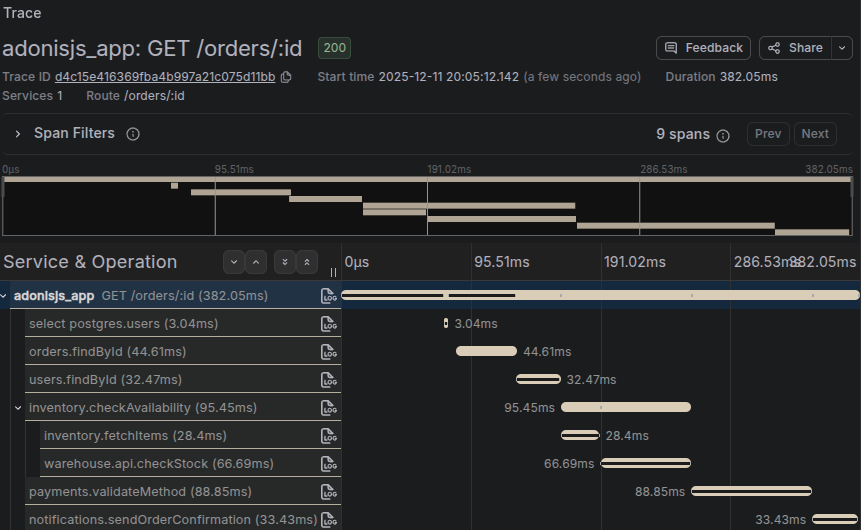

# OpenTelemetry

This guide covers OpenTelemetry integration in AdonisJS applications. You will learn how to install and configure the `@adonisjs/otel` package, understand OpenTelemetry concepts like traces and spans, use automatic instrumentation for HTTP requests and database queries, create custom spans with helpers and decorators, propagate trace context across services, and configure sampling and exporters for production environments.

## Overview

OpenTelemetry is an open standard for collecting telemetry data from your applications: traces, metrics, and logs. The `@adonisjs/otel` package provides a seamless integration between AdonisJS and OpenTelemetry, giving you distributed tracing and automatic instrumentation with sensible defaults and zero-config setup.

Observability is essential for understanding what happens inside your application, especially in production. When a user reports that "the checkout page is slow," tracing lets you see exactly where time is spent: was it the database query? An external API call? A slow service? Without tracing, you're left guessing.

:::media

:::

This package handles the complexity of OpenTelemetry setup for you. Run a single command, and your application automatically traces HTTP requests, database queries, Redis operations, and more.

## OpenTelemetry concepts

Before diving into the implementation, you should understand a few core OpenTelemetry concepts. For a comprehensive introduction, see the [official OpenTelemetry documentation](https://opentelemetry.io/docs/concepts/observability-primer/).

A **trace** represents the complete journey of a request through your system. When a user hits your API, the trace captures everything that happens: the HTTP request, database queries, cache lookups, calls to external services, and the response.

A **span** is a single unit of work within a trace. Each database query, HTTP request, or function call can be a span. Spans have a start time, duration, name, and attributes (key-value metadata). Spans are nested hierarchically: a parent span for the HTTP request contains child spans for each database query made during that request.

**Attributes** are key-value pairs attached to spans that provide context. For example, an HTTP span might have attributes like `http.method: GET`, `http.route: /users/:id`, and `http.status_code: 200`.

## Installation

Install and configure the package using the following command:

```sh
node ace add @adonisjs/otel
```

This command creates `otel.ts` at the root of your project with the OpenTelemetry initialization, adds the import at the top of `bin/server.ts`, registers the provider and middleware, and sets up environment variables.

That's it. Your application now has automatic tracing for HTTP requests, database queries, and more.

:::warning

**The import order is critical**

OpenTelemetry must initialize before any other code loads. The SDK needs to patch libraries like `http`, `pg`, and `redis` before they're imported. That's why `otel.ts` is imported as the very first line in `bin/server.ts`.

If you move or remove the `import './otel.js'` line, auto-instrumentation will not work. You'll still be able to create manual spans, but automatic tracing of HTTP requests and database queries won't be captured.

:::

## Manual setup

If you prefer not to use `node ace add`, here's what it configures.

First, create a file at `otel.ts` with the OpenTelemetry initialization:

```ts 
// title: otel.ts
import { init } from '@adonisjs/otel/init'

await init(import.meta.dirname)
```

Then update `bin/server.ts` to import it as the very first line:

```ts 
// title: bin/server.ts
/**
 * OpenTelemetry initialization - MUST be the first import
 */
import './otel.js'

import { Ignitor } from '@adonisjs/core'
// ... rest of your server setup
```

Add the provider in `adonisrc.ts` to hook into AdonisJS's exception handler and record errors in spans:

```ts 
// title: adonisrc.ts
{
  providers: [
    // ... other providers
    () => import('@adonisjs/otel/otel_provider'),
  ]
}
```

Finally, add the middleware as the first router middleware in `start/kernel.ts` to enrich HTTP spans with route information:

```ts 
// title: start/kernel.ts
router.use([
  () => import('@adonisjs/otel/otel_middleware'),
  // ... other middlewares
])
```

## Configuration

The configuration file is located at `config/otel.ts`:

```ts 
// title: config/otel.ts
import { defineConfig } from '@adonisjs/otel'
import env from '#start/env'

export default defineConfig({
  serviceName: env.get('APP_NAME'),
  serviceVersion: env.get('APP_VERSION'),
  environment: env.get('APP_ENV'),
})
```

### Service identification

The package resolves service metadata from multiple sources:

| Option           | Environment Variable              | Default           |
| ---------------- | --------------------------------- | ----------------- |
| `serviceName`    | `OTEL_SERVICE_NAME` or `APP_NAME` | `unknown_service` |
| `serviceVersion` | `APP_VERSION`                     | `0.0.0`           |
| `environment`    | `APP_ENV`                         | `development`     |

### Exporters

By default, the package exports traces using OTLP over gRPC to `localhost:4317`. This is the standard OpenTelemetry Collector endpoint. If you're running an OpenTelemetry Collector locally or in your infrastructure, traces will be sent there automatically.

You can configure the exporter endpoint using environment variables without changing any code:

```dotenv
# title: .env
OTEL_EXPORTER_OTLP_ENDPOINT=https://otel-collector.example.com:4317
```

For authentication or custom headers:

```dotenv
# title: .env
OTEL_EXPORTER_OTLP_HEADERS=x-api-key=your-api-key
```

See the [OpenTelemetry environment variable specification](https://opentelemetry.io/docs/specs/otel/configuration/sdk-environment-variables/) for all available options, and check [Advanced configuration](#advanced-configuration) for even more customization.

### Debug mode

Enable debug mode to print spans to the console during development:

```ts 
// title: config/otel.ts
import { defineConfig } from '@adonisjs/otel'

export default defineConfig({
  serviceName: 'my-app',
  debug: true,
})
```

This adds a `ConsoleSpanExporter` that outputs spans to your terminal, helping you visualize traces without setting up a collector.

### Enabling and disabling

OpenTelemetry is automatically disabled when `NODE_ENV === 'test'` to avoid noise during tests. You can override this behavior:

```ts 
// title: config/otel.ts
import { defineConfig } from '@adonisjs/otel'

export default defineConfig({
  serviceName: 'my-app',
  
  /**
   * Force enable in tests
   */
  enabled: true,
  
  /**
   * Or force disable in any environment
   */
  enabled: false,
})
```

### Sampling

In high-traffic production environments, tracing every single request generates enormous amounts of data. Sampling controls what percentage of traces are collected:

```ts 
// title: config/otel.ts
import { defineConfig } from '@adonisjs/otel'

export default defineConfig({
  serviceName: 'my-app',
  
  /**
   * Sample 10% of traces (recommended for high-traffic production)
   */
  samplingRatio: 0.1,
  
  /**
   * Sample 100% of traces (default, good for development)
   */
  samplingRatio: 1.0,
})
```

The sampler uses parent-based sampling, meaning child spans inherit the sampling decision from their parent. This ensures you always get complete traces rather than fragments.

See also: [OpenTelemetry Sampling documentation](https://opentelemetry.io/docs/concepts/sampling/)

:::note

If you provide a custom `sampler` option, `samplingRatio` is ignored.

:::

## Automatic instrumentation

The package automatically instruments common libraries without any code changes. Out of the box, you get tracing for HTTP requests (incoming and outgoing), Lucid database queries (via Knex), Redis operations, and more.

### Default ignored URLs

To reduce noise, the following endpoints are excluded from tracing by default:

- `/health`, `/healthz`, `/ready`, `/readiness`
- `/metrics`, `/internal/metrics`, `/internal/healthz`
- `/favicon.ico`

### Customizing instrumentations

You can configure individual instrumentations or add custom ignored URLs:

```ts 
// title: config/otel.ts
import { defineConfig } from '@adonisjs/otel'

export default defineConfig({
  serviceName: 'my-app',
  
  instrumentations: {
    /**
     * Add custom ignored URLs (merged with defaults)
     */
    '@opentelemetry/instrumentation-http': {
      ignoredUrls: ['/internal/*', '/api/ping'],
      mergeIgnoredUrls: true,
    },
    
    /**
     * Disable a specific instrumentation
     */
    '@opentelemetry/instrumentation-pg': { enabled: false },
  },
})
```

## Creating custom spans

While automatic instrumentation covers most common operations, you'll often want to trace custom business logic. The package provides helpers and decorators for this purpose.

### Using the record helper

The `record` helper creates a span around a code section:

```ts 
// title: app/services/order_service.ts
import { record } from '@adonisjs/otel/helpers'

export default class OrderService {
  async processOrder(orderId: string) {
    /**
     * Wrap synchronous or asynchronous code in a span
     */
    const result = await record('order.process', async () => {
      const order = await Order.findOrFail(orderId)
      await this.validateInventory(order)
      await this.chargePayment(order)
      return order
    })
    
    return result
  }
  
  async validateInventory(order: Order) {
    /**
     * Access the span to add custom attributes
     */
    await record('order.validate_inventory', async (span) => {
      span.setAttributes({
        'order.id': order.id,
        'order.items_count': order.items.length,
      })
      
      // Validation logic...
    })
  }
}
```

### Using decorators

For class methods, decorators provide a cleaner syntax:

```ts 
// title: app/services/user_service.ts
import { span, spanAll } from '@adonisjs/otel/decorators'

export default class UserService {
  /**
   * Creates a span named "UserService.findById"
   */
  @span()
  async findById(id: string) {
    return User.find(id)
  }
  
  /**
   * Custom span name and attributes
   */
  @span({ name: 'user.create', attributes: { operation: 'create' } })
  async create(data: UserData) {
    return User.create(data)
  }
}
```

To automatically trace all methods of a class, use the `@spanAll` decorator:

```ts 
// title: app/services/payment_service.ts
import { spanAll } from '@adonisjs/otel/decorators'

/**
 * All methods get spans: "PaymentService.charge", "PaymentService.refund", etc.
 */
@spanAll()
export default class PaymentService {
  async charge(amount: number) {
    // ...
  }
  
  async refund(transactionId: string) {
    // ...
  }
}

/**
 * Custom prefix: "payment.charge", "payment.refund", etc.
 */
@spanAll({ prefix: 'payment' })
export default class PaymentService {
  // ...
}
```

### Setting attributes on the current span

Use `setAttributes` to add metadata to the currently active span without creating a new one:

```ts 
// title: app/controllers/orders_controller.ts
import { setAttributes } from '@adonisjs/otel/helpers'

export default class OrdersController {
  async store({ request }: HttpContext) {
    const data = request.all()
    
    /**
     * Add business context to the HTTP span
     */
    setAttributes({
      'order.type': data.type,
      'order.total': data.total,
      'customer.tier': data.customerTier,
    })
    
    // Process order...
  }
}
```

### Recording events

Events are time-stamped annotations within a span. Use them to mark significant moments:

```ts 
// title: app/services/checkout_service.ts
import { recordEvent } from '@adonisjs/otel/helpers'

export default class CheckoutService {
  async process(cart: Cart) {
    recordEvent('checkout.started')
    
    await this.validateCart(cart)
    recordEvent('checkout.cart_validated')
    
    const payment = await this.processPayment(cart)
    recordEvent('checkout.payment_processed', {
      'payment.method': payment.method,
      'payment.amount': payment.amount,
    })
    
    await this.fulfillOrder(cart)
    recordEvent('checkout.completed')
  }
}
```

## Context propagation

When your application calls other services or processes background jobs, you need to propagate the trace context so all operations appear in the same trace.

### Propagating to HTTP calls

Inject trace context into outgoing HTTP request headers:

```ts 
// title: app/services/external_api_service.ts
import { injectTraceContext } from '@adonisjs/otel/helpers'

export default class ExternalApiService {
  async fetchUserData(userId: string) {
    const headers: Record<string, string> = {
      'Content-Type': 'application/json',
    }
    
    /**
     * Adds traceparent and tracestate headers
     */
    injectTraceContext(headers)
    
    const response = await fetch(`https://api.example.com/users/${userId}`, {
      headers,
    })
    
    return response.json()
  }
}
```

### Propagating to queue jobs

When dispatching background jobs, include the trace context:

```ts 
// title: app/controllers/orders_controller.ts
import { injectTraceContext } from '@adonisjs/otel/helpers'

export default class OrdersController {
  async store({ request }: HttpContext) {
    const order = await Order.create(request.all())
    
    /**
     * Include trace context in job metadata
     */
    const traceHeaders: Record<string, string> = {}
    injectTraceContext(traceHeaders)
    
    await queue.dispatch('process-order', {
      orderId: order.id,
      traceContext: traceHeaders,
    })
    
    return order
  }
}
```

In your queue worker, extract the context and continue the trace:

```ts 
// title: app/jobs/process_order_job.ts
import { extractTraceContext, record } from '@adonisjs/otel/helpers'
import { context } from '@adonisjs/otel'

export default class ProcessOrderJob {
  async handle(payload: { orderId: string; traceContext: Record<string, string> }) {
    /**
     * Extract the trace context from the job payload
     */
    const extractedContext = extractTraceContext(payload.traceContext)
    
    /**
     * Run the job within the extracted context
     */
    await context.with(extractedContext, async () => {
      await record('job.process_order', async () => {
        /**
         * This span will be a child of the original HTTP request span
         */
        const order = await Order.findOrFail(payload.orderId)
        await this.fulfillOrder(order)
      })
    })
  }
}
```

## User context

When `@adonisjs/auth` is installed, the middleware automatically sets user attributes on spans if a user is authenticated. This includes `user.id`, `user.email` (if available), and `user.roles` (if available).

You can customize this behavior or add additional user attributes:

```ts 
// title: config/otel.ts
import { defineConfig } from '@adonisjs/otel'

export default defineConfig({
  serviceName: 'my-app',
  
  /**
   * Disable automatic user context
   */
  userContext: false,
  
  /**
   * Or customize with a resolver
   */
  userContext: {
    resolver: async (ctx) => {
      if (!ctx.auth.user) return null
      
      return {
        id: ctx.auth.user.id,
        tenantId: ctx.auth.user.tenantId,
        plan: ctx.auth.user.plan,
      }
    },
  },
})
```

You can also manually set user context anywhere in your code:

```ts 
// title: app/middleware/auth_middleware.ts
import { setUser } from '@adonisjs/otel/helpers'

export default class AuthMiddleware {
  async handle({ auth }: HttpContext, next: NextFn) {
    await auth.authenticate()
    
    setUser({
      id: auth.user!.id,
      email: auth.user!.email,
      role: auth.user!.role,
    })
    
    return next()
  }
}
```

## Logging integration

The package automatically injects trace context into Pino logs, adding `trace_id` and `span_id` to each log entry. This lets you correlate logs with traces in your observability platform.

When using `pino-pretty` for development, you can hide these fields for cleaner output:

```ts 
// title: config/logger.ts
import { defineConfig, targets } from '@adonisjs/core/logger'
import app from '@adonisjs/core/services/app'
import { otelLoggingPreset } from '@adonisjs/otel/helpers'

export default defineConfig({
  default: 'app',
  loggers: {
    app: {
      transport: {
        targets: targets()
          .pushIf(!app.inProduction, targets.pretty({ ...otelLoggingPreset() }))
          .toArray(),
      },
    },
  },
})
```

To keep specific fields visible:

```ts
otelLoggingPreset({ keep: ['trace_id', 'span_id'] })
```

## Advanced configuration

The `defineConfig` function accepts all options from the [OpenTelemetry Node SDK](https://opentelemetry.io/docs/languages/js/getting-started/nodejs/), giving power users full control:

```ts 
// title: config/otel.ts
import { defineConfig } from '@adonisjs/otel'
import { BatchSpanProcessor } from '@opentelemetry/sdk-trace-base'
import { OTLPTraceExporter } from '@opentelemetry/exporter-trace-otlp-http'

export default defineConfig({
  serviceName: 'my-app',
  
  /**
   * Use HTTP instead of gRPC
   */
  traceExporter: new OTLPTraceExporter({
    url: 'https://otel-collector.example.com/v1/traces',
    headers: { 'x-api-key': process.env.OTEL_API_KEY },
  }),
  
  /**
   * Custom span processor with batching configuration
   */
  spanProcessors: [
    new BatchSpanProcessor(new OTLPTraceExporter(), {
      maxQueueSize: 2048,
      scheduledDelayMillis: 5000,
    }),
  ],
  
  /**
   * Custom resource attributes
   */
  resourceAttributes: {
    'deployment.region': 'eu-west-1',
    'k8s.pod.name': process.env.POD_NAME,
  },
})
```

See the [OpenTelemetry JS documentation](https://opentelemetry.io/docs/languages/js/) for all available options.

## Performance considerations

OpenTelemetry adds some overhead to your application. The SDK needs to create span objects, record timing information, and export data to your collector. In most applications, this overhead is negligible, but you should be aware of it.

For high-traffic production environments, consider these recommendations:

- **Use sampling** to reduce the volume of traces. A `samplingRatio` of `0.1` (10%) is often sufficient to identify issues while dramatically reducing overhead and storage costs.

- **Use batch processing** (the default) rather than sending spans immediately. The `BatchSpanProcessor` queues spans and sends them in batches, reducing network overhead.

- **Be selective with custom spans**. Automatic instrumentation covers most needs. Only add custom spans for business-critical operations where you need additional visibility. Don't over-instrument by using a `@spanAll` decorator on every single class.

See also: [OpenTelemetry Sampling documentation](https://opentelemetry.io/docs/concepts/sampling/)

## Helpers reference

All helpers are available from `@adonisjs/otel/helpers`:

| Helper                           | Description                                               |
| -------------------------------- | --------------------------------------------------------- |
| `getCurrentSpan()`               | Returns the currently active span, or `undefined` if none |
| `setAttributes(attributes)`      | Sets attributes on the current span                       |
| `record(name, fn)`               | Creates a span around a function                          |
| `recordEvent(name, attributes?)` | Records an event on the current span                      |
| `setUser(user)`                  | Sets user attributes on the current span                  |
| `injectTraceContext(carrier)`    | Injects trace context into a carrier object (headers)     |
| `extractTraceContext(carrier)`   | Extracts trace context from a carrier object              |
| `otelLoggingPreset(options?)`    | Returns pino-pretty options that hide OTEL fields         |
