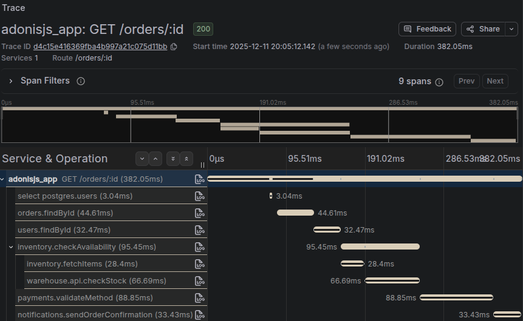

# OpenTelemetry

本指南涵盖了 AdonisJS 应用程序中的 OpenTelemetry 集成。你将学习如何安装和配置 `@adonisjs/otel` 包，理解 OpenTelemetry 的概念（如 traces 和 spans），对 HTTP 请求和数据库查询使用自动仪表化 (automatic instrumentation)，使用辅助函数和装饰器创建自定义 spans，跨服务传播追踪上下文，以及为生产环境配置采样和导出器。

## 概述

OpenTelemetry 是一个用于从应用程序收集遥测数据（traces、metrics 和 logs）的开放标准。`@adonisjs/otel` 包提供了 AdonisJS 和 OpenTelemetry 之间的无缝集成，为你提供分布式链路追踪和具有合理默认值及零配置设置的自动仪表化。

可观测性对于理解应用程序内部发生的事情至关重要，尤其是在生产环境中。当用户报告“结账页面很慢”时，追踪可以让你准确看到时间花在哪里：是数据库查询？外部 API 调用？还是缓慢的服务？没有追踪，你只能靠猜测。

:::media

:::

该包为你处理了 OpenTelemetry 设置的复杂性。只需运行一个命令，你的应用程序就会自动追踪 HTTP 请求、数据库查询、Redis 操作等。

## OpenTelemetry 概念

在深入实施之前，你应该了解一些核心的 OpenTelemetry 概念。有关全面的介绍，请参阅 [OpenTelemetry 官方文档](https://opentelemetry.io/docs/concepts/observability-primer/)。

**Trace (链路)** 代表请求在系统中经过的完整旅程。当用户访问你的 API 时，trace 会捕获发生的所有事情：HTTP 请求、数据库查询、缓存查找、对外部服务的调用以及响应。

**Span (跨度)** 是 trace 中的单个工作单元。每个数据库查询、HTTP 请求或函数调用都可以是一个 span。Span 具有开始时间、持续时间、名称和属性（键值元数据）。Span 是分层嵌套的：HTTP 请求的父 span 包含该请求期间进行的每个数据库查询的子 span。

**Attributes (属性)** 是附加到 span 的键值对，提供上下文信息。例如，HTTP span 可能具有 `http.method: GET`、`http.route: /users/:id` 和 `http.status_code: 200` 等属性。

## 安装

使用以下命令安装并配置该包：

```sh
node ace add @adonisjs/otel
```

此命令会在项目根目录下创建 `otel.ts` 文件以进行 OpenTelemetry 初始化，在 `bin/server.ts` 顶部添加导入，注册提供者和中间件，并设置环境变量。

就是这样。你的应用程序现在具有针对 HTTP 请求、数据库查询等的自动追踪功能。

:::warning

**导入顺序至关重要**

OpenTelemetry 必须在加载任何其他代码之前初始化。SDK 需要在导入 `http`、`pg` 和 `redis` 等库之前对其进行修补 (patch)。这就是为什么 `otel.ts` 被作为 `bin/server.ts` 中的第一行导入。

如果你移动或删除 `import './otel.js'` 行，自动仪表化将无法工作。你仍然可以创建手动 span，但 HTTP 请求和数据库查询的自动追踪将不会被捕获。

:::

## 手动设置

如果你不想使用 `node ace add`，以下是它的配置内容。

首先，在 `otel.ts` 中创建一个文件，用于 OpenTelemetry 初始化：

```ts
// title: otel.ts
import { init } from '@adonisjs/otel/init'

await init(import.meta.dirname)
```

然后更新 `bin/server.ts`，将其作为第一行导入：

```ts
// title: bin/server.ts
/**
 * OpenTelemetry initialization - MUST be the first import
 */
import './otel.js'

import { Ignitor } from '@adonisjs/core'
// ... rest of your server setup
```

在 `adonisrc.ts` 中添加提供者，以挂钩到 AdonisJS 的异常处理程序并在 span 中记录错误：

```ts
// title: adonisrc.ts
{
  providers: [
    // ... other providers
    () => import('@adonisjs/otel/otel_provider'),
  ]
}
```

最后，将中间件作为第一个路由器中间件添加到 `start/kernel.ts` 中，以使用路由信息丰富 HTTP span：

```ts
// title: start/kernel.ts
router.use([
  () => import('@adonisjs/otel/otel_middleware'),
  // ... other middlewares
])
```

## 配置

配置文件位于 `config/otel.ts`：

```ts
// title: config/otel.ts
import { defineConfig } from '@adonisjs/otel'
import env from '#start/env'

export default defineConfig({
  serviceName: env.get('APP_NAME'),
  serviceVersion: env.get('APP_VERSION'),
  environment: env.get('APP_ENV'),
})
```

### 服务标识

该包从多个来源解析服务元数据：

| 选项 | 环境变量 | 默认值 |
| ---------------- | --------------------------------- | ----------------- |
| `serviceName` | `OTEL_SERVICE_NAME` 或 `APP_NAME` | `unknown_service` |
| `serviceVersion` | `APP_VERSION` | `0.0.0` |
| `environment` | `APP_ENV` | `development` |

### 导出器 (Exporters)

默认情况下，该包使用 OTLP over gRPC 将 traces 导出到 `localhost:4317`。这是标准的 OpenTelemetry Collector 端点。如果你在本地或基础设施中运行 OpenTelemetry Collector，traces 将自动发送到那里。

你可以使用环境变量配置导出器端点，而无需更改任何代码：

```dotenv
OTEL_EXPORTER_OTLP_ENDPOINT=https://otel-collector.example.com:4317
```

对于身份验证或自定义头：

```dotenv
OTEL_EXPORTER_OTLP_HEADERS=x-api-key=your-api-key
```

请参阅 [OpenTelemetry 环境变量规范](https://opentelemetry.io/docs/specs/otel/configuration/sdk-environment-variables/) 以了解所有可用选项，并查看 [高级配置](#高级配置) 以获取更多自定义选项。

### 调试模式

启用调试模式以在开发期间将 span 打印到控制台：

```ts
// title: config/otel.ts
import { defineConfig } from '@adonisjs/otel'

export default defineConfig({
  serviceName: 'my-app',
  debug: true,
})
```

这将添加一个 `ConsoleSpanExporter`，将 span 输出到你的终端，帮助你在不设置收集器的情况下可视化 traces。

### 启用和禁用

为了避免测试期间的噪音，OpenTelemetry 在 `NODE_ENV === 'test'` 时自动禁用。你可以覆盖此行为：

```ts
// title: config/otel.ts
import { defineConfig } from '@adonisjs/otel'

export default defineConfig({
  serviceName: 'my-app',
  
  /**
   * Force enable in tests
   */
  enabled: true,
  
  /**
   * Or force disable in any environment
   */
  enabled: false,
})
```

### 采样 (Sampling)

在高流量的生产环境中，追踪每一个请求会产生大量数据。采样控制收集 trace 的百分比：

```ts
// title: config/otel.ts
import { defineConfig } from '@adonisjs/otel'

export default defineConfig({
  serviceName: 'my-app',
  
  /**
   * Sample 10% of traces (recommended for high-traffic production)
   */
  samplingRatio: 0.1,
  
  /**
   * Sample 100% of traces (default, good for development)
   */
  samplingRatio: 1.0,
})
```

采样器使用基于父级的采样，这意味着子 span 继承其父级的采样决策。这确保了你总是获得完整的 trace，而不是片段。

另请参阅：[OpenTelemetry 采样文档](https://opentelemetry.io/docs/concepts/sampling/)

:::note

如果你提供自定义 `sampler` 选项，`samplingRatio` 将被忽略。

:::

## 自动仪表化 (Automatic instrumentation)

在底层，`@adonisjs/otel` 使用官方的 [`@opentelemetry/auto-instrumentations-node`](https://github.com/open-telemetry/opentelemetry-js-contrib/tree/main/packages/auto-instrumentations-node#readme) 包。这意味着你无需更改任何代码即可获得对各种库的自动追踪：HTTP 请求（传入和传出）、数据库查询（PostgreSQL、MySQL、MongoDB）、Redis 操作以及 [更多](https://github.com/open-telemetry/opentelemetry-js-contrib/tree/main/packages/auto-instrumentations-node#supported-instrumentations)。

我们预先配置了合理的默认值，以便一切开箱即用。但是，你可以通过配置中的 `instrumentations` 选项覆盖任何仪表化设置。

### 默认忽略的 URL

为了减少噪音，默认情况下以下端点不被追踪：

- `/health`, `/healthz`, `/ready`, `/readiness`
- `/metrics`, `/internal/metrics`, `/internal/healthz`
- `/favicon.ico`
- 所有 `OPTIONS` 请求 (CORS 预检)

### 自定义仪表化

你可以配置单个仪表化或添加自定义忽略的 URL：

```ts
// title: config/otel.ts
import { defineConfig } from '@adonisjs/otel'
import { MyCustomInstrumentation } from 'my-custom-instrumentation'

export default defineConfig({
  serviceName: 'my-app',
  
  instrumentations: {
    /**
     * Add custom ignored URLs (merged with defaults)
     */
    '@opentelemetry/instrumentation-http': {
      ignoredUrls: ['/internal/*', '/api/ping'],
      mergeIgnoredUrls: true,
    },
    
    /**
     * Disable a specific instrumentation
     */
    '@opentelemetry/instrumentation-pg': { enabled: false },

    /**
     * Add a custom instrumentation
     */
    'my-custom-instrumentation': new MyCustomInstrumentation(),
  },
})
```

## 创建自定义 Spans

虽然自动仪表化涵盖了大多数常见操作，但你通常希望追踪自定义业务逻辑。该包为此提供了辅助函数和装饰器。

### 使用 record 辅助函数

`record` 辅助函数围绕代码段创建一个 span：

```ts
// title: app/services/order_service.ts
import { record } from '@adonisjs/otel/helpers'

export default class OrderService {
  async processOrder(orderId: string) {
    /**
     * Wrap synchronous or asynchronous code in a span
     */
    const result = await record('order.process', async () => {
      const order = await Order.findOrFail(orderId)
      await this.validateInventory(order)
      await this.chargePayment(order)
      return order
    })
    
    return result
  }
  
  async validateInventory(order: Order) {
    /**
     * Access the span to add custom attributes
     */
    await record('order.validate_inventory', async (span) => {
      span.setAttributes({
        'order.id': order.id,
        'order.items_count': order.items.length,
      })
      
      // Validation logic...
    })
  }
}
```

### 使用装饰器

对于类方法，装饰器提供了更简洁的语法：

```ts
// title: app/services/user_service.ts
import { span, spanAll } from '@adonisjs/otel/decorators'

export default class UserService {
  /**
   * Creates a span named "UserService.findById"
   */
  @span()
  async findById(id: string) {
    return User.find(id)
  }
  
  /**
   * Custom span name and attributes
   */
  @span({ name: 'user.create', attributes: { operation: 'create' } })
  async create(data: UserData) {
    return User.create(data)
  }
}
```

要自动追踪类的所有方法，请使用 `@spanAll` 装饰器：

```ts
// title: app/services/payment_service.ts
import { spanAll } from '@adonisjs/otel/decorators'

/**
 * All methods get spans: "PaymentService.charge", "PaymentService.refund", etc.
 */
@spanAll()
export default class PaymentService {
  async charge(amount: number) {
    // ...
  }
  
  async refund(transactionId: string) {
    // ...
  }
}

/**
 * Custom prefix: "payment.charge", "payment.refund", etc.
 */
@spanAll({ prefix: 'payment' })
export default class PaymentService {
  // ...
}
```

### 在当前 span 上设置属性

使用 `setAttributes` 将元数据添加到当前活动的 span，而无需创建新的 span：

```ts
// title: app/controllers/orders_controller.ts
import { setAttributes } from '@adonisjs/otel/helpers'

export default class OrdersController {
  async store({ request }: HttpContext) {
    const data = request.all()
    
    /**
     * Add business context to the HTTP span
     */
    setAttributes({
      'order.type': data.type,
      'order.total': data.total,
      'customer.tier': data.customerTier,
    })
    
    // Process order...
  }
}
```

### 记录事件

事件是 span 内的时间戳注释。使用它们来标记重要时刻：

```ts
// title: app/services/checkout_service.ts
import { recordEvent } from '@adonisjs/otel/helpers'

export default class CheckoutService {
  async process(cart: Cart) {
    recordEvent('checkout.started')
    
    await this.validateCart(cart)
    recordEvent('checkout.cart_validated')
    
    const payment = await this.processPayment(cart)
    recordEvent('checkout.payment_processed', {
      'payment.method': payment.method,
      'payment.amount': payment.amount,
    })
    
    await this.fulfillOrder(cart)
    recordEvent('checkout.completed')
  }
}
```

## 上下文传播 (Context propagation)

当你的应用程序调用其他服务或处理后台作业时，你需要传播追踪上下文，以便所有操作都出现在同一个 trace 中。

### 传播到队列作业

分发后台作业时，包含追踪上下文：

```ts
// title: app/controllers/orders_controller.ts
import { injectTraceContext } from '@adonisjs/otel/helpers'

export default class OrdersController {
  async store({ request }: HttpContext) {
    const order = await Order.create(request.all())
    
    /**
     * Include trace context in job metadata
     */
    const traceHeaders: Record<string, string> = {}
    injectTraceContext(traceHeaders)
    
    await queue.dispatch('process-order', {
      orderId: order.id,
      traceContext: traceHeaders,
    })
    
    return order
  }
}
```

在你的队列工作者 (worker) 中，提取上下文并继续 trace：

```ts
// title: app/jobs/process_order_job.ts
import { extractTraceContext, record } from '@adonisjs/otel/helpers'
import { context } from '@adonisjs/otel'

export default class ProcessOrderJob {
  async handle(payload: { orderId: string; traceContext: Record<string, string> }) {
    /**
     * Extract the trace context from the job payload
     */
    const extractedContext = extractTraceContext(payload.traceContext)
    
    /**
     * Run the job within the extracted context
     */
    await context.with(extractedContext, async () => {
      await record('job.process_order', async () => {
        /**
         * This span will be a child of the original HTTP request span
         */
        const order = await Order.findOrFail(payload.orderId)
        await this.fulfillOrder(order)
      })
    })
  }
}
```

## 用户上下文 (User context)

当安装了 `@adonisjs/auth` 时，如果用户已通过身份验证，中间件会自动在 span 上设置用户属性。这包括 `user.id`、`user.email`（如果可用）和 `user.roles`（如果可用）。

:::note
为了使自动用户检测工作，用户必须在 OTEL 中间件运行**之前**通过身份验证。这意味着你需要在路由器中间件堆栈中的 OTEL 中间件**之前**注册 `silent_auth` 中间件。如果此设置不符合你的需求，你可以在自己的 auth 中间件中手动使用 `setUser()`。
:::

你可以自定义此行为或添加其他用户属性：

```ts
// title: config/otel.ts
import { defineConfig } from '@adonisjs/otel'

export default defineConfig({
  serviceName: 'my-app',
  
  /**
   * Disable automatic user context
   */
  userContext: false,
  
  /**
   * Or customize with a resolver
   */
  userContext: {
    resolver: async (ctx) => {
      if (!ctx.auth.user) return null
      
      return {
        id: ctx.auth.user.id,
        tenantId: ctx.auth.user.tenantId,
        plan: ctx.auth.user.plan,
      }
    },
  },
})
```

你也可以在代码中的任何位置手动设置用户上下文。自定义属性会自动加上 `user.` 前缀：

```ts
// title: app/middleware/auth_middleware.ts
import { setUser } from '@adonisjs/otel/helpers'

export default class AuthMiddleware {
  async handle({ auth }: HttpContext, next: NextFn) {
    await auth.authenticate()
    
    setUser({
      id: auth.user?.id,
      email: auth.user?.email,
      role: auth.user?.role,
      // Custom attributes
      tenantId: auth.user?.tenantId,
      plan: auth.user?.plan,
    })
    
    return next()
  }
}
```

:::warning
请注意不要在用户属性中包含敏感数据（密码、令牌、API 密钥）。这些值会被发送到你的可观测性后端，并且可能在 trace 查看器中可见。
:::

## 日志集成

该包会自动将追踪上下文注入 Pino 日志，向每个日志条目添加 `trace_id` 和 `span_id`。这让你可以在可观测性平台中将日志与 traces 关联起来。

当在开发中使用 `pino-pretty` 时，你可以隐藏这些字段以获得更清晰的输出：

```ts
// title: config/logger.ts
import { defineConfig, targets } from '@adonisjs/core/logger'
import app from '@adonisjs/core/services/app'
import { otelLoggingPreset } from '@adonisjs/otel/helpers'

export default defineConfig({
  default: 'app',
  loggers: {
    app: {
      transport: {
        targets: targets()
          .pushIf(!app.inProduction, targets.pretty({ ...otelLoggingPreset() }))
          .toArray(),
      },
    },
  },
})
```

要保持特定字段可见：

```ts
otelLoggingPreset({ keep: ['trace_id', 'span_id'] })
```

## 高级配置

`defineConfig` 函数接受来自 [OpenTelemetry Node SDK](https://opentelemetry.io/docs/languages/js/getting-started/nodejs/) 的所有选项，给予高级用户完全控制权：

```ts
// title: config/otel.ts
import { defineConfig } from '@adonisjs/otel'
import { BatchSpanProcessor } from '@opentelemetry/sdk-trace-base'
import { OTLPTraceExporter } from '@opentelemetry/exporter-trace-otlp-http'

export default defineConfig({
  serviceName: 'my-app',
  
  /**
   * Use HTTP instead of gRPC
   */
  traceExporter: new OTLPTraceExporter({
    url: 'https://otel-collector.example.com/v1/traces',
    headers: { 'x-api-key': process.env.OTEL_API_KEY },
  }),
  
  /**
   * Custom span processor with batching configuration
   */
  spanProcessors: [
    new BatchSpanProcessor(new OTLPTraceExporter(), {
      maxQueueSize: 2048,
      scheduledDelayMillis: 5000,
    }),
  ],
  
  /**
   * Custom resource attributes
   */
  resourceAttributes: {
    'deployment.region': 'eu-west-1',
    'k8s.pod.name': process.env.POD_NAME,
  },
})
```

有关所有可用选项，请参阅 [OpenTelemetry JS 文档](https://opentelemetry.io/docs/languages/js/)。

## 性能考量

OpenTelemetry 会给你的应用程序增加一些开销。SDK 需要创建 span 对象，记录时间信息，并将数据导出到你的收集器。在大多数应用程序中，这种开销可以忽略不计，但你应该意识到这一点。

对于高流量的生产环境，请考虑以下建议：

- **使用采样** 来减少 trace 的数量。`0.1` (10%) 的 `samplingRatio` 通常足以识别问题，同时显著减少开销和存储成本。

- **使用批处理**（默认），而不是立即发送 span。`BatchSpanProcessor` 将 span 排队并分批发送，从而减少网络开销。

- **有选择地使用自定义 spans**。自动仪表化涵盖了大多数需求。仅为需要额外可见性的业务关键操作添加自定义 span。不要通过在每个类上使用 `@spanAll` 装饰器来进行过度仪表化。

另请参阅：[OpenTelemetry 采样文档](https://opentelemetry.io/docs/concepts/sampling/)

## 辅助函数参考

所有辅助函数都可以从 `@adonisjs/otel/helpers` 获取：

| 辅助函数 | 描述 |
| -------------------------------- | --------------------------------------------------------- |
| `getCurrentSpan()` | 返回当前活动的 span，如果没有则返回 `undefined` |
| `setAttributes(attributes)` | 在当前 span 上设置属性 |
| `record(name, fn)` | 围绕函数创建一个 span |
