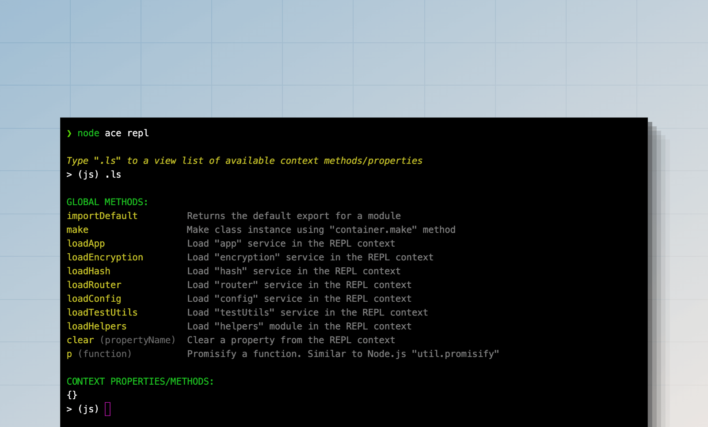

# REPL

像 [Node.js REPL](https://nodejs.org/api/repl.html) 一样，AdonisJS 提供了一个应用感知的 REPL，用于从命令行与你的应用程序进行交互。你可以使用 `node ace repl` 命令启动 REPL 会话。

```sh
node ace repl
```



在标准 Node.js REPL 之上，AdonisJS 提供了以下功能：

- 导入并执行 TypeScript 文件。
- 用于导入容器服务（如 `router`、`helpers`、`hash` 服务等）的快捷方法。
- 使用 [IoC 容器](../concepts/dependency_injection.md#constructing-a-tree-of-dependencies) 创建类实例的快捷方法。
- 可扩展的 API，用于添加自定义方法和 REPL 命令。

## 与 REPL 交互

启动 REPL 会话后，你会看到一个交互式提示符，你可以在其中编写有效的 JavaScript 代码并按回车键执行它。代码的输出将打印在下一行。

如果你想输入多行代码，可以通过输入 `.editor` 命令进入编辑器模式。按 `Ctrl+D` 执行多行语句，或按 `Ctrl+C` 取消并退出编辑器模式。

```sh
> (js) .editor
# // Entering editor mode (Ctrl+D to finish, Ctrl+C to cancel)
```

### 访问最后执行命令的结果

如果你忘记将语句的值分配给变量，可以使用 `_` 变量访问它。例如：

```sh
> (js) helpers.string.generateRandom(32)
# 'Z3y8QQ4HFpYSc39O2UiazwPeKYdydZ6M'
> (js) _
# 'Z3y8QQ4HFpYSc39O2UiazwPeKYdydZ6M'
> (js) _.length
# 32
> (js)
```

### 访问最后执行命令引发的错误

你可以使用 `_error` 变量访问上一条命令引发的异常。例如：

```sh
> (js) helpers.string.generateRandom()
> (js) _error.message
# 'The value of "size" is out of range. It must be >= 0 && <= 2147483647. Received NaN'
```

### 搜索历史记录

REPL 历史记录保存在用户主目录中的 `.adonisjs_v6_repl_history` 文件中。

你可以通过按向上箭头 `↑` 键循环浏览历史记录中的命令，或按 `Ctrl+R` 在历史记录中搜索。

### 退出 REPL 会话

你可以通过输入 `.exit` 或按两次 `Ctrl+C` 退出 REPL 会话。AdonisJS 将在关闭 REPL 会话之前执行优雅关闭。

此外，如果你修改了代码库，必须退出并重新启动 REPL 会话才能使新更改生效。

## 导入模块

Node.js 不允许在 REPL 会话中使用 `import` 语句。因此，你必须使用动态 `import` 函数并将输出分配给变量。例如：

```ts
const { default: User } = await import('#models/user')
```

你可以使用 `importDefault` 方法访问默认导出，而无需解构导出。

```ts
const User = await importDefault('#models/user')
```

## 辅助方法 (Helpers methods)

辅助方法是你可以执行以执行特定操作的快捷函数。你可以使用 `.ls` 命令查看可用方法的列表。

```sh
> (js) .ls

# GLOBAL METHODS:
importDefault         Returns the default export for a module
make                  Make class instance using "container.make" method
loadApp               Load "app" service in the REPL context
loadEncryption        Load "encryption" service in the REPL context
loadHash              Load "hash" service in the REPL context
loadRouter            Load "router" service in the REPL context
loadConfig            Load "config" service in the REPL context
loadTestUtils         Load "testUtils" service in the REPL context
loadHelpers           Load "helpers" module in the REPL context
clear                 Clear a property from the REPL context
p                     Promisify a function. Similar to Node.js "util.promisify"
```

## 向 REPL 添加自定义方法

你可以使用 `repl.addMethod` 向 REPL 添加自定义方法。该方法接受名称作为第一个参数，实现回调作为第二个参数。

为了演示，让我们创建一个 [预加载文件](../concepts/adonisrc_file.md#preloads) 并定义一个方法来导入 `./app/models` 目录中的所有模型。

```sh
node ace make:preload repl -e=repl
```

```ts
// title: start/repl.ts
import app from '@adonisjs/core/services/app'
import repl from '@adonisjs/core/services/repl'
import { fsImportAll } from '@adonisjs/core/helpers'

repl.addMethod('loadModels', async () => {
  const models = await fsImportAll(app.makePath('app/models'))
  repl.server!.context.models = models

  repl.notify('Imported models. You can access them using the "models" property')
  repl.server!.displayPrompt()
})
```

你可以将以下选项作为第三个参数传递给 `repl.addMethod` 方法。

- `description`: 在帮助输出中显示的人类可读描述。
- `usage`: 定义方法用法代码片段。如果未设置，将使用方法名称。

完成后，你可以重新启动 REPL 会话并执行 `loadModels` 方法以导入所有模型。

```sh
node ace repl

# Type ".ls" to a view list of available context methods/properties
> (js) await loadModels()
```
