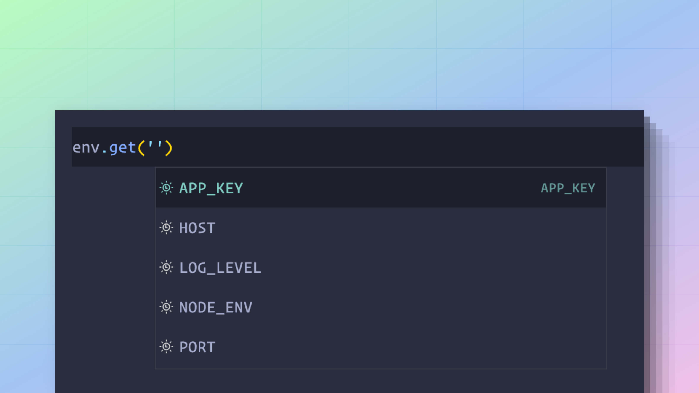

# 环境变量

环境变量用于在应用程序代码库之外存储数据库密码、应用密钥或 API 密钥等机密信息。

此外，环境变量还可用于针对不同环境进行不同的配置。例如，你可以在测试期间使用内存邮件程序，在开发期间使用 SMTP 邮件程序，在生产环境中使用第三方服务。

由于所有操作系统、部署平台和 CI/CD 流水线都支持环境变量，因此它们已成为存储机密和特定于环境配置的事实标准。

在本指南中，我们将学习如何在 AdonisJS 应用程序中利用环境变量。

## 读取环境变量

Node.js 原生通过 [`process.env` 全局属性](https://nodejs.org/dist/latest-v8.x/docs/api/process.html#process_process_env) 将所有环境变量作为对象公开，你可以按如下方式访问它们。

```dotenv
process.env.NODE_ENV
process.env.HOST
process.env.PORT
```

## 使用 AdonisJS env 模块

通过 `process.env` 对象读取环境变量不需要在 AdonisJS 端进行任何设置，因为 Node.js 运行时支持它。但是，在本文档的其余部分，我们将使用 AdonisJS env 模块，原因如下。

- 能够从多个 `.env` 文件存储和解析环境变量。
- 应用程序启动后立即验证环境变量。
- 为经过验证的环境变量提供静态类型安全。

env 模块在 `start/env.ts` 文件中实例化，你可以按如下方式在应用程序的其他位置访问它。

```ts
import env from '#start/env'

env.get('NODE_ENV')
env.get('HOST')
env.get('PORT')

// 当 PORT 未定义时返回 3333
env.get('PORT', 3333)
```

### 与 Edge 模板共享 env 模块

如果你想在 edge 模板中访问环境变量，则必须将 `env` 模块作为全局变量与 edge 模板共享。

你可以 [创建一个 `view.ts` 作为预加载文件](../concepts/adonisrc_file.md#preloads) 在 `start` 目录中，并在其中编写以下代码行。

:::note

这样做不会将 `env` 模块公开给浏览器。`env` 模块仅在服务器端渲染期间可用。

:::

```ts
// title: start/view.ts
import env from '#start/env'
import edge from 'edge.js'

edge.global('env', env)
```

## 验证环境变量

环境变量的验证规则在 `start/env.ts` 文件中使用 `Env.create` 方法定义。

当你首次导入此文件时，验证会自动执行。通常，`start/env.ts` 文件由项目中的某个配置文件导入。如果没有，那么 AdonisJS 将隐式导入此文件 [在启动应用程序之前](https://github.com/adonisjs/slim-starter-kit/blob/main/bin/server.ts#L34-L36)。

`Env.create` 方法接受验证模式作为键值对。

- 键是环境变量的名称。
- 值是执行验证的函数。它可以是自定义内联函数，也可以是对预定义模式方法（如 `schema.string` 或 `schema.number`）的引用。

```ts
import Env from '@adonisjs/core/env'

/**
 * App root is used to locate .env files inside
 * the project root.
 */
const APP_ROOT = new URL('../', import.meta.url)

export default await Env.create(APP_ROOT, {
  HOST: Env.schema.string({ format: 'host' }),
  PORT: Env.schema.number(),
  APP_KEY: Env.schema.string(),
  APP_NAME: Env.schema.string(),
  CACHE_VIEWS: Env.schema.boolean(),
  SESSION_DRIVER: Env.schema.string(),
  NODE_ENV: Env.schema.enum([
    'development',
    'production',
    'test'
  ] as const),
})
```

### 静态类型信息

相同的验证规则用于推断静态类型信息。使用 env 模块时可以使用类型信息。



## 验证器模式 API

### schema.string

`schema.string` 方法确保值是有效的字符串。空字符串无法通过验证，你必须使用可选变体来允许空字符串。

```ts
{
  APP_KEY: Env.schema.string()
}

// 标记为可选
{
  APP_KEY: Env.schema.string.optional()
}

// 带有条件地标记为可选
{
  APP_KEY: Env.schema.string.optionalWhen(() => process.env.NODE_ENV === 'production')
}
```

可以验证字符串值的格式。以下是可用格式的列表。

#### host

验证该值是有效的 URL 或 IP 地址。

```ts
{
  HOST: Env.schema.string({ format: 'host' })
}
```

#### url

验证该值是有效的 URL。或者，你可以通过允许 URL 没有 `protocol` 或 `tld` 来降低验证严格程度。

```ts
{
  S3_ENDPOINT: Env.schema.string({ format: 'url' })

  // 允许没有协议的 URL
  S3_ENDPOINT: Env.schema.string({ format: 'url', protocol: false })

  // 允许没有 tld 的 URL
  S3_ENDPOINT: Env.schema.string({ format: 'url', tld: false })
}
```
  
#### email

验证该值是有效的电子邮件地址。

```ts
{
  SENDER_EMAIL: Env.schema.string({ format: 'email' })
}
```

### schema.boolean

`schema.boolean` 方法确保值是有效的布尔值。空值无法通过验证，你必须使用可选变体来允许空值。

`'true'`、`'1'`、`'false'` 和 `'0'` 的字符串表示形式将转换为布尔数据类型。

```ts
{
  CACHE_VIEWS: Env.schema.boolean()
}

// 标记为可选
{
  CACHE_VIEWS: Env.schema.boolean.optional()
}

// 带有条件地标记为可选
{
  CACHE_VIEWS: Env.schema.boolean.optionalWhen(() => process.env.NODE_ENV === 'production')
}
```

### schema.number

`schema.number` 方法确保值是有效的数字。数字值的字符串表示形式将转换为数字数据类型。

```ts
{
  PORT: Env.schema.number()
}

// 标记为可选
{
  PORT: Env.schema.number.optional()
}

// 带有条件地标记为可选
{
  PORT: Env.schema.number.optionalWhen(() => process.env.NODE_ENV === 'production')
}
```

### schema.enum

`schema.enum` 方法根据预定义的值之一验证环境变量。枚举选项可以指定为值数组或 TypeScript 原生枚举类型。

```ts
{
  NODE_ENV: Env
    .schema
    .enum(['development', 'production'] as const)
}

// 标记为可选
{
  NODE_ENV: Env
    .schema
    .enum
    .optional(['development', 'production'] as const)
}

// 带有条件地标记为可选
{
  NODE_ENV: Env
    .schema
    .enum
    .optionalWhen(
      () => process.env.NODE_ENV === 'production',
      ['development', 'production'] as const
    )
}

// 使用原生枚举
enum NODE_ENV {
  development = 'development',
  production = 'production'
}

{
  NODE_ENV: Env.schema.enum(NODE_ENV)
}
```

### 自定义函数

自定义函数可以执行模式 API 未涵盖的验证。

该函数接收环境变量的名称作为第一个参数，接收值作为第二个参数。它必须返回验证后的最终值。

```ts
{
  PORT: (name, value) => {
    if (!value) {
      throw new Error('Value for PORT is required')
    }
    
    if (isNaN(Number(value))) {
      throw new Error('Value for PORT must be a valid number')
    }

    return Number(value)
  }
}
```

## 定义环境变量

### 在开发中

在开发过程中，环境变量定义在 `.env` 文件中。env 模块在项目的根目录中查找此文件并自动解析它（如果存在）。

```dotenv
// title: .env
PORT=3333
HOST=0.0.0.0
NODE_ENV=development
APP_KEY=sH2k88gojcp3PdAJiGDxof54kjtTXa3g
SESSION_DRIVER=cookie
CACHE_VIEWS=false
```

### 在生产中

在生产环境中，建议使用你的部署平台来定义环境变量。大多数现代部署平台都对从其 Web UI 定义环境变量提供了一流的支持。

假设你的部署平台没有提供定义环境变量的方法。你可以在项目根目录或生产服务器上的其他位置创建一个 `.env` 文件。

AdonisJS 将自动从项目根目录读取 `.env` 文件。但是，当 `.env` 文件存储在其他位置时，你必须设置 `ENV_PATH` 变量。

```sh
# 尝试从项目根目录读取 .env 文件
node server.js

# 从 "/etc/secrets" 目录读取 .env 文件
ENV_PATH=/etc/secrets node server.js
```

### 在测试期间

特定于测试环境的环境变量必须定义在 `.env.test` 文件中。此文件中的值会覆盖 `.env` 文件中的值。

```dotenv
// title: .env
NODE_ENV=development
SESSION_DRIVER=cookie
ASSETS_DRIVER=vite
```

```dotenv
// title: .env.test
NODE_ENV=test
SESSION_DRIVER=memory
ASSETS_DRIVER=fake
```

```ts
// 在测试期间
import env from '#start/env'

env.get('SESSION_DRIVER') // memory
```

### 所有其他 dot-env 文件

除了 `.env` 文件之外，AdonisJS 还会处理来自以下 dot-env 文件的环境变量。因此，你可以选择性地创建这些文件（如果需要）。

排名最高的那个文件会覆盖排名较低文件中的值。

<table>
    <thead>
        <tr>
            <th width="40px">排名</th>
            <th width="220px">文件名</th>
            <th>备注</th>
        </tr>
    </thead>
    <tbody>
        <tr>
            <td>第一</td>
            <td><code>.env.[NODE_ENV].local</code></td>
            <td>
            为当前 <code>NODE_ENV</code> 加载。例如，如果 <code>NODE_ENV</code> 设置为 <code>development</code>，则会加载 <code>.env.development.local</code> 文件。
            </td>
        </tr>
        <tr>
            <td>第二</td>
            <td><code>.env.local</code></td>
            <td>在所有环境中加载，除了 <code>test</code> 和 <code>testing</code> 环境</td>
        </tr>
        <tr>
            <td>第三</td>
            <td><code>.env.[NODE_ENV]</code></td>
            <td>
            为当前 <code>NODE_ENV</code> 加载。例如，如果 <code>NODE_ENV</code> 设置为 <code>development</code>，则会加载 <code>.env.development</code> 文件。
            </td>
        </tr>
        <tr>
            <td>第四</td>
            <td><code>.env</code></td>
            <td>在所有环境中加载。当在其中存储机密时，你应该将此文件添加到 <code>.gitignore</code> 中。</td>
        </tr>
    </tbody>
</table>

## 使用标识符进行插值

你可以定义并使用“标识符”来更改插值行为。标识符是一个字符串，它作为环境变量值的前缀，让你自定义值解析。

```ts
import { EnvParser } from '@adonisjs/env'

EnvParser.defineIdentifier('base64', (value) => {
  return Buffer.from(value, 'base64').toString()
})

const envParser = new EnvParser(`
  APP_KEY=base64:U7dbSKkdb8wjVFOTq2osaDVz4djuA7BRLdoCUJEWxak=
`)

console.log(await envParser.parse())
```

在上面的示例中，`base64:` 前缀告诉 env 解析器在返回之前从 base64 解码该值。

或者，你可以使用 `defineIdentifierIfMissing` 方法定义标识符。此方法不会覆盖现有标识符。

```ts
EnvParser.defineIdentifierIfMissing('base64', (value) => {
  return Buffer.from(value, 'base64').toString()
})
```

:::note

你可以直接在 `start/env.ts` 文件中使用这些方法。

```ts
// title: start/env.ts
import { Env } from '@adonisjs/core/env'

Env.defineIdentifier('base64', (value) => {
  return Buffer.from(value, 'base64').toString()
})

export default await Env.create(APP_ROOT, {
  APP_KEY: Env.schema.string()
})
```

:::

## 在 dot-env 文件中使用变量

在 dot-env 文件中，你可以使用变量替换语法引用其他环境变量。

在下面的示例中，我们根据 `HOST` 和 `PORT` 属性计算 `APP_URL`。

```dotenv
HOST=localhost
PORT=3333
// highlight-start
URL=$HOST:$PORT
// highlight-end
```

`$` 符号后的所有 **字母**、**数字** 和 **下划线 (_)** 用于形成变量名。如果名称包含下划线以外的特殊字符，则必须将变量名包裹在花括号 `{}` 中。

```dotenv
REDIS-USER=admin
REDIS-URL=localhost@${REDIS-USER}
```

### 转义 `$` 符号

要将 `$` 符号用作值，必须对其进行转义以防止变量替换。

```dotenv
PASSWORD=pa\$\$word
```
