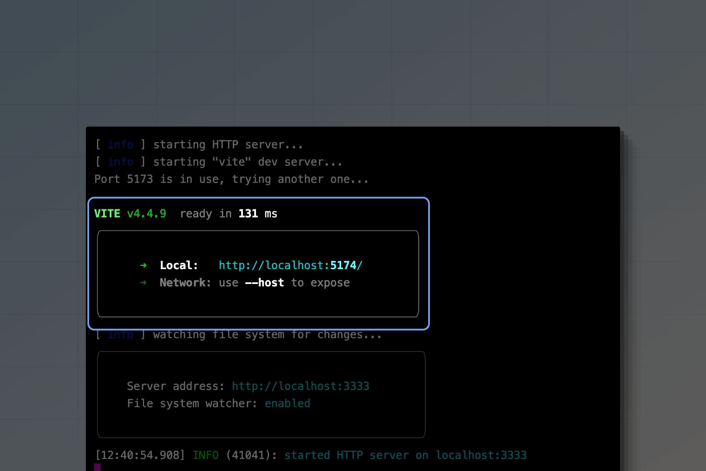

# Assets bundling

AdonisJS uses [Vite](https://vitejs.dev/) to bundle the frontend assets of your applications. We provide an official integration that performs all the heavy lifting required to integrate Vite with a backend framework like AdonisJS. It includes:

- Starting the Vite development server alongside the AdonisJS dev server.
- A dedicated Vite plugin to simplify configuration options.
- Edge helpers and tags to generate URLs for assets processed by Vite.

## Installation
Vite comes pre-configured with the [web starter kit](../guides/installation.md#web-starter-kit-spannot-ready-yetclassbadge). However, you can follow the below instructions to configure it inside an existing AdonisJS project.

Install and configure the package using the following command :

```sh
node ace add @adonisjs/vite

# Auto-install vite
node ace add @adonisjs/vite --install

# Do not install vite
node ace add @adonisjs/vite --no-install
```

:::disclosure{title="See steps performed by the add command"}

1. Installs the `@adonisjs/vite` package using the detected package manager.

2. Registers the following service provider inside the `adonisrc.ts` file.

    ```ts
    {
      providers: [
        // ...other providers
        () => import('@adonisjs/vite/vite_provider')
      ]
    }
    ```

3. Create `vite.config.js` and `config/vite.ts` configuration files.

4. Create the frontend entry point file, i.e. `resources/js/app.js`.

:::


## Configuration
The setup process creates two configuration files. The `vite.config.js` file is used to configure the Vite bundler, and `config/vite.ts` is used by AdonisJS on the backend.

### Vite config file
The `vite.config.js` file is a regular configuration file used by Vite. Per your project requirements, you can install and register additional Vite plugins inside this file.

By default, the `vite.config.js` file uses the AdonisJS plugin, which accepts the following options.

```ts
// title: vite.config.js
import { defineConfig } from 'vite'
import adonisjs from '@adonisjs/vite/client'

export default defineConfig({
  plugins: [
    adonisjs({
      entrypoints: ['resources/js/app.js'],
      reloads: ['resources/views/**/*.edge'],
    }),
  ]
})
```

<dl>

<dt>
entrypoints
</dt>

<dd>

The `entrypoints` refers to the entry point file of your frontend codebase. Usually, it will be a JavaScript or a TypeScript file with additional imports. Each entry point will result in a separate output bundle.

Also, if needed, you can define multiple entrypoints. For example, An entry point for your user-facing app and another for the admin panel.

</dd>

<dt>
buildDirectory
</dt>

<dd>

The `buildDirectory` option defines a relative path to the output directory. The option value is supplied to Vite as the [`build.outDir`](https://vitejs.dev/config/build-options.html#build-outdir) option.

If you decide to change the default value, make sure also to update the `buildDirectory` path in the `config/vite.ts` file.

**Default: public/assets**

</dd>

<dt>
hotFile
</dt>

<dd>

The `hotFile` option defines the path for generating the hot file during development. The hot file contains the URL of the Vite development server, and AdonisJS uses this URL to create asset links.

**Default: public/assets/hot.json**

</dd>

<dt>
reload
</dt>

<dd>

An array of glob patterns to watch and reload the browser on file change. By default, we watch for Edge templates. However, you can configure additional patterns as well.

</dd>

<dt>
assetsUrl
</dt>

<dd>

The URL to prefix when generating links for assets in production. If you upload the Vite output to a CDN, then the value of this property should be the CDN server URL.

Ensure you update the backend configuration to use the same `assetsUrl` value.

</dd>
</dl>

---

### AdonisJS config file
AdonisJS uses the `config/vite.ts` file on the backend to know about the output paths of the Vite build process. 

```ts
// title: config/vite.ts
import { defineConfig } from '@adonisjs/vite'

const viteBackendConfig = defineConfig({
  buildDirectory: 'public/assets',
  assetsUrl: '/assets',
})

export default viteBackendConfig
```

<dl>

<dt>
buildDirectory
</dt>

<dd>

The path to the Vite's build output directory. You must also update this backend config if you change the default value inside the `vite.config.js` file.

</dd>

<dt>
assetsUrl
</dt>

<dd>

The URL to prefix when generating links for assets in production. If you upload the Vite output to a CDN, then the value of this property should be the CDN server URL.

</dd>

<dt>
scriptAttributes
</dt>

<dd>

You can use the `scriptAttributes` property to set attributes on the script tags generated using the `@vite` tag. The attributes are a collection of key-value pairs.

```ts
// title: config/vite.ts
defineConfig({
  scriptAttributes: {
    defer: true,
    async: true,
  }
})
```

</dd>

<dt>
styleAttributes
</dt>

<dd>

You can use the `styleAttributes` property to set attributes on the link tags generated using the `@vite` tag. The attributes are a collection of key-value pairs.

```ts
// title: config/vite.ts
defineConfig({
  styleAttributes: {
    'data-turbo-track': 'reload'
  }
})
```

You can also apply the attributes conditionally by assigning a function to the `styleAttributes` option.

```ts
defineConfig({
  styleAttributes: ({ src, url }) => {
    if (src === 'resources/css/admin.css') {
      return {
        'data-turbo-track': 'reload'
      }
    }
  }
})
```

</dd>

</dl>

## Folder structure for frontend assets
Technically, AdonisJS does not enforce any folder structure for storing your frontend assets. You can organize them as you like.

However, we recommend storing frontend assets inside the `resources` folder, with each asset class inside its subdirectory.

```
resources
└── css
└── js
└── fonts
└── images
```

The vite output will be written to the `public/assets` folder. We choose the `/assets` subdirectory so you can continue using the `public` folder for other static files you wish not to process using Vite.

## Starting the dev server
You can start your application as usual, and AdonisJS will automatically start the Vite development server alongside it. For example:

```sh
node ace serve --watch
```



You may pass CLI arguments to the Vite dev server using the `--assets-args` commandline flag.

```sh
node ace serve --watch --assets-args="--debug"
```

You may turn off the Vite development server using the `--no-assets` commandline flag.

```sh
node ace serve --watch --no-assets
```

## Including entrypoints in Edge templates
You can render the script and the style tags for the entrypoints defined inside the `vite.config.js` file using the `@vite` Edge tag. The tag accepts an array of entrypoints and returns the `script` and the `link` tags.

```edge
<!DOCTYPE html>
<html lang="en">
<head>
    <meta charset="UTF-8">
    <meta name="viewport" content="width=device-width, initial-scale=1.0">
    // highlight-start
    @vite(['resources/js/app.js'])
    // highlight-end
</head>
<body>
    
</body>
</html>
```

We recommend importing CSS files inside your JavaScript files and not registering them separately as an entry point. For example:

```
resources
└── css
    └── app.css
└── js
    └── app.js
```

```js
// title: resources/js/app.js
import '../css/app.css'
```

## Referencing assets inside Edge templates
Vite creates a dependency graph of files imported by the entrypoints and auto-updates their paths per the bundled output. However, Vite is unaware of Edge templates and cannot detect their referenced assets.

Therefore, we provide an Edge helper you can use to create URLs for files processed by Vite. In the following example:

- The `asset` helper will return a URL pointing to the Vite dev server during development.
- Return a URL pointing to the output filename during production.

```edge
<link rel="stylesheet" href="{{ asset('resources/css/app.css') }}">
```

```html
// title: Output in development
<link rel="stylesheet" href="http://localhost:5173/resources/css/app.css">
```

```html
// title: Output in production
<link rel="stylesheet" href="/assets/app-3bc29777.css">
```

## Processing additional assets with Vite
Vite ignores static assets not imported by the frontend code. It could be static images, fonts, or SVG icons only referenced inside the Edge templates.

Therefore, you will have to notify Vite about the existence of these assets using its [Glob imports](https://vitejs.dev/guide/features.html#glob-import) API.

In the following example, we ask Vite to process all the files within the `resources/images` directory. This code should be written within an entry point file.

```js
// title: resources/js/app.js
import.meta.glob(['../images/**'])
```

Now, you can reference the images within your Edge templates as follows.

```edge

```

## Configuring TypeScript
If you plan to use TypeScript in your frontend codebase, create an additional `tsconfig.json` file inside the `resources` directory. Vite and your code editor will automatically use this config file for the TypeScript source code inside the `resources` directory.

```json
// title: resources/tsconfig.json
{
  "extends": "../tsconfig.json",
  "compilerOptions": {
    "baseUrl": ".",
    "lib": ["DOM"],
    "jsx": "preserve", // If you are using React
    "paths": {
      "@/*": ["./js/*"]
    }
  }
}
```

## Enabling HMR with React
To enable [react-refresh](https://www.npmjs.com/package/react-refresh) during development, you must use the `@viteReactRefresh` Edge tag. It should be written before you include the entrypoints using the `@vite` tag.

```edge
<!DOCTYPE html>
<html lang="en">
<head>
    <meta charset="UTF-8">
    <meta name="viewport" content="width=device-width, initial-scale=1.0">
    // highlight-start
    @viteReactRefresh()
    @vite(['resources/js/app.js'])
    // highlight-end
</head>
<body>
    
</body>
</html>
```

Once done, you can configure the React plugin as usual in a regular Vite project.

```ts
import { defineConfig } from 'vite'
import adonisjs from '@adonisjs/vite/client'
import react from '@vitejs/plugin-react'

export default defineConfig({
  plugins: [
    adonisjs({
      entrypoints: ["resources/js/app.js"],
    }),
    // highlight-start
    react(),
    // highlight-end
  ],
})
```

## Deploying assets to a CDN
After you create the production build using Vite, you can upload the bundled output to a CDN server to serve the files.

However, before you do that, you must register the URL of your CDN server with both Vite and AdonisJS so that the output URLs inside the `manifest.json` file or lazy loaded chunks should point to your CDN server.

You must define the `assetsUrl` inside the `vite.config.js` and `config/vite.ts` files.

```ts
// title: vite.config.js
import { defineConfig } from 'vite'
import adonisjs from '@adonisjs/vite/client'

export default defineConfig({
  plugins: [
    adonisjs({
      entrypoints: ['resources/js/app.js'],
      reloads: ['resources/views/**/*.edge'],
      // highlight-start
      assetsUrl: 'https://cdn.example.com/',
      // highlight-end
    }),
  ]
})
```

```ts
// title: config/vite.ts
import { defineConfig } from '@adonisjs/vite'

const viteBackendConfig = defineConfig({
  buildDirectory: 'public/assets',
  // highlight-start
  assetsUrl: 'https://cdn.example.com/',
  // highlight-end
})

export default viteBackendConfig
```

## Advanced concepts

### Hot file
The AdonisJS Vite plugin creates a hot file (`public/assets/hot.json`) when you start the Vite dev server, and the file is automatically deleted after the server is stopped.

- The existence of the hot file tells AdonisJS that we are running in development mode, and all assets should point to the Vite dev server.
- The hot file contains the URL of the Vite development server. It is required to generate URLs pointing to the Vite dev server.

You can customize the output path of the hot file by modifying the `hotFile` option in both the [`vite.config.js`](#vite-config-file) file and the [`config/vite.ts`](#adonisjs-config-file) file.

### Manifest file
Vite generates the [manifest file](https://vitejs.dev/guide/backend-integration.html) alongside the production build of your assets.

The manifest file contains the URLs to the assets processed by Vite, and AdonisJS uses this file to create URLs for assets referenced inside the Edge templates either using the `asset` helper or the `@vite` tag.
