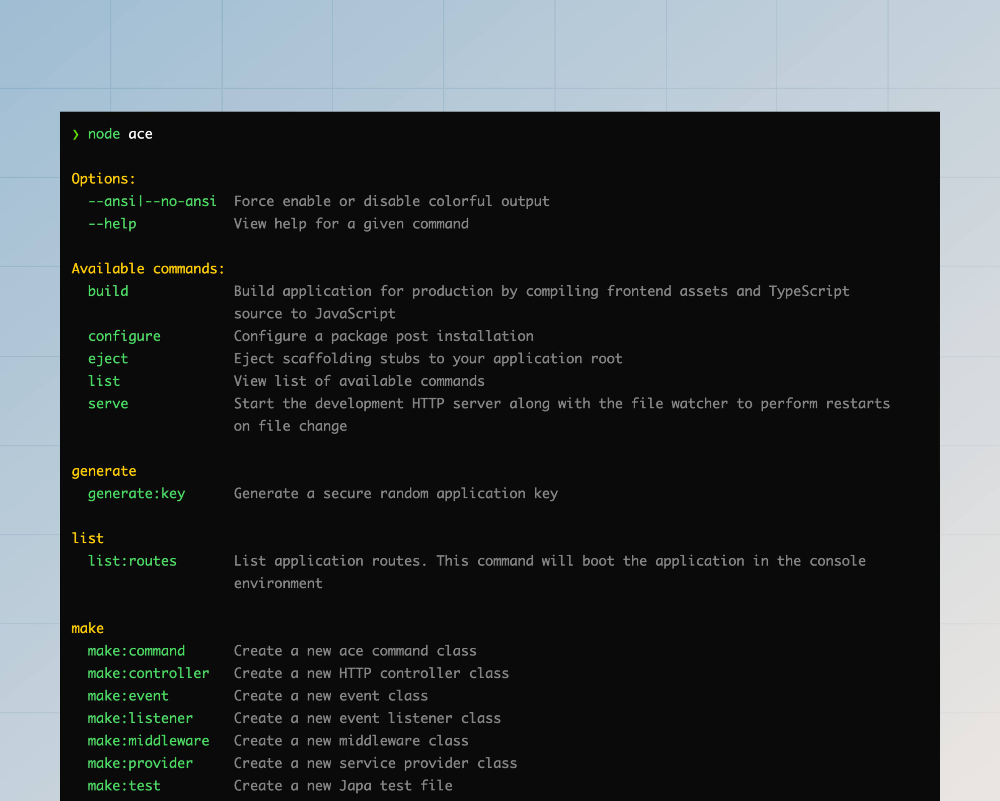

# 命令参考手册

在本指南中，我们将介绍随框架核心和官方包一起提供的所有命令的用法。你也可以使用 `node ace list` 命令或 `node ace <command-name> --help` 命令查看命令帮助。

```sh
node ace list
```



:::note

帮助屏幕的输出格式遵循 [docopt](http://docopt.org/) 标准。

:::

## serve
`serve` 命令使用 [@adonisjs/assembler](https://github.com/adonisjs/assembler?tab=readme-ov-file#dev-server) 包在开发环境中启动 AdonisJS 应用程序。你可以选择监听文件更改并在每次文件更改时重新启动 HTTP 服务器。

```sh
node ace serve --hmr
```

`serve` 命令作为子进程启动开发服务器（通过 `bin/server.ts` 文件）。如果你想向子进程传递 [node 参数](https://nodejs.org/api/cli.html#options)，可以在命令名称之前定义它们。

```sh
node ace --no-warnings --inspect serve --hmr
```

以下是可以传递给 `serve` 命令的可用选项列表。或者，使用 `--help` 标志查看命令的帮助。

<dl>

<dt>

--hmr

</dt>

<dd>

监听文件系统并以 HMR 模式重新加载服务器。

</dd>

<dt>

--watch

</dt>

<dd>

监听文件系统并在文件更改时始终重新启动进程。

</dd>

<dt>

--poll

</dt>

<dd>

使用轮询来检测文件系统更改。在开发中使用 Docker 容器时，你可能想要使用轮询。

</dd>

<dt>

--clear | --no-clear

</dt>

<dd>

在每次文件更改后和显示新日志之前清除终端。使用 `--no-clear` 标志保留旧日志。

</dd>

<dt>

--assets | --no-assets

</dt>

<dd>

在 AdonisJS HTTP 服务器旁边启动资源捆绑开发服务器。使用 `--no-assets` 标志关闭资源捆绑器开发服务器。

</dd>

<dt>

--assets-args

</dt>

<dd>

将命令行参数传递给资源管理器子进程。例如，如果你使用 vite，你可以按如下方式定义其选项。

```sh
node ace serve --hmr --assets-args="--cors --open"
```

</dd>

</dl>

## build
`build` 命令使用 [@adonisjs/assembler](https://github.com/adonisjs/assembler?tab=readme-ov-file#bundler) 包创建 AdonisJS 应用程序的生产构建。执行以下步骤以生成构建。

另请参阅：[TypeScript 构建过程](../concepts/typescript_build_process.md)。

```sh
node ace build
```

以下是可以传递给 `build` 命令的可用选项列表。或者，使用 `--help` 标志查看命令的帮助。

<dl>

<dt>

--ignore-ts-errors

</dt>

<dd>

当你的项目有 TypeScript 错误时，构建命令会终止构建过程。但是，你可以使用 `--ignore-ts-errors` 标志忽略这些错误并完成构建。

</dd>

<dt>

--package-manager

</dt>

<dd>

构建命令会将 `package.json` 文件与你的应用程序使用的包管理器的锁定文件一起复制。

我们使用 [@antfu/install-pkg](https://github.com/antfu/install-pkg) 包检测包管理器。但是，你可以通过显式提供包管理器的名称来关闭检测。

</dd>

<dt>

--assets | --no-assets

</dt>

<dd>

将前端资源与后端应用程序一起捆绑。使用 `--no-assets` 标志关闭资源捆绑器开发服务器。

</dd>

<dt>

--assets-args

</dt>

<dd>

将命令行参数传递给资源管理器子进程。例如，如果你使用 vite，你可以按如下方式定义其选项。

```sh
node ace build --assets-args="--sourcemap --debug"
```

</dd>

</dl>

## add

`add` 命令结合了 `npm install <package-name>` 和 `node ace configure` 命令。因此，你可以使用 `add` 命令一次性安装并配置包，而不是运行两个单独的命令。

`add` 命令将自动检测你的应用程序使用的包管理器，并使用它来安装包。但是，你始终可以使用 `--package-manager` CLI 标志选择特定的包管理器。

```sh
# 安装并配置 @adonisjs/lucid 包
node ace add @adonisjs/lucid

# 将包安装为开发依赖项并进行配置
node ace add my-dev-package --dev
```

如果包可以使用标志进行配置，你可以将它们直接传递给 `add` 命令。每个未知标志都将传递给 `configure` 命令。

```sh
node ace add @adonisjs/lucid --db=sqlite
```

<dl>

<dt>

--verbose

</dt>

<dd>

启用详细模式以显示包安装和配置日志。

</dd>

<dt>

--force

</dt>

<dd>

传递给 `configure` 命令。在配置包时强制覆盖文件。有关更多信息，请参阅 `configure` 命令。

<dt>

--package-manager

</dt>

<dd>

定义用于安装包的包管理器。该值必须是 `npm`、`pnpm`、`bun` 或 `yarn`。

</dd>

<dt>

--dev

</dt>

<dd>

将包安装为开发依赖项。

</dd>

</dl>

## configure
在安装包后对其进行配置。该命令接受包名称作为第一个参数。

```sh
node ace configure @adonisjs/lucid
```

<dl>

<dt>

--verbose

</dt>

<dd>

启用详细模式以显示包安装日志。

</dd>

<dt>

--force

</dt>

<dd>

AdonisJS 的存根系统不会覆盖现有文件。例如，如果你配置 `@adonisjs/lucid` 包，而你的应用程序已经有一个 `config/database.ts` 文件，则配置过程不会覆盖现有的配置文件。

但是，你可以使用 `--force` 标志强制覆盖文件。

</dd>

</dl>

## eject

将给定包中的存根弹出到你的应用程序 `stubs` 目录。在以下示例中，我们将 `make/controller` 存根复制到我们的应用程序以进行修改。

另请参阅：[自定义存根](../concepts/scaffolding.md#ejecting-stubs)

```sh
# 从 @adonisjs/core 包复制存根
node ace eject make/controller

# 从 @adonisjs/bouncer 包复制存根
node ace eject make/policy --pkg=@adonisjs/bouncer
```

## generate:key
生成一个加密安全的随机密钥，并将其作为 `APP_KEY` 环境变量写入 `.env` 文件。

另请参阅：[应用密钥](../security/encryption.md)

```sh
node ace generate:key
```

<dl>

<dt>

--show

</dt>

<dd>

在终端上显示密钥，而不是将其写入 `.env` 文件。默认情况下，密钥写入 env 文件。

</dd>

<dt>

--force

</dt>

<dd>

在生产环境中运行应用程序时，`generate:key` 命令不会将密钥写入 `.env` 文件。但是，你可以使用 `--force` 标志覆盖此行为。

</dd>

</dl>

## make:controller

创建一个新的 HTTP 控制器类。控制器是在 `app/controllers` 目录中创建的，并使用以下命名约定。

- 形式：`复数`
- 后缀：`controller`
- 类名示例：`UsersController`
- 文件名示例：`users_controller.ts`

```sh
node ace make:controller users
```

你也可以生成带有自定义操作名称的控制器，如下例所示。

```sh
# 生成带有 "index"、"show" 和 "store" 方法的控制器
node ace make:controller users index show store
```

<dl>

<dt>

--singular

</dt>

<dd>

强制控制器名称为单数形式。

</dd>

<dt>

--resource

</dt>

<dd>

生成一个带有对资源执行 CRUD 操作的方法的控制器。

</dd>

<dt>

--api

</dt>

<dd>

`--api` 标志类似于 `--resource` 标志。但是，它不定义 `create` 和 `edit` 方法，因为它们用于显示表单。

</dd>

</dl>

## make:middleware
创建一个新的 HTTP 请求中间件。中间件存储在 `app/middleware` 目录中，并使用以下命名约定。

- 形式：`单数`
- 后缀：`middleware`
- 类名示例：`BodyParserMiddleware`
- 文件名示例：`body_parser_middleware.ts`

```sh
node ace make:middleware bodyparser
```

<dl>

<dt>

--stack

</dt>

<dd>

通过显式定义堆栈来跳过 [中间件堆栈](../basics/middleware.md#middleware-stacks) 选择提示。该值必须是 `server`、`named` 或 `router`。

```sh
node ace make:middleware bodyparser --stack=router
```

</dd>

</dl>

## make:event
创建一个新的事件类。事件存储在 `app/events` 目录中，并使用以下命名约定。

- 形式：`不适用`
- 后缀：`不适用`
- 类名示例：`OrderShipped`
- 文件名示例：`order_shipped.ts`
- 建议：你必须围绕操作的生命周期命名事件。例如：`MailSending`、`MailSent`、`RequestCompleted` 等。

```sh
node ace make:event orderShipped
```

## make:validator
创建一个新的 VineJS 验证器文件。验证器存储在 `app/validators` 目录中，每个文件可以导出多个验证器。

- 形式：`单数`
- 后缀：`不适用`
- 文件名示例：`user.ts`
- 建议：你必须围绕应用程序的资源创建验证器文件。

```sh
# 用于管理用户的验证器
node ace make:validator user

# 用于管理帖子的验证器
node ace make:validator post
```

<dl>

<dt>

--resource

</dt>

<dd>

创建一个带有针对 `create` 和 `update` 操作的预定义验证器的验证器文件。

```sh
node ace make:validator post --resource
```

</dd>

</dl>

## make:listener

创建一个新的事件监听器类。监听器类存储在 `app/listeners` 目录中，并使用以下命名约定。

- 形式：`不适用`
- 后缀：`不适用`
- 类名示例：`SendShipmentNotification`
- 文件名示例：`send_shipment_notification.ts`
- 建议：事件监听器必须以它们执行的操作命名。例如，发送发货通知电子邮件的监听器应称为 `SendShipmentNotification`。

```sh
node ace make:listener sendShipmentNotification
```

<dl>

<dt>

--event

</dt>

<dd>

生成一个与事件监听器并列的事件类。

```sh
node ace make:listener sendShipmentNotification --event=shipment_received
```

</dd>

</dl>

## make:service

创建一个新的服务类。服务类存储在 `app/services` 目录中，并使用以下命名约定。

:::note

服务没有预定义的含义，你可以使用它来提取应用程序内部的业务逻辑。例如，如果你的应用程序生成大量 PDF，你可以创建一个名为 `PdfGeneratorService` 的服务并在多个地方重用它。

:::

- 形式：`单数`
- 后缀：`service`
- 类名示例：`InvoiceService`
- 文件名示例：`invoice_service.ts`

```sh
node ace make:service invoice
```

## make:exception

创建一个新的 [自定义异常类](../basics/exception_handling.md#custom-exceptions)。异常存储在 `app/exceptions` 目录中。

- 形式：`不适用`
- 后缀：`exception`
- 类名示例：`CommandValidationException`
- 文件名示例：`command_validation_exception.ts`

```sh
node ace make:exception commandValidation
```

## make:command

创建一个新的 Ace 命令。默认情况下，命令存储在应用程序根目录下的 `commands` 目录中。

当你尝试执行任何 Ace 命令时，AdonisJS 会自动导入此目录中的命令。你可以在文件名前加上 `_`，以便在此目录中存储不是 Ace 命令的其他文件。

- 形式：`不适用`
- 后缀：`不适用`
- 类名示例：`ListRoutes`
- 文件名示例：`list_routes.ts`
- 建议：命令必须以它们执行的操作命名。例如，`ListRoutes`、`MakeController` 和 `Build`。

```sh
node ace make:command listRoutes
```

## make:view
创建一个新的 Edge.js 模板文件。模板是在 `resources/views` 目录中创建的。

- 形式：`不适用`
- 后缀：`不适用`
- 文件名示例：`posts/view.edge`
- 建议：你必须将资源的模板分组在子目录中。例如：`posts/list.edge`、`posts/create.edge` 等。

```sh
node ace make:view posts/create
node ace make:view posts/list
```

## make:provider

创建一个 [服务提供者文件](../concepts/service_providers.md)。提供者存储在应用程序根目录下的 `providers` 目录中，并使用以下命名约定。

- 形式：`单数`
- 后缀：`provider`
- 类名示例：`AppProvider`
- 文件名示例：`app_provider.ts`

```sh
node ace make:provider app
```


<dl>

<dt>

--environments

</dt>

<dd>

定义应导入提供者的环境。[了解有关应用环境的更多信息](../concepts/application.md#environment)

```sh
node ace make:provider app -e=web -e=console
```

</dd>

</dl>

## make:preload

创建一个新的 [预加载文件](../concepts/adonisrc_file.md#preloads)。预加载文件存储在 `start` 目录中。

```sh
node ace make:preload view
```

<dl>

<dt>

--environments

</dt>

<dd>

定义应导入预加载文件的环境。[了解有关应用环境的更多信息](../concepts/application.md#environment)

```sh
node ace make:preload view app -e=web -e=console
```

</dd>

</dl>

## make:test
在 `tests/<suite>` 目录中创建一个新的测试文件。

- 形式：不适用
- 后缀：`.spec`
- 文件名示例：`posts/list.spec.ts`, `posts/update.spec.ts`

```sh
node ace make:test --suite=unit
```

<dl>

<dt>

--suite

</dt>

<dd>

定义要为其创建测试文件的套件。否则，该命令将显示套件选择提示。

</dd>

</dl>

## make:mail

在 `app/mails` 目录中创建一个新的邮件类。邮件类以后缀 `Notification` 关键字结尾。但是，你可以使用 `--intent` CLI 标志定义自定义后缀。

- 形式：不适用
- 后缀：`Intent`
- 类名示例：ShipmentNotification
- 文件名示例：shipment_notification.ts

```sh
node ace make:mail shipment
# ./app/mails/shipment_notification.ts
```


<dl>

<dt>

--intent

</dt>

<dd>

定义邮件的自定义意图。

```sh
node ace make:mail shipment --intent=confirmation
# ./app/mails/shipment_confirmation.ts

node ace make:mail storage --intent=warning
# ./app/mails/storage_warning.ts
```

</dd>

</dl>

## make:policy

创建一个新的 Bouncer 策略类。策略存储在 `app/policies` 文件夹中，并使用以下命名约定。

- 形式：`单数`
- 后缀：`policy`
- 类名示例：`PostPolicy`
- 文件名示例：`post_policy.ts`

```sh
node ace make:policy post
```

## inspect:rcfile
查看合并默认值后的 `adonisrc.ts` 文件内容。你可以使用此命令检查可用的配置选项，并根据你的应用程序要求覆盖它们。

另请参阅：[AdonisRC 文件](../concepts/adonisrc_file.md)

```sh
node ace inspect:rcfile
```

## list:routes
查看你的应用程序注册的路由列表。此命令将在 `console` 环境中启动你的 AdonisJS 应用程序。

```sh
node ace list:routes
```

此外，如果你使用我们的 [官方 VSCode 扩展](https://marketplace.visualstudio.com/items?itemName=jripouteau.adonis-vscode-extension)，你可以从 VSCode 活动栏中查看路由列表。


<dl>

<dt>

--json

</dt>

<dd>

将路由视为 JSON 字符串。输出将是一个对象数组。

</dd>

<dt>

--table

</dt>

<dd>

在 CLI 表格中查看路由。默认情况下，我们在紧凑、美观的列表中显示路由。

</dd>

<dt>

--middleware

</dt>

<dd>

过滤路由列表并包括使用提到的中间件的路由。你可以使用 `*` 关键字包括使用一个或多个中间件的路由。

</dd>

<dt>

--ignore-middleware

</dt>

<dd>

过滤路由列表并包括**不**使用提到的中间件的路由。你可以使用 `*` 关键字包括不使用任何中间件的路由。

</dd>

</dl>

## env:add

`env:add` 命令允许你向 `.env`、`.env.example` 文件添加新的环境变量，并将在 `start/env.ts` 文件中定义验证规则。

你可以只运行该命令，它会提示你输入变量名称、值和验证规则。或者你可以将它们作为参数传递。

```sh
# 将提示输入变量名称、值和验证规则
node ace env:add

# 定义变量名称、值和验证规则
node ace env:add MY_VARIABLE value --type=string
```

<dl>

<dt>

--type

</dt>

<dd>

定义环境变量的类型。该值必须是以下之一：`string`、`boolean`、`number`、`enum`。

</dd>

<dt>

--enum-values

</dt>

<dd>

当类型为 `enum` 时定义环境变量的允许值。

```sh
node ace env:add MY_VARIABLE foo --type=enum --enum-values=foo --enum-values=bar
```

</dd>

</dl>
