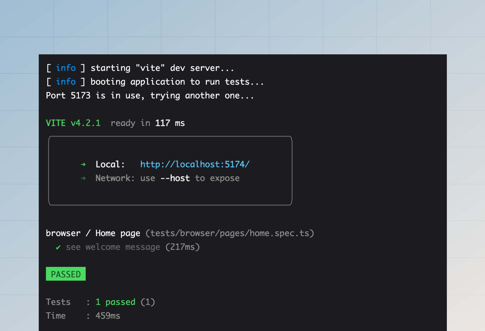

# 浏览器测试

浏览器测试是在 Chrome、Firefox 或 Safari 等真实浏览器中执行的。我们利用 [Playwright](https://playwright.dev/)（一个浏览器自动化工具）以编程方式与网页进行交互。

Playwright 既是一个测试框架，也是一个公开 JavaScript API 以与浏览器交互的库。我们**不使用 Playwright 测试框架**，因为我们已经在使用 Japa，而且在单个项目中使用多个测试框架只会导致混乱和配置膨胀。

相反，我们将使用 Japa 的 [Browser Client](https://japa.dev/docs/plugins/browser-client) 插件，它与 Playwright 集成良好，并提供了极佳的测试体验。

## 设置
第一步是从 npm 包注册表安装以下包。

:::codegroup

```sh
// title: npm
npm i -D playwright @japa/browser-client
```

:::

### 注册浏览器套件
让我们开始在 `adonisrc.ts` 文件中为浏览器测试创建一个新的测试套件。浏览器套件的测试文件将存储在 `tests/browser` 目录中。

```ts
{
  tests: {
    suites: [
      // highlight-start
      {
        files: [
          'tests/browser/**/*.spec(.ts|.js)'
        ],
        name: 'browser',
        timeout: 300000
      }
      // highlight-end
    ]
  }
}
```

### 配置插件
在开始编写测试之前，必须在 `tests/bootstrap.ts` 文件中注册 `browserClient` 插件。

```ts
import { browserClient } from '@japa/browser-client'

export const plugins: Config['plugins'] = [
  assert(),
  apiClient(),
  // highlight-start
  browserClient({
    runInSuites: ['browser']
  }),
  // highlight-end
  pluginAdonisJS(app)
]
```

## 基本示例
让我们创建一个示例测试，打开 AdonisJS 应用程序的主页并验证页面内容。[`visit`](https://japa.dev/docs/plugins/browser-client#browser-api) 助手打开一个新页面并访问 URL。返回值是 [页面对象](https://playwright.dev/docs/api/class-page)。

另请参阅：[断言方法列表](https://japa.dev/docs/plugins/browser-client#assertions)

```sh
node ace make:test pages/home --suite=browser
# DONE:    create tests/browser/pages/home.spec.ts
```

```ts
// title: tests/browser/pages/home.spec.ts
import { test } from '@japa/runner'

test.group('Home page', () => {
  test('see welcome message', async ({ visit }) => {
    const page = await visit('/')
    await page.assertTextContains('body', 'It works!')
  })
})
```

最后，让我们使用 `test` 命令运行上述测试。你可以使用 `--watch` 标志来创建文件监视器，并在每次文件更改时重新运行测试。

```sh
node ace test browser
```



## 读取/写入 Cookie
在真实浏览器中测试时，Cookie 会在 [浏览器上下文](https://playwright.dev/docs/api/class-browsercontext) 的整个生命周期内持久保存。

Japa 为每个测试创建一个新的浏览器上下文。因此，一个测试中的 Cookie 不会泄漏到其他测试中。但是，单个测试中的多次页面访问将共享 Cookie，因为它们使用相同的 `browserContext`。

```ts
test.group('Home page', () => {
  test('see welcome message', async ({ visit, browserContext }) => {
    // highlight-start
    await browserContext.setCookie('username', 'virk')
    // highlight-end
    
    // "username" cookie 将在请求期间发送
    const homePage = await visit('/')

    // "username" cookie 也将在该请求期间发送
    const aboutPage = await visit('/about')
  })
})
```

同样，可以使用 `browserContext.getCookie` 方法访问服务器设置的 Cookie。

```ts
import router from '@adonisjs/core/services/router'

router.get('/', async ({ response }) => {
  // highlight-start
  response.cookie('cartTotal', '100')
  // highlight-end

  return 'It works!'
})
```

```ts
test.group('Home page', () => {
  test('see welcome message', async ({ visit, browserContext }) => {
    const page = await visit('/')
    // highlight-start
    console.log(await browserContext.getCookie('cartTotal'))
    // highlight-end
  })
})
```

你可以使用以下方法读取/写入加密和纯文本 Cookie。

```ts
// Write
await browserContext.setEncryptedCookie('username', 'virk')
await browserContext.setPlainCookie('username', 'virk')

// Read
await browserContext.getEncryptedCookie('cartTotal')
await browserContext.getPlainCookie('cartTotal')
```

## 填充会话存储
如果你正在使用 [`@adonisjs/session`](../basics/session.md) 包在应用程序中读取/写入会话数据，你可能还希望使用 `sessionBrowserClient` 插件在编写测试时填充会话存储。

### 设置
第一步是在 `tests/bootstrap.ts` 文件中注册插件。

```ts
// insert-start
import { sessionBrowserClient } from '@adonisjs/session/plugins/browser_client'
// insert-end

export const plugins: Config['plugins'] = [
  assert(),
  pluginAdonisJS(app),
  // insert-start
  sessionBrowserClient(app)
  // insert-end
]
```

然后，更新 `.env.test` 文件（如果缺少则创建一个）并将 `SESSON_DRIVER` 设置为 `memory`。

```dotenv
// title: .env.test
SESSION_DRIVER=memory
```

### 写入会话数据
你可以使用 `browserContext.setSession` 方法为当前浏览器上下文定义会话数据。

使用相同浏览器上下文的所有页面访问都将有权访问相同的会话数据。但是，当浏览器或上下文关闭时，会话数据将被删除。

```ts
test('checkout with cart items', async ({ browserContext, visit }) => {
  // highlight-start
  await browserContext.setSession({
    cartItems: [
      {
        id: 1,
        name: 'South Indian Filter Press Coffee'
      },
      {
        id: 2,
        name: 'Cold Brew Bags',
      }
    ]
  })
  // highlight-end

  const page = await visit('/checkout')
})
```

与 `setSession` 方法类似，你可以使用 `browser.setFlashMessages` 方法定义闪存消息。

```ts
/**
 * 定义闪存消息
 */
await browserContext.setFlashMessages({
  success: 'Post created successfully',
})

const page = await visit('/posts/1')

/**
 * 断言帖子页面显示了闪存消息
 * 在 ".alert-success" div 中。
 */
await page.assertExists(page.locator(
  'div.alert-success',
  { hasText: 'Post created successfully' }
))
```

### 读取会话数据
你可以使用 `browserContext.getSession` 和 `browser.getFlashMessages` 方法读取会话存储中的数据。这些方法将返回与特定浏览器上下文实例关联的会话 ID 的所有数据。

```ts
const session = await browserContext.getSession()
const flashMessages = await browserContext.getFlashMessages()
```

## 验证用户身份
如果你正在使用 `@adonisjs/auth` 包在应用程序中验证用户身份，你可以使用 `authBrowserClient` Japa 插件在向应用程序发出 HTTP 请求时验证用户身份。

第一步是在 `tests/bootstrap.ts` 文件中注册插件。

```ts
// title: tests/bootstrap.ts
// insert-start
import { authBrowserClient } from '@adonisjs/auth/plugins/browser_client'
// insert-end

export const plugins: Config['plugins'] = [
  assert(),
  pluginAdonisJS(app),
  // insert-start
  authBrowserClient(app)
  // insert-end
]
```

如果你使用的是基于会话的身份验证，请确保还设置了会话插件。请参阅 [填充会话存储 - 设置](#setup-1)。

就这样。现在，你可以使用 `loginAs` 方法登录用户。该方法接受用户对象作为唯一参数，并将用户标记为在当前浏览器上下文中登录。

使用相同浏览器上下文的所有页面访问都将有权访问已登录用户。但是，当浏览器或上下文关闭时，用户会话将被销毁。

```ts
import User from '#models/user'

test('get payments list', async ({ browserContext, visit }) => {
  // highlight-start
  const user = await User.create(payload)
  await browserContext.loginAs(user)
  // highlight-end

  const page = await visit('/dashboard')
})
```

`loginAs` 方法使用 `config/auth.ts` 文件中配置的默认守卫进行身份验证。但是，你可以使用 `withGuard` 方法指定自定义守卫。例如：

```ts
const user = await User.create(payload)
await browserContext
  .withGuard('admin')
  .loginAs(user)
```


## 路由助手
你可以使用 TestContext 中的 `route` 助手为路由创建 URL。使用路由助手可以确保每当更新路由时，不必回来修复测试中的所有 URL。

`route` 助手接受与全局模板方法 [route](../basics/routing.md#url-builder) 接受的一组参数相同的参数。

```ts
test('see list of users', async ({ visit, route }) => {
  const page = await visit(
    // highlight-start
    route('users.list')
    // highlight-end
  )
})
```
